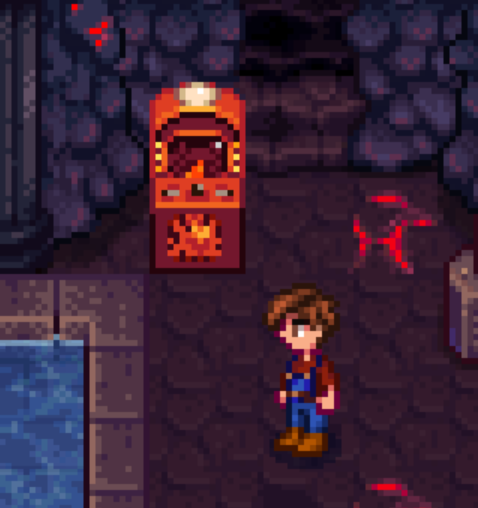

**You're viewing a file in the SMAPI mod dump, which contains a copy of every open-source SMAPI mod
for queries and analysis.**

**This is _not_ the original file, and not necessarily the latest version.**  
**Source repository: https://github.com/strobel1ght/StardewValleyMods**

----

# Pyromancer's Journey
A new arcade game! Play it on level 5 of the volcano dungeon and beat it to win a prize.

Controls:
* WSQE to move
* AD to turn
* Spacebar to charge staff, release to shoot

You can also start it by doing `pyrojourney` in the SMAPI console.

## See also
* [Release notes](release-notes.md)
