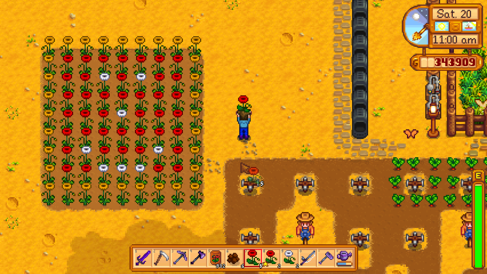

**You're viewing a file in the SMAPI mod dump, which contains a copy of every open-source SMAPI mod
for queries and analysis.**

**This is _not_ the original file, and not necessarily the latest version.**  
**Source repository: https://github.com/strobel1ght/StardewValleyMods**

----

# Flower Color Picker
This is the source code. Releases can be found at:
* [My site](http://spacechase0.com/mods/stardew-valley/flower-color-picker/)
* [Nexus](http://www.nexusmods.com/stardewvalley/mods/1229/)
* [Chucklefish forums](http://community.playstarbound.com/resources/flower-color-picker.4765/)

Choose the color of your flowers.

Left click a flower while holding a flower of the same type that is the color you want. Don't stand
too close, or you might harvest it.

## See also
* [Release notes](release-notes.md)
