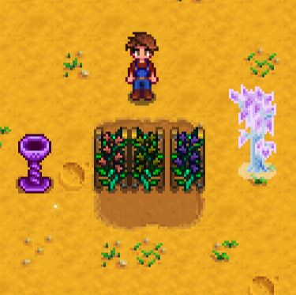

**You're viewing a file in the SMAPI mod dump, which contains a copy of every open-source SMAPI mod
for queries and analysis.**

**This is _not_ the original file, and not necessarily the latest version.**  
**Source repository: https://github.com/strobel1ght/StardewValleyMods**

----

# Json Assets
Successor to Custom Crops.

Lets you add new simple items to the game.

Currently supports items w/ crafting recipes, crops (including giant), fruit trees, big craftables, hats, weapons, clothing, and boots.

Uninstallation: Delete everything added using this mod.

## See also
* [Author guide](author-guide.md)
* [Release notes](release-notes.md)
