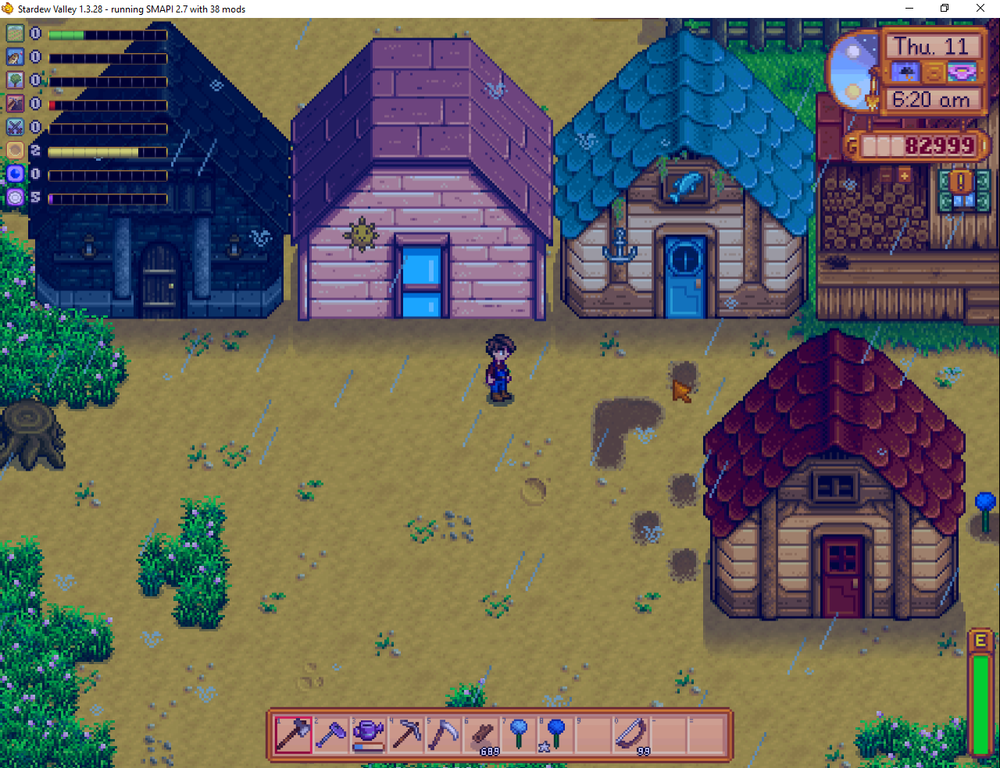

**You're viewing a file in the SMAPI mod dump, which contains a copy of every open-source SMAPI mod
for queries and analysis.**

**This is _not_ the original file, and not necessarily the latest version.**  
**Source repository: https://github.com/strobel1ght/StardewValleyMods**

----

# More Buildings
More buildings to construct. (Blueprints subject to change.)

* Spooky Shed - You can place a mob drop in the crystal, and mobs will spawn when you enter the
  building.
* Mini Spa - A place to relax and gain stamina.
* Fishing Shack - Allows you to catch any fish again, including legendaries.
* Big Shed - An upgrade for the normal shed.

## See also
* [Release notes](release-notes.md)
