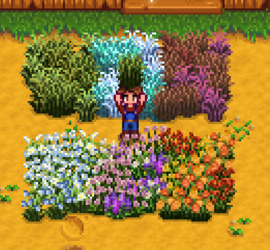

**You're viewing a file in the SMAPI mod dump, which contains a copy of every open-source SMAPI mod
for queries and analysis.**

**This is _not_ the original file, and not necessarily the latest version.**  
**Source repository: https://github.com/strobel1ght/StardewValleyMods**

----

# More Grass Starters
This is the source code. Releases can be found at:
* [My site](http://spacechase0.com/mods/stardew-valley/more-grass-starters/)
* [Nexus](http://www.nexusmods.com/stardewvalley/mods/1702/)
* [Chucklefish forums](http://community.playstarbound.com/resources/more-grass-starters.5129)

This mod adds other types of grass starters for decorating purposes.

They can be purchased from Pierre.

Credit to eemie for the flower types of grass.

## See also
* [Release notes](release-notes.md)
