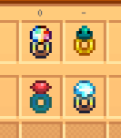

**You're viewing a file in the SMAPI mod dump, which contains a copy of every open-source SMAPI mod
for queries and analysis.**

**This is _not_ the original file, and not necessarily the latest version.**  
**Source repository: https://github.com/strobel1ght/StardewValleyMods**

----

# More Rings
This is the source code. Releases can be found at:
* [My site](http://spacechase0.com/mods/stardew-valley/more-rings)
* [Nexus](https://www.nexusmods.com/stardewvalley/mods/2054/)
* [Chucklefish forums](https://community.playstarbound.com/resources/more-rings.5271/)

Currently
* Ring of Regeneration - Regenerates health passively - Recipe from Marlon
* Ring of Wide Nets - 50% larger fishing bar - Recipe from Willy when raining
* Ring of Diamond Booze - Negates "Tipsy" effect from alcohol - Recipe from Dwarf
* Refreshing Ring - Restores stamina passively - Recipe from Krobus

A few ring sprites by ParadigmNomad.

## See also
* [Release notes](release-notes.md)
