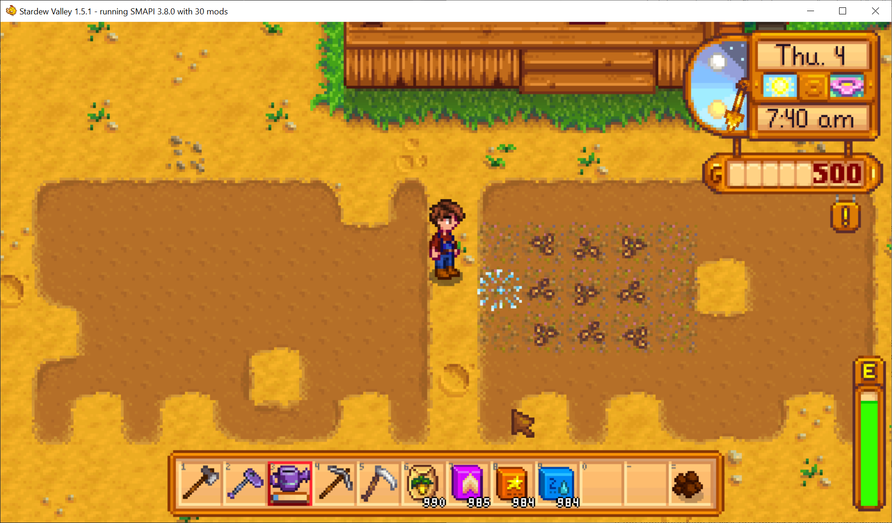

**You're viewing a file in the SMAPI mod dump, which contains a copy of every open-source SMAPI mod
for queries and analysis.**

**This is _not_ the original file, and not necessarily the latest version.**  
**Source repository: https://github.com/strobel1ght/StardewValleyMods**

----

# MultiFertilizer
Apply multiple types of fertilizer to a single crop space!

## See also
* [Release notes](release-notes.md)
