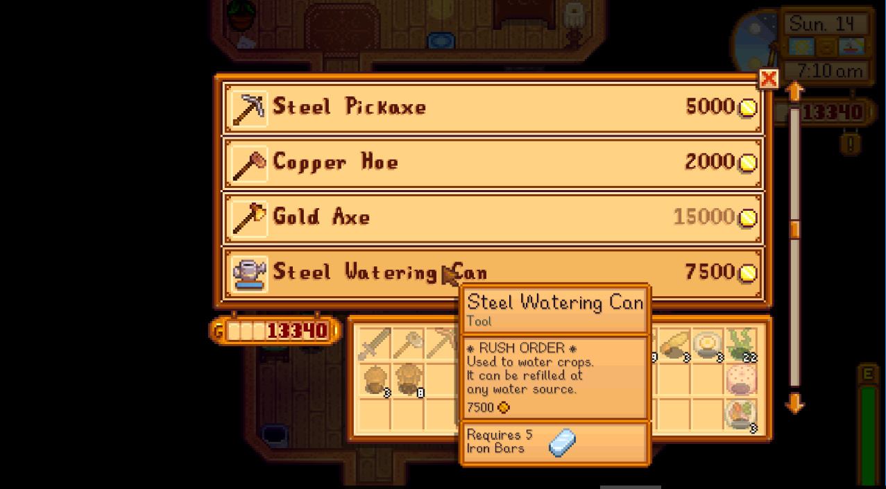

**You're viewing a file in the SMAPI mod dump, which contains a copy of every open-source SMAPI mod
for queries and analysis.**

**This is _not_ the original file, and not necessarily the latest version.**  
**Source repository: https://github.com/strobel1ght/StardewValleyMods**

----

# Rush Orders
This is the source code. Releases can be found at:
* [My site](http://spacechase0.com/mods/stardew-valley/rush-orders/)
* [Nexus](http://www.nexusmods.com/stardewvalley/mods/605/)
* [Chucklefish forums](http://community.playstarbound.com/threads/rush-orders.125785/)

For extra gold, you can rush your tool upgrade and get it in one day instead of two. For even more
gold, you can get it instantly.

By talking to Robin after queuing a construction, you can speed construction up by a day or two.

Price factors are configurable.

  

## See also
* [Release notes](release-notes.md)
