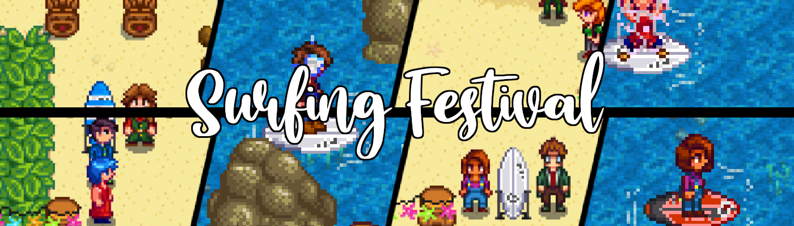
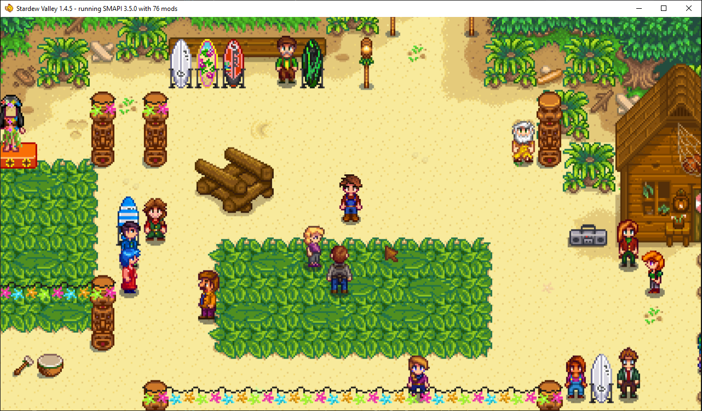
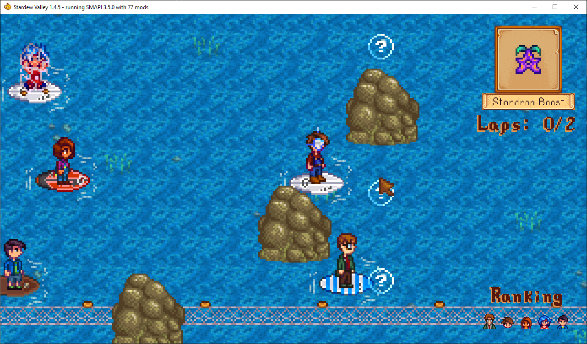

**You're viewing a file in the SMAPI mod dump, which contains a copy of every open-source SMAPI mod
for queries and analysis.**

**This is _not_ the original file, and not necessarily the latest version.**  
**Source repository: https://github.com/strobel1ght/StardewValleyMods**

----

Come to a new festival on Summer 5 at the Beach, where you can race some of your friends in the
town!

Don't put anything weird in the bonfire.

## Things to note
* Made for the SDV Discord Server 2020 Summer Event, theme: wavy
* Before the race the text explaining the powerups extends past the textbox. It still functions as
  intended just a bit harder to read the bottom word.
* When using the Stardrop powerup your character may jump forward and backwards, this is because of
  how fast you're going.

## You will need
* Latest version of [Json Assets](https://www.nexusmods.com/stardewvalley/mods/1720)
* Latest version of [SMAPI](https://stardewvalleywiki.com/Modding:Installing_SMAPI)
* Latest version of [SpaceCore](https://www.nexusmods.com/stardewvalley/mods/1348)
* Latest version of [Content Patcher](https://www.nexusmods.com/stardewvalley/mods/1915)
* Latest version of [Content Patcher Animations](https://www.nexusmods.com/stardewvalley/mods/3853)
* Latest version of [Mail Framework Mod](https://www.nexusmods.com/stardewvalley/mods/1536)
* Latest version of [Shop Tile Framework](https://www.nexusmods.com/stardewvalley/mods/5005) + Dependencies

## Installation
Step 1. Install SMAPI, Json Assets, SpaceCore, Content Patcher, Content Patcher Animations, Mail
Framework Mod, and Shop Tile Framework + Dependencies.

Step 2. Download this mod and extract the zip file anywhere you would like. There are 4 files
included in the download:

SurfingFestival
SurfingFestival.CP-A
SurfingFestival.STF
SurfingFestival.MFM

Step 3. Drag & Drop the extracted folder(s) directly into the /Mods folder.

## Uninstallation
- Delete every existing item made from this mod
- Remove the corresponding folder(s) inside /Mods

  

## See also
* [Release notes](release-notes.md)
