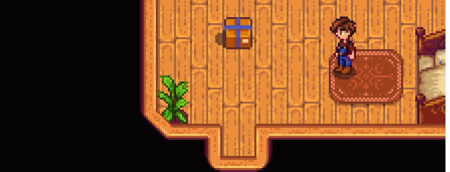

# StardewDiscord
> Relays messages from Stardew Valley to Discord via webhooks using SMAPI

## Installation

* Install [SMAPI](https://smapi.io/)
* Extract latest release to mods folder
* Create a new [webhook](https://support.discordapp.com/hc/en-us/articles/228383668-Intro-to-Webhooks) on Discord
* Launch game and load farm
* Type "discord" in SMAPI console, or "/discord" in chat if you are using [Chat Commands](https://www.nexusmods.com/stardewvalley/mods/2092/)
* Paste webhook URL in the text box and click the "set" button

#### Adding/Changing Emojis

The `emojis.json` file translates the emoji ids in Stardew Valley to an equivalent Discord emoji. Modify this file if you want to add your own emojis or you aren't satisfied with the current emojis.

## Contributing

1. Fork it (<https://github.com/steven-kraft/StardewDiscord/fork>)
2. Create your feature branch (`git checkout -b feature/fooBar`)
3. Commit your changes (`git commit -am 'Add some fooBar'`)
4. Push to the branch (`git push origin feature/fooBar`)
5. Create a new Pull Request

## License

Distributed under the MIT license. See ``LICENSE`` for more information.
