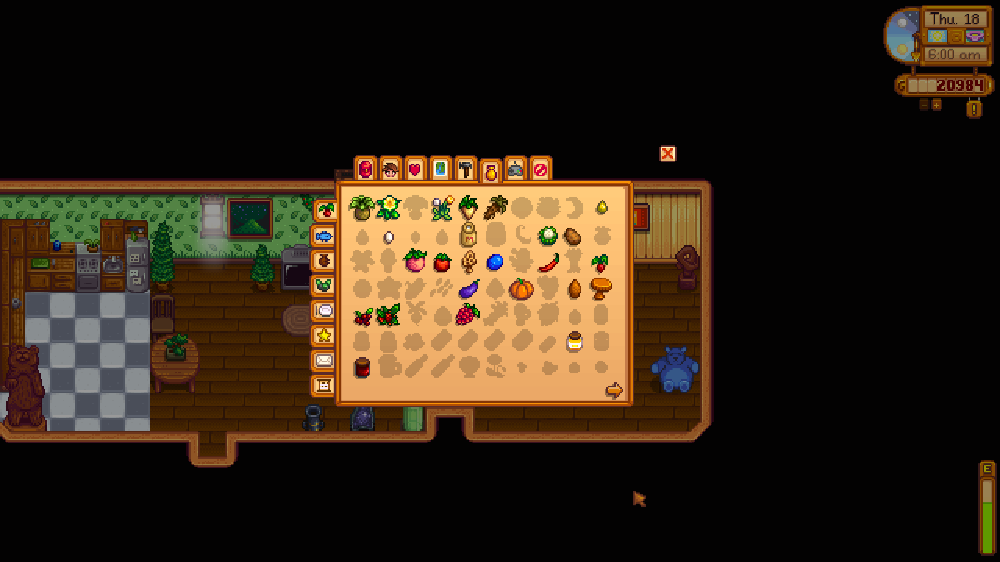

**You're viewing a file in the SMAPI mod dump, which contains a copy of every open-source SMAPI mod
for queries and analysis.**

**This is _not_ the original file, and not necessarily the latest version.**  
**Source repository: https://github.com/evfredericksen/StardewSpeak**

----

# Collections Page

<table>
    <tr>
        <th>Command</th>
        <th>Description</th>
        <th>Example</th>
    </tr>
    <tr>
        <td>&lt;side&gt;</td>
        <td>Click a side tab</td>
        <td>"achievments"</td>
    </tr>
    <tr>
        <td>(previous | next) page</td>
        <td>Move to the previous or next page.</td>
        <td>"previous page"</td>
    </tr>
</table>