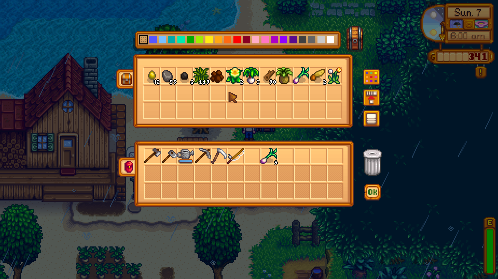

**You're viewing a file in the SMAPI mod dump, which contains a copy of every open-source SMAPI mod
for queries and analysis.**

**This is _not_ the original file, and not necessarily the latest version.**  
**Source repository: https://github.com/evfredericksen/StardewSpeak**

----

# Containers

Any menu that involves transfers between player items and another container, such as chests.
<table>
    <tr>
        <th>Command</th>
        <th>Description</th>
        <th>Example</th>
    </tr>
    <tr>
        <td>item &lt;n&gt;</td>
        <td>Move the cursor to the nth item in the current row (first by default)</td>
        <td>"item seven"</td>
    </tr>
    <tr>
        <td>row &lt;n&gt;</td>
        <td>Move the cursor to the nth row</td>
        <td>"row three"</td>
    </tr>
    <tr>
        <td>deposit &lt;n&gt;</td>
        <td>Place the nth item in the current row (first by default) of your backpack into the container</td>
        <td>"deposit five"</td>
    </tr>
    <tr>
        <td>deposit &lt;n&gt; through &lt;n2&gt;</td>
        <td>Place the nth through n2th item in the current row (first by default) of your backpack into the container</td>
        <td>"deposit five through nine"</td>
    </tr>
    <tr>
        <td>row &lt;n&gt;</td>
        <td>Move the cursor to the nth row</td>
        <td>"row three"</td>
    </tr>
    <tr>
        <td>ok</td>
        <td>Click the ok button</td>
        <td>"ok"</td>
    </tr>
    <tr>
        <td>(trash | garbage) can</td>
        <td>Click the trash can. Will discard any selected item.</td>
        <td>"trash can"</td>
    </tr>
    <tr>
        <td>[add to] existing stacks</td>
        <td>Click the add to existing stacks button.</td>
        <td>"existing stacks"</td>
    </tr>
    <tr>
        <td>[toggle] color picker</td>
        <td>Click the color picker.</td>
        <td>"color picker"</td>
    </tr>
    <tr>
        <td>organize</td>
        <td>Click the organize button.</td>
        <td>"organize"</td>
    </tr>
    <tr>
        <td>community center</td>
        <td>Click the community center/jumino button.</td>
        <td>"community center"</td>
    </tr>
</table>