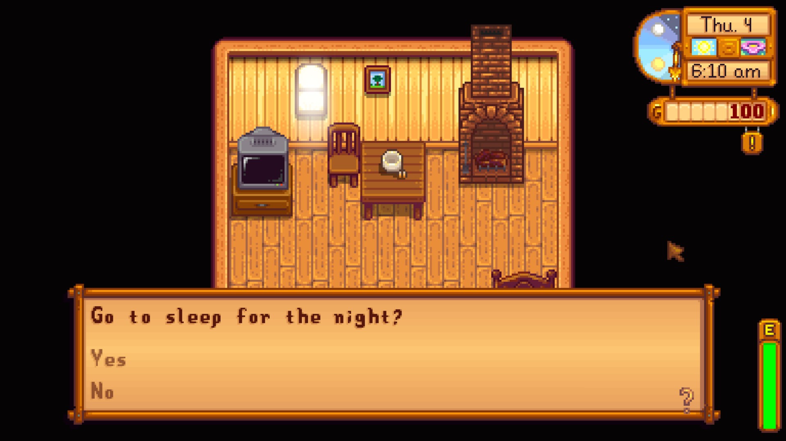

**You're viewing a file in the SMAPI mod dump, which contains a copy of every open-source SMAPI mod
for queries and analysis.**

**This is _not_ the original file, and not necessarily the latest version.**  
**Source repository: https://github.com/evfredericksen/StardewSpeak**

----

# Dialogue menu

<table>
    <tr>
        <th>Command</th>
        <th>Description</th>
        <th>Example</th>
    </tr>
    <tr>
        <td>(item | response) &lt;n&gt;</td>
        <td>Select the <i>nth</i> dialogue response.</td>
        <td>"response two"</td>
    </tr>
    <tr>
        <td>&lt;anything&gt;</td>
        <td>Select the dialogue response that most closely matches what was said.</td>
        <td>"yes"</td>
    </tr>
</table>