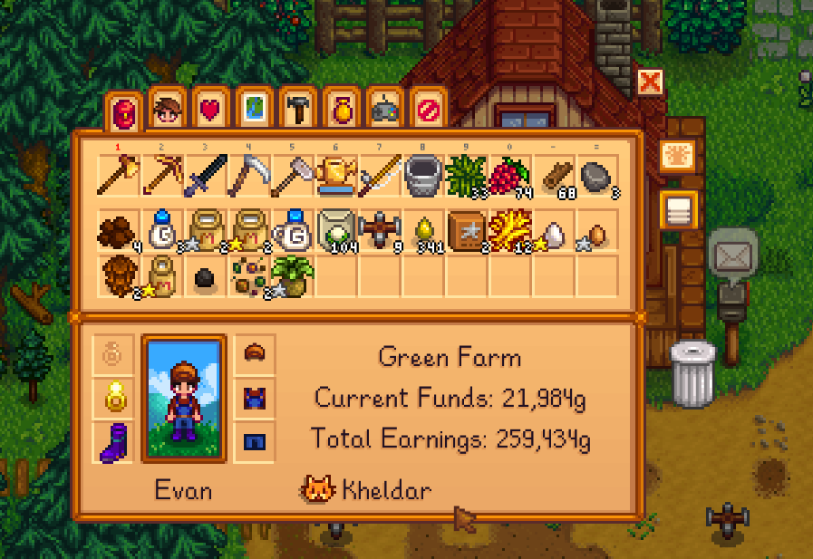

**You're viewing a file in the SMAPI mod dump, which contains a copy of every open-source SMAPI mod
for queries and analysis.**

**This is _not_ the original file, and not necessarily the latest version.**  
**Source repository: https://github.com/evfredericksen/StardewSpeak**

----

# Inventory Page

<table>
    <tr>
        <th>Command</th>
        <th>Description</th>
        <th>Example</th>
    </tr>
    <tr>
        <td>&lt;item&gt;</td>
        <td>Move the mouse cursor over <i>item</i> recipe on the current page.</td>
        <td>"quality sprinkler"</td>
    </tr>
    <tr>
        <td>scroll (up &#124; down) [&lt;n&gt;]</td>
        <td>Click scroll up or scroll down <i>n</i> times (default 1).</td>
        <td>"scroll down"</td>
    </tr>
    <tr>
        <td>item &lt;n&gt;</td>
        <td>Equip the nth item in the toolbar.</td>
        <td>"item seven"</td>
    </tr>
    <tr>
        <td>row &lt;n&gt;</td>
        <td>Move the cursor to the nth row</td>
        <td>"row three"</td>
    </tr>
    <tr>
        <td>trash can</td>
        <td>Click the trash can. Will discard any selected item.</td>
        <td>"trash can"</td>
    </tr>
</table>