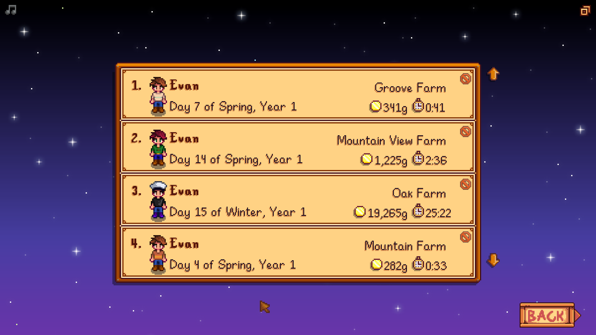

**You're viewing a file in the SMAPI mod dump, which contains a copy of every open-source SMAPI mod
for queries and analysis.**

**This is _not_ the original file, and not necessarily the latest version.**  
**Source repository: https://github.com/evfredericksen/StardewSpeak**

----

# Load Game Menu

<table>
    <tr>
        <th>Command</th>
        <th>Description</th>
        <th>Example</th>
    </tr>
    <tr>
        <td>(load [game] | [load] game) &lt;n&gt;</td>
        <td>Load the <i>n</i>th game from the top of the screen </td>
        <td>"load game three"</td>
    </tr>
    <tr>
        <td>scroll (up | down)</td>
        <td>Scroll up or down</td>
        <td>"scroll down"</td>
    </tr>
    <tr>
        <td>page (up | down)</td>
        <td>Scroll up or down four times</td>
        <td>"page up"</td>
    </tr>
    <tr>
        <td>(delete [game] | [delete] game) &lt;n&gt;</td>
        <td>Delete the <i>n</i>th game from the top of the screen </td>
        <td>"delete game three"</td>
    </tr>
    <tr>
        <td>(yes | ok)</td>
        <td>Confirm game deletion</td>
        <td>"ok"</td>
    </tr>
        <tr>
        <td>(no | cancel)</td>
        <td>Cancel game deletion</td>
        <td>"no"</td>
    </tr>
    <tr>
        <td>[go] back</td>
        <td>Exit to title menu.</td>
        <td>"back"</td>
    </tr>
</table>