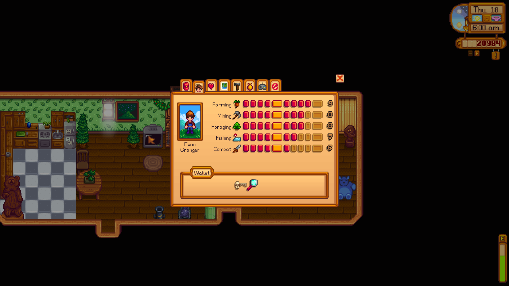

**You're viewing a file in the SMAPI mod dump, which contains a copy of every open-source SMAPI mod
for queries and analysis.**

**This is _not_ the original file, and not necessarily the latest version.**  
**Source repository: https://github.com/evfredericksen/StardewSpeak**

----

# Skills Page

<table>
    <tr>
        <th>Command</th>
        <th>Description</th>
        <th>Example</th>
    </tr>
    <tr>
        <td>&lt;skill&gt;</td>
        <td>Move the mouse cursor to a skill.</td>
        <td>"foraging"</td>
    </tr>
    <tr>
        <td>&lt;item&gt;</td>
        <td>Focus one of the wallet items.</td>
        <td>"skull key"</td>
    </tr>
</table>