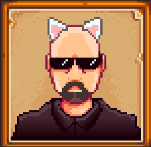
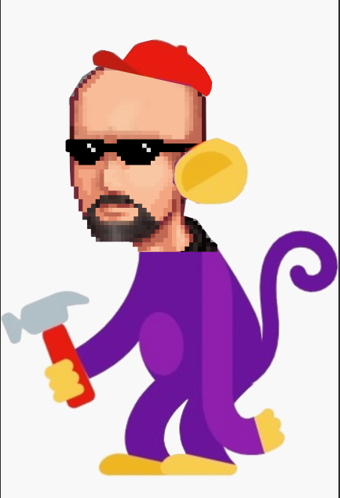

**You're viewing a file in the SMAPI mod dump, which contains a copy of every open-source SMAPI mod
for queries and analysis.**

**This is _not_ the original file, and not necessarily the latest version.**  
**Source repository: https://github.com/HauntedPineapple/Stendew-Valley**

----

# Stendew Valley

Team: Jack Doyle, Audrey Main, Renee Mei, Sofia Rivas

* [Nexus Mod Page](https://www.nexusmods.com/stardewvalley/mods/19483)
* [Design Doc](https://docs.google.com/document/d/1jIqs-RYWuWFZDSytus_9hnhrJfXRBKdCKAexcCkoB24/edit?usp=sharing)
* [Post Mortem](https://docs.google.com/document/d/1h2b1dBVOOrU6KzQIzf6VJnaCZI1ZB_vpkkyA5LrqDDk/edit?usp=sharing)
* [Modding Notes](https://docs.google.com/document/d/1vBRQ07ky8WCGWh4jQFbxmYEmaPnTfFR5X_xecvqqyfw/edit?usp=sharing)
<!-- * [NAME](URL) -->

### Dependencies
* [SMAPI](https://smapi.io/)
* [Content Patcher](https://www.nexusmods.com/stardewvalley/mods/1915)
* [Quest Framework](https://www.nexusmods.com/stardewvalley/mods/6414)
* [Quest Essentials](https://www.nexusmods.com/stardewvalley/mods/8827)
* [JSON Assets](https://www.nexusmods.com/stardewvalley/mods/1720)
* [SpaceCore](https://www.nexusmods.com/stardewvalley/mods/1348)
* [Expanded Precondition Utilities](https://www.nexusmods.com/stardewvalley/mods/6529)

<!--  -->
