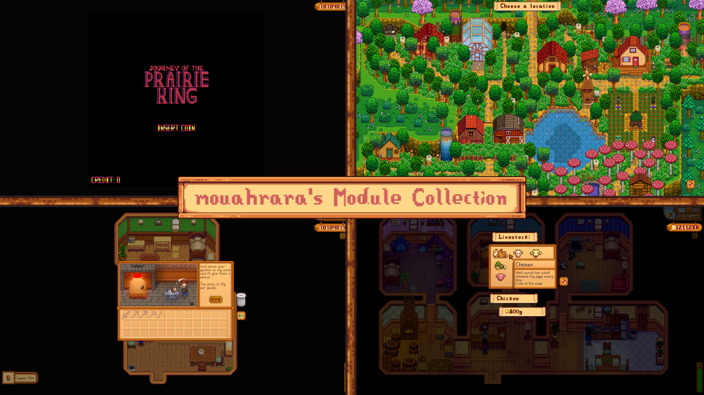

**You're viewing a file in the SMAPI mod dump, which contains a copy of every open-source SMAPI mod
for queries and analysis.**

**This is _not_ the original file, and not necessarily the latest version.**  
**Source repository: https://github.com/mouahrara/mouahrarasModuleCollection**

----

The Mouahrara's Module Collection mod is a compilation of tweaks, features, additions, and overhauls that enhance the quality of life, improve gameplay, introduce new functionality and provide functional details.

## Install
 - Install the latest version of [SMAPI](https://smapi.io).
 - Download this mod and unzip it into `Stardew Valley/Mods`.
 - Run the game using **SMAPI**.

## Modules

### Tweaks & Features
This section contains modules that add minor tweaks and features designed to enhance the quality of life and provide functional details.

- #### Arcade games

https://github.com/mouahrara/mouahrarasModuleCollection/assets/131559634/8b13e5b9-55e0-4c45-a7e8-4b17337dd1e5

| Sub-module                | Functionality                                                       | GMCM options                                                                     | Additional Information                                                                          |
|---------------------------|---------------------------------------------------------------------|----------------------------------------------------------------------------------|-------------------------------------------------------------------------------------------------|
| Konami code               | Allows you to enter the Konami code to get infinite lives.          | <ul><li>Enabled</li></ul>                                                        | In infinite lives mode, achievements and special rewards for beating arcade games are disabled. |
| Non-realistic leaderboard | Hides multiple high scores of the same player from the leaderboard. | <ul><li>Enabled</li></ul>	                                                     |                                                                                                 |
| Pay-to-play               | Requires you to pay to play arcade games.                           | <ul><li>Enabled</li><li>Coins per JotPK game</li><li>Coins per JK game</li></ul> |                                                                                                 |

- #### Clint's shop

https://github.com/mouahrara/mouahrarasModuleCollection/assets/131559634/3f85a5e0-70f3-4691-a6cb-73ab6f79cfc9

| Sub-module            | Functionality                                                      | GMCM options                                               |
|-----------------------|--------------------------------------------------------------------|------------------------------------------------------------|
| Geodes auto-process   | Allows you to automatically and quickly process many geodes.       | <ul><li>Enabled</li><li>Process speed multiplier</li></ul> |
| Simultaneous services | Allows you to shop and process geodes, even while upgrading tools. | <ul><li>Enabled</li></ul>                                  |

- #### Crystalariums

| Sub-module       | Functionality                                                                    | GMCM options              |
|------------------|----------------------------------------------------------------------------------|---------------------------|
| Safe replacement | Automatically retrieves the content of a crystalarium when you insert a new one. | <ul><li>Enabled</li></ul> |

- #### Farm view

https://github.com/mouahrara/mouahrarasModuleCollection/assets/131559634/007d5677-2905-4bb1-8ba4-63d134491dce

| Sub-module     | Functionality                                                                                                                     | GMCM options                                                                                                         |
|----------------|-----------------------------------------------------------------------------------------------------------------------------------|----------------------------------------------------------------------------------------------------------------------|
| Fast scrolling | Allows you to scroll faster when building, moving, painting or destroying buildings and when purchasing or moving farm animals.   | <ul><li>Enabled</li><li>Scroll speed multiplier</li></ul>                                                            |
| Zoom           | Allows you to zoom in and out when building, moving, painting or destroying buildings and when purchasing or moving farm animals. | <ul><li>Enabled</li><li>Secondary zoom-in key</li><li>Secondary zoom-out key</li><li>Zoom speed multiplier</li></ul> |

- #### Festivals

https://github.com/mouahrara/mouahrarasModuleCollection/assets/131559634/65d3d199-eec3-4bdd-8bf6-29bbc07adfbc

| Sub-module | Functionality                                                            | GMCM options                                                                     | Additional Information                                                                                                                                                                                                                                                                                                                           |
|------------|--------------------------------------------------------------------------|----------------------------------------------------------------------------------|--------------------------------------------------------------------------------------------------------------------------------------------------------------------------------------------------------------------------------------------------------------------------------------------------------------------------------------------------|
| End time   | Allows you to get back home at the time the festival is supposed to end. | <ul><li>Enabled</li><li>Duration (in hours)</li></ul>                            | The festival end time is determined by the minimum between 1am and the sum of the arrival end time and the duration of the festival.  The formula is: min(1am, ArrivalEndTime + FestivalDuration).  For example, the arrival end time of the Egg Festival is 2pm. Considering the default duration of 2 hours, the festival end time is 4pm. |

- #### Marnie's shop

https://github.com/mouahrara/mouahrarasModuleCollection/assets/131559634/469a20d9-cf42-4dbc-9b64-f413d3bae3c9

| Sub-module      | Functionality                                    | GMCM options              |
|-----------------|--------------------------------------------------|---------------------------|
| Animal purchase | Allows you to purchase several animals in a row. | <ul><li>Enabled</li></ul> |

### Additions
This section contains modules that add content, such as events or objects, designed to introduce new functionality, enhance gameplay, and provide functional details.

| Sub-module           | Functionality | GMCM options              |
|----------------------|---------------|---------------------------|
| (in future releases) |               | <ul><li>Enabled</li></ul> |

### Overhauls
This section contains modules that introduce overhauls to various game elements, aiming to introduce new functionality, enhance gameplay, and provide functional details.

| Sub-module           | Functionality | GMCM options              |
|----------------------|---------------|---------------------------|
| (in future releases) |               | <ul><li>Enabled</li></ul> |

## Accessibility
Chinese (thanks to **wsphm**), English and French translations are included in the base mod, and contributions are welcome. To contribute, please submit a pull request on the [GitHub repository](https://github.com/mouahrara/mouahrarasModuleCollection/pulls).  
Note that this mod has controller support.

## Multiplayer
The mod is compatible with multiplayer as long as all connected players have the mod installed.

## Frequently Asked Questions
- **Can I use this mod on an existing save?**  
Yes, no problem at all.
- **Can I uninstall this mod without any issues?**  
Yes, to uninstall the mod, run the `mmc_uninstall` command in the [SMAPI](https://smapi.io) console and save the game. You can then remove the mouahrara's Module Collection mod from the `Stardew Valley/Mods` folder.

## See also
- [Release notes](https://github.com/mouahrara/mouahrarasModuleCollection/releases)
- [Nexus Mods](https://www.nexusmods.com/stardewvalley/mods/18973)
