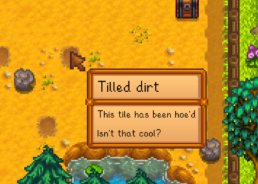

**You're viewing a file in the SMAPI mod dump, which contains a copy of every open-source SMAPI mod
for queries and analysis.**

**This is _not_ the original file, and not necessarily the latest version.**  
**Source repository: https://github.com/Achtuur/StardewMods**

----

# Hover Labels

This mod lets you hover over things and shows you a neat little label with some information about it.

# Features

Types of labels:

* Crops
* Trees
* Fruit Trees
* All types of nodes (Ore, Geode, Mineral etc.)
* Buildings:
  * Barn
  * Coop
  * Fish pond
  * Greenhouse
  * Junimo hut
  * Mill
  * Silo
  * Slime hutch
* Objects (any plaed object will have its name shown):
  * Chests
  * Casks
  * Machines (any placed object that is processing items, furnaces for example)
  * Scarecrows
  * Sprinklers

# Changelog

## Planned

### New/Changes to existing content

#### ambitious changes
* Add additional box to label for "show more" types of things.
* Add option for smaller borders (similar to ones you get when hovering over items in inventory)

#### extra labels
* None for now

#### small label changes

* disable label during events?
* labels with a duration that is longer than a day should show date

## 2.0.0
* New/Changed
    * Reworked how labels are drawn, pretty much breaks all existing labels using the API
    * New types of labels:
        * Item label (item icon with optional text)
        * Inventory label (items in a grid to show an inventory)
    * Added a lot more text to the I18n file so it can be translated

## 1.2.2
* New/Changed
  * add more i18n stuff to labels

## 1.2.1
* Fixes
    * Fix warning message in console
 
## 1.2.0

Updated to support Stardew Valley 1.6

* New/Changed
  * Crop label no longer shows number of harvestables

## 1.1.2
* New/Changed
  * Junimo hut label now shows whether hut is prismatic

* Fixes
  * Label enabled config now properly saves

## 1.1.1
* Fixes
  * Fixed objects being labelled as nodes erroneously (kegs, seed makers etc.)
  * Fixed some palm trees being labelled as "palm tree 2"
  * Fixed jade nodes being labelled as ruby nodes

## 1.1.0
* New/Changed
  * Added label for all types of nodes
  * Greenhouse now switches between crop/trees when pressing shift
  * Sprinklers label text updated
  * text for which key to press now looks a bit nicer
  * New labels:
    * Added generic label for buildings that shows the name
    * Added label for fish ponds, showing number of fish and quests
    * Added label for silos, showing hay
    * Added label to Barn and Coop showing their animals
  	* Added label to slime hutch
    * Added label to mill
  * Updated labels:
    * Casks now show next quality AND iridium quality date

* Fixes
  * Fixed nullrefexception when hovering over Greenhouse
  * Chest label now shows correct number of items
  * Crop label text fixed (missing word added)
  * Fixed date string showing dates with a 0 in them
  * Fixed regrowable crops not properly showing as fully grown sometimes

## 1.0.0

* Initial release

