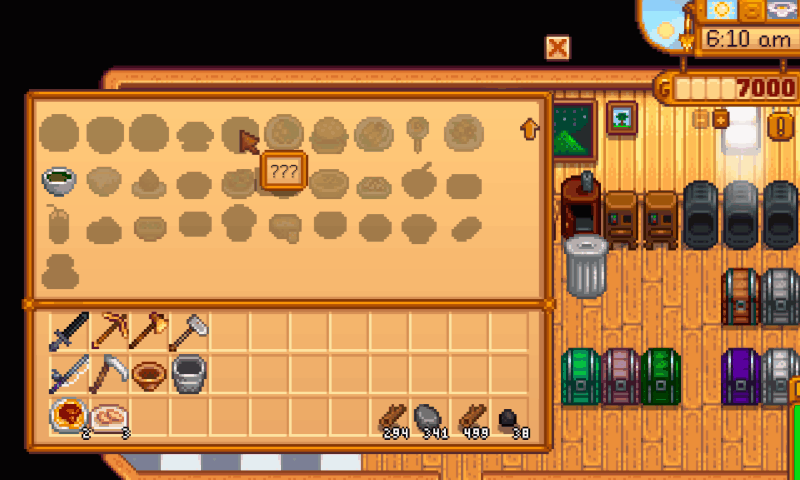
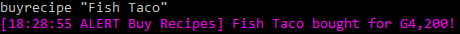
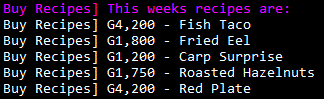

**Buy Recipes** is a [Stardew Valley](http://stardewvalley.net/) mod which lets you 
buy cooking recipes from the SMAPI console.

Compatible with Stardew Valley 1.3.

Each week on Sunday a new set of up to five recipes will be available to buy. These 
will be recipes that you **do not** already own. Prices are listed next to each item.

To buy a recipe, just type `buyrecipe <recipe name>`  

Future a development will allow you to buy recipes from a magazine rack in Pierre's shop.

## Contents
* [Installation](#installation)
* [Usage](#usage)
* [Configuration](#configuration)
* [Versions](#versions)
* [See also](#see-also)

## Installation
1. [Install the latest version of SMAPI](http://canimod.com/guides/using-mods#installing-smapi).
2. Install [this mod from Nexus mods](http://www.nexusmods.com/stardewvalley/mods/1126).
3. Run the game using SMAPI.
4. Load a saved game.
5. After your game loads, the SMAPI console will output this weeks available recipes.

## Usage
### Buy a recipe
1. Run the game using SMAPI.
2. Load a saved game.
3. Type in `buyrecipe <recipe name>` and press enter.  
  _Replace `<recipe name>` with the name of the recipe you want to buy_  
 
  
_Quotes around the name are no longer required!_

### See this weeks recipes
Each sunday the SMAPI console will list the weeks recipes but you can show the list on demand.
1. Run the game using SMAPI.
2. Load a saved game.
3. Type in `showrecipes` and press enter.  

## Configuration
The mod will work fine out of the box, but you can tweak its settings by editing the `config.json`
file if you want. These are the available settings:

| setting           | what it affects
| ----------------- | -------------------
| `CheckForUpdates` | Default `true`. Whether the mod should check for a newer version when you load the game. If a new version is available, you'll see a small message at the bottom of the screen for a few seconds. This doesn't affect the load time even if your connection is offline or slow, because it happens in the background.

## Versions
See [release notes](release-notes.md).

## See also
* [Nexus mod](http://www.nexusmods.com/stardewvalley/mods/1126)
* [Discussion thread](http://community.playstarbound.com/threads/buy-recipes-purchase-your-missing-cooking-recipes.132713)
* [My other mods](../readme.md)