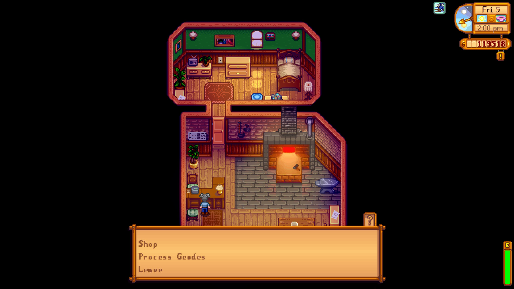

**You're viewing a file in the SMAPI mod dump, which contains a copy of every open-source SMAPI mod
for queries and analysis.**

**This is _not_ the original file, and not necessarily the latest version.**  
**Source repository: https://github.com/Dunc4nNT/StardewMods**

----

# Self Serve

Don't want to wait for shop owners like Marnie and Clint while they're gone? You no longer have to! Access any shop services even while its owner isn't attending it.

## Table of Contents

- [Prerequisites](#prerequisites)
- [Installation](#installation)
- [Configuration](#configuration)
- [How to Use](#how-to-use)
- [Compatibility](#compatibility)
- [Translations](#translations)
- [Contact](#contact)
- [Links](#links)
- [Credits](#credits)
- [Licensing](#licensing)

## Prerequisites

Mandatory and optional requirements for use of this mod.

- [SMAPI 4.0](https://www.nexusmods.com/stardewvalley/mods/2400) (required)
- [GMCM 1.12][GMCM-nexus] (optional, but highly recommended)

## Installation

1. Download and install the required prerequisites.
2. Download the latest version of this mod through [NexusMods](https://www.nexusmods.com/stardewvalley/mods/20985?tab=files) or [GitHub releases](https://github.com/Dunc4nNT/StardewMods/releases).
3. Unzip the downloaded file into the `Stardew Valley/Mods` directory.
4. Launch the game using SMAPI.

## Configuration

The mod's configurable options can be found below. These can either be adjusted through [Generic Mod Configuration Menu (GMCM)][GMCM-nexus] or the `config.json` file. Editing the options using GMCM is recommended. GMCM will also provide descriptive tooltips if the option itself is not clear.

- Pierre's General Store
- Willy's Fish Shop
- Ice Cream Shop
- Blacksmith
- Carpenter's
- Marnie's Animal Shop
- Hospital
- Stardrop Saloon Bar
- Bookseller's Shop
- Traveling Merchant
- Resort Bar
- Sandy's Oasis

## How to Use

Once you've configured the mod the way you want, simply go to a shop and interact with it!

## Compatibility

This mod is made for Stardew Valley 1.6 using SMAPI 4.0. This mod will **not** work on versions prior to those mentioned.

## Translations

Currently, only English is supported.

If you'd like another language to be supported and would like to help, please check the [modding translations wiki](https://stardewvalleywiki.com/Modding:Translations) and send a [pull request][gh-pr].

## Contact

**Having issues with installing or using the mod?** Leave a comment on the [NexusMods page][nexus-comments] detailing which steps you've done, which step you're failing at and if SMAPI is giving an error, please include a link to your [SMAPI log][smapi-log].

**Certain you've found a bug?** Please open an [issue][gh-issues] using the bug report template and add the appropriate mod label. If you prefer using Nexus, you can leave a report on the [bug reports page][nexus-bugs]. **Uncertain?** Leave a [comment][nexus-comments] first detailing what you've run into, including a link to your [SMAPI log][smapi-log]. **Know what you're doing?** Feel free to send a PR if you'd like.

**Like to request a new feature or addition to an existing feature?** Please open an [issue][gh-issues] using the feature request template and add the appropriate mod label.

**I may take a while to see a comment on nexus, you can try contacting me through Discord DMs or the SDV server (never.toxic) if that's the case, or incase of an urgent issue.**

## Links

- [NexusMods page for this mod](https://www.nexusmods.com/stardewvalley/mods/20985)
- [GitHub mono repo with all my mods](https://github.com/Dunc4nNT/StardewMods)

## Credits

This is a complete rewrite of the [Self Serve](https://www.nexusmods.com/stardewvalley/mods/11313) mod, made to be compatible with the Stardew Valley 1.6 update. Credit to [Aedenthorn](https://www.nexusmods.com/stardewvalley/users/18901754) for the original mod!

## Licensing

Copyright © 2024 Dunc4nNT

This project is licensed under the Mozilla Public License 2.0 (MPL 2.0). See [LICENSE](../LICENSE) for more information.

[GMCM-nexus]: https://www.nexusmods.com/stardewvalley/mods/5098
[nexus-comments]: https://www.nexusmods.com/stardewvalley/mods/20985?tab=posts
[nexus-bugs]: https://www.nexusmods.com/stardewvalley/mods/20985?tab=bugs
[smapi-log]: https://smapi.io/log
[gh-issues]: https://github.com/Dunc4nNT/StardewMods/issues
[gh-pr]: https://github.com/Dunc4nNT/StardewMods/pulls
