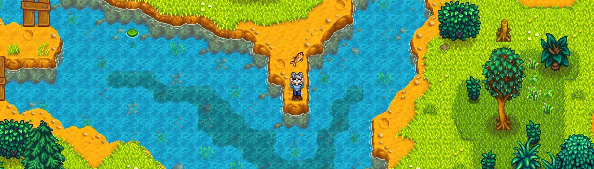

**You're viewing a file in the SMAPI mod dump, which contains a copy of every open-source SMAPI mod
for queries and analysis.**

**This is _not_ the original file, and not necessarily the latest version.**  
**Source repository: https://github.com/Dunc4nNT/StardewMods**

----

# Yet Another Fishing Mod

Having difficulty fishing? Or finding it too easy? This is yet another mod that allows you to adjust various fishing-related options.

## Table of Contents

- [Prerequisites](#prerequisites)
- [Installation](#installation)
- [Configuration](#configuration)
- [How to Use](#how-to-use)
- [Compatibility](#compatibility)
- [Translations](#translations)
- [Contact](#contact)
- [Links](#links)
- [To Do](#to-do)
- [Licensing](#licensing)

## Prerequisites

Mandatory and optional requirements for use of this mod.

- [SMAPI 4.0](https://www.nexusmods.com/stardewvalley/mods/2400) (required)
- [GMCM 1.12][GMCM-nexus] (optional, but highly recommended)

## Installation

1. Download and install the required prerequisites.
2. Download the latest version of this mod through [NexusMods](https://www.nexusmods.com/stardewvalley/mods/20391?tab=files) or [GitHub releases](https://github.com/Dunc4nNT/StardewMods/releases).
3. Unzip the downloaded file into the `Stardew Valley/Mods` directory.
4. Launch the game using SMAPI.

## Configuration

The mod's configurable options can be found below. These can either be adjusted through [Generic Mod Configuration Menu (GMCM)][GMCM-nexus] or the `config.json` file. Editing the options using GMCM is recommended. GMCM will also provide descriptive tooltips if the option itself is not clear.

### Minigame Skip

#### Automatically Cast
Keybind to toggle automatically casting your fishing rod. Will try casting every second if enabled.

#### Skip Minigame
Skips the fishing minigame. Amount of catches required before skip can be changed below.

#### Catches Required
Amount of catches required before it skips the minigame. The "Skip Minigame" option must be enabled.

#### Chance of Perfect
The chance that the minigame skip causes a perfect catch. "Always Perfect" trumps this option. The "Skip Minigame" option must be enabled.

#### Treasure Catch Chance
The chance that the skip minigame catches treasure, if there was one. "Instant Catch Treasure" trumps this option. The "Skip Minigame" option must be enabled.

### Difficulty

#### Difficulty Multiplier
Value with which the standard fishing difficulty is multiplied.

#### Adjust XP Gain
Adjust the XP gained based on the fish difficulty set above.

#### Fish Catch Multiplier
A multiplier for the increase given when the fish is inside the green bar. The higher the value, the quicker the fish is caught.

#### Fish Escape Multiplier
A multiplier for the penalty given when the fish is outside of the green bar. The higher the value, the quicker the fish escapes.

#### Bar Size Multiplier
A multiplier for the size of the bar in the fishing minigame. The higher the value, the larger the bar.

#### Always Max Casting Power
Always casts the fishing rod with maximum power, no matter how long you held the button.

#### Automatically Hook
Automatically starts reeling in your fish after one bites.

#### Always Perfect
Always get a perfect after catching a fish, even if you did not.

#### Instantly Catch Treasure
If there are any treasures in the fishing minigame, instantly catch them even if you missed them.

#### Treasure Catch Multiplier
A multiplier for the increase given when a treasure is inside the green bar. The higher the value, the quicker the treasure is caught.

### Fishing Loot

#### Fish
Increases the chance of catching fish when enabled.

#### Rubbish
Increases the chance of catching rubbish when enabled.

#### Other
Increases the chance of catching other items when enabled. This includes items such as seaweed and algae.

#### Amount of Fish
Catch the set amount of fish. Using bait may override this amount. Whichever is highest.

#### Minimum Fish Quality
Always gets fish of the set quality or better. Trumps the "Fish Quality" option.

#### Set Fish Quality
Always catch fish with the set quality. Trumped by the "Minimum Fish Quality" option.

#### Treasure Probability
Adjust how often treasure chests appear. (vanilla, always, never)

#### Golden Treasure Probability
Adjust how often a treasure chest is a golden treasure chest. (vanilla, always, never)

### Faster Please

#### Instant Bite
Fish instantly bite after casting your fishing rod.

#### Automatically Loot Fish
Automatically loot and close the fish popup after catching a fish.

#### Automatically Loot Treasure
Automatically loot and close the treasure menu popup after catching treasure.

#### Faster Animations
Various animations are quicker. These include the casting, reeling and treasure opening animations.

### Attachments

#### Override Attachment Limit
Overrides the fishing rod's attachment limit when spawning bait and tackle.

#### Reset Attachments Limit
Resets attachment limit back to the default when unequipping the fishing rod. **WARNING: If you have any attachments in an overriden slot, they will be deleted.**

#### Infinite Bait
Never run out of bait.

#### Spawn Bait When Equipped
Spawns the below selected bait item whenever you equip your fishing rod.

#### Amount of Bait
How much bait to spawn.

#### Bait to Spawn
Which bait to automatically spawn when fishing rod is equipped.

#### Infinite Tackles
Your tackle never wears out.

#### Spawn Tackle When Equipped
Spawns the below selected tackle item whenever you equip your fishing rod.

#### Tackle to Spawn
Which tackle to automatically spawn when fishing rod is equipped.

### Enchantments

#### Enable Adding Enchantments
Adds enchantments as set below when checked.

#### Reset Enchantments
Resets enchantments to what they were before after unequipping the fishing rod.

#### Add All Enchantments
Adds all available enchantments when you equip a fishing rod.

#### Add Auto-Hook Enchantment
Adds the auto-hook enchantment when equipping a fishing rod.

#### Add Efficient Enchantment
Adds the efficient tool enchantment when equipping a fishing rod.

#### Add Master Enchantment
Adds the master enchantment when equipping a fishing rod.

#### Add Preserving Enchantment
Adds the preserving enchantment when equipping a fishing rod.

## How to Use

Once you've configured the mod the way you want, simply equip a fishing rod and start fishing!

## Compatibility

This mod is made for **Stardew Valley 1.6** using **SMAPI 4.0**. This mod will **not** work on versions prior to those mentioned.

Both **singleplayer** and **multiplayer** should work. If you are having issues with multiplayer, make sure you've downloaded at least version 1.0.1 of the mod as this included a multiplayer hotfix.

I have yet to test **split screen**, but did try to make it compatible.

This mod does not change fish spawns, so it *should* work with mods adding **custom fish**.

*Should* be compatible with mods that add **custom bait and or hooks**, I've yet to test this, but as long as the category for the custom item was set correctly, this mod should detect them.

This mod will **not** work with **custom enchantments** at the moment. I'm looking to add support for this in the future.

Likely to conflict with mods that try to do the same thing. Due to every option in this mod being configurable it should not be likely to cause issues, as you can simply turn the conflicting option off. Though, feel free to report any mods that do conflict by [opening an issue][gh-issues], updating the README and [sending a pull request][gh-pr] or [comment on the NexusMods page][nexus-comments].

## Translations

English is the only language fully supported by me, and guaranteed to be up to date.

There are various languages that have translations available to download and use on NexusMods. Do note that these may not always be up to date, as I can't guarantee support for those languages myself.

If the language you'd like to see has no translation, or it's outdated, feel free to create your own translations and publish them as a mod translation on NexusMods. **Please only upload the translation file and nothing else.** You can either upload it inside of a `Yet Another Fishing Mod/i18n/` folder or as just the file. For extra information, take a look at the [translation wiki](https://stardewvalleywiki.com/Modding:Translations).

Due to me not being able to guarantee whether other languages are up to date, I prefer they be uploaded separately from this mod (so a mod translation on NexusMods). For players this means you'll have to look at the "Translations" tab on Nexus and check if the language you speak is on there. For translators this means you'll have to publish your translations on Nexus and publish updates after new releases yourself.

If you have a question regarding translations (whether it's about how to translate, how to upload them etc), feel free to contact me any way.

## Contact

**In almost all cases** please leave a comment on the [NexusMods page][nexus-comments] detailing your issue. **Always** include a link to your [SMAPI log][smapi-log]. **Without** this log it may be impossible for me to solve the problem you're having. If you prefer, you could send a DM on Nexus.

**Only after receiving permission**, may you try contacting me through Discord DMs or the SDV server (never.toxic). I likely won't respond otherwise.

## Links

- [NexusMods page for this mod](https://www.nexusmods.com/stardewvalley/mods/20391)
- [GitHub mono repo with all my mods](https://github.com/Dunc4nNT/StardewMods)
- [CurseForge page for this mod](https://legacy.curseforge.com/stardewvalley/mods/yet-another-fishing-mod)

## To Do

List of things I'd like to add at some point. I'm uncertain how many of these I'll actually end up doing. List in no specific order.

- Rewrite enchantment logic.
- Allow for custom enchantments.
- Add a transpiler for catching fish in the mines. Currently it's just vanilla settings, so you'll mostly catch rubbish.
- Look into fish probability more in depth, currently if you just enable catching "Other", you won't catch jellies, and you'll catch rubbish in certain cases.
- For spawning bait and tackles, allow switching them without having to remove them from your rod.
- Option to apply fishing related buffs, such as luck and fishing.
- Refund stamina on max cast option.
- Gradually learn catching fish, so say after catching 5 of a certain fish the amount of time it takes to catch the next one decreases, all the way till it's instant.
- Allow requiring a certain amount of perfect catches before the minigame gets skipped.
- Split animation skip up into separate options.
- Add a slider to change animation speed (say from vanilla speed, up to 100% speed increase)
- Per fish override settings, e.g. have red snappers never appear or change difficulty for that fish specifically.
- Dutch translations.

## Licensing

Copyright © 2024 Dunc4nNT

This project is licensed under the Mozilla Public License 2.0 (MPL 2.0). See [LICENSE](../LICENSE) for more information.

[GMCM-nexus]: https://www.nexusmods.com/stardewvalley/mods/5098
[nexus-comments]: https://www.nexusmods.com/stardewvalley/mods/20391?tab=posts
[nexus-bugs]: https://www.nexusmods.com/stardewvalley/mods/20391?tab=bugs
[smapi-log]: https://smapi.io/log
[gh-issues]: https://github.com/Dunc4nNT/StardewMods/issues
[gh-pr]: https://github.com/Dunc4nNT/StardewMods/pulls
