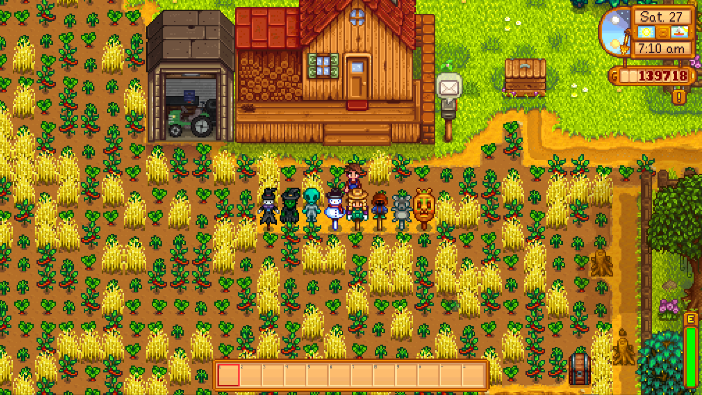

**You're viewing a file in the SMAPI mod dump, which contains a copy of every open-source SMAPI mod
for queries and analysis.**

**This is _not_ the original file, and not necessarily the latest version.**  
**Source repository: https://github.com/EpicBellyFlop45/StardewMods**

----

**Better Rarecrows** is a [Stardew Valley](http://stardewvalley.net/) mod that enabled [Rarecrows](https://stardewvalley.fandom.com/wiki/Rarecrow) to have full farm coverage from crows once they've all been placed.

## Install
1. Install the latest version of [SMAPI](https://www.nexusmods.com/stardewvalley/mods/2400).
2. Install the latest version of [this mod](https://www.nexusmods.com/stardewvalley/mods/3232).
3. Extract the .zip mod file into your StardewValley/Mods folder and run the game using SMAPI.

## Use
First, open the game using SMAPI like normal, this will generate a config.json file in the Mods/BetterRarecrows folder.
Then using the below section configure the number of required rarecrows to your liking.
Lastly load back into the game and use rarecrows like normal.

## Configure
The configuration file has 3 property. There are: 
 * **NumberOfRequiredRarecrows** - The number of different types of rare crows on the farm to have total immunity from crows.
 * **EnableProgressiveMode** - Progressive mode will lower the chance of crows spawning based on how many rarecrows you have (When the placed amount is below the number of the config option above).
 * **ProgressivePercentPerRarecrow** - The percent chance each placed rarecrow will add to the progressive mode calculation (At a chance of 10, 5 rarecrows would sheild the farm 50% or time etc).

## Compatibility
Better Rarecrows is compatible with Stardew Valley 1.3+ on Windows/Mac/Linus, both single player and multiplayer. To view reported bug visit both the issues on this repo and bug reports on [Nexus](https://www.nexusmods.com/stardewvalley/mods/3232?tab=bugs).