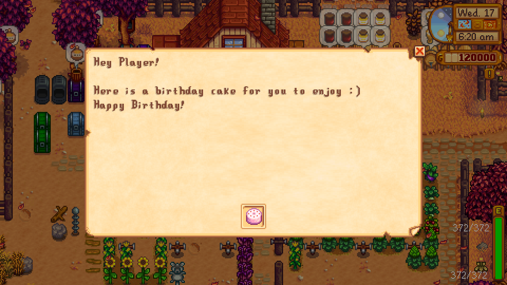
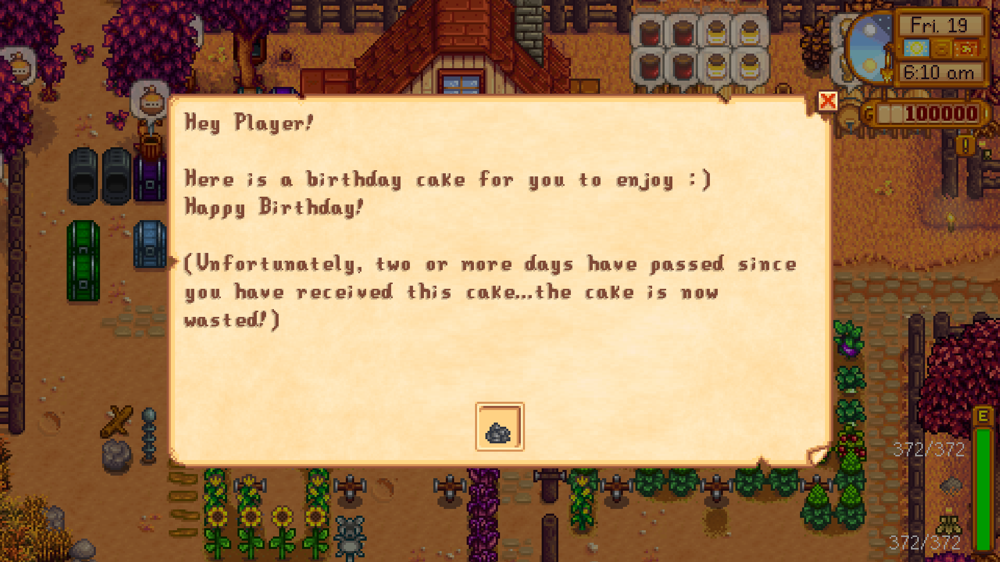
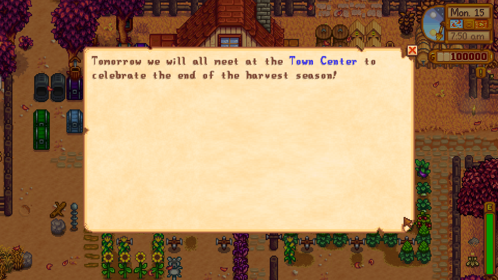
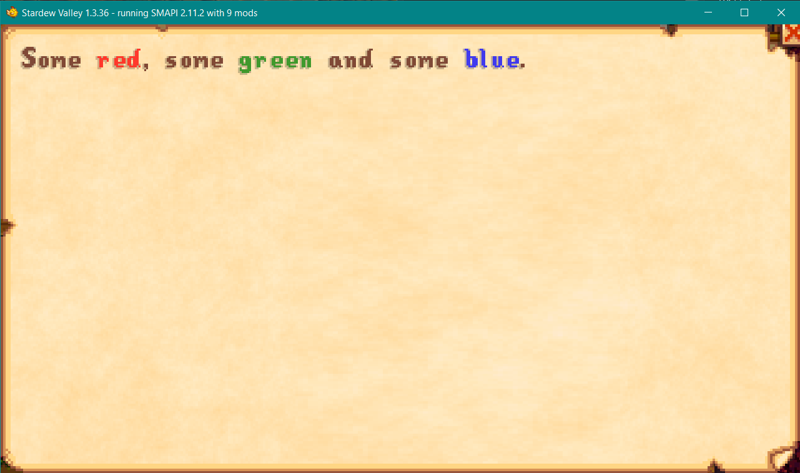
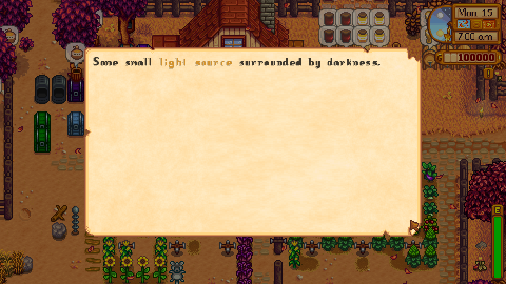
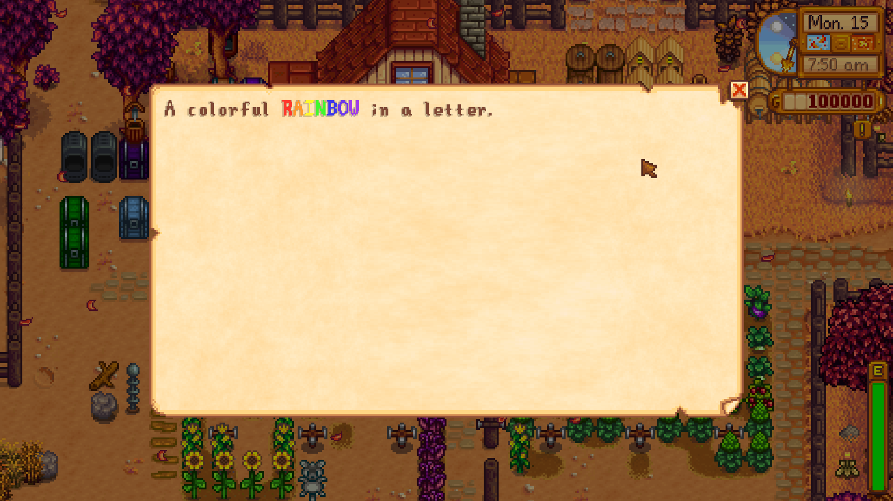
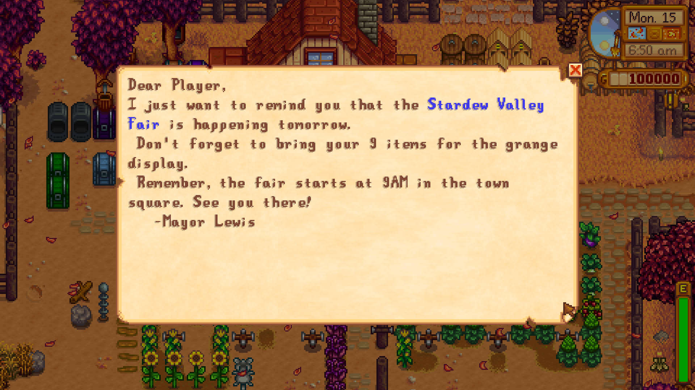

**You're viewing a file in the SMAPI mod dump, which contains a copy of every open-source SMAPI mod
for queries and analysis.**

**This is _not_ the original file, and not necessarily the latest version.**  
**Source repository: https://github.com/Felix-Dev/StardewMods**

----

# Mail API Overview

The Mail API of the framework exposes a couple of features modders can use:
* Easy and powerful way to add mails to the game
* Dynamic mail content
* Get feedback on player interaction with mail content
* Add visual emphasis to mail content

Note: Not every feature requires mails to be added to the game via the framework!

## Table of Contents
* [Add Mails](#add-mails)
* [Dynamic Mail Content](#dynamic-mail-content)
* [Get Player Interaction Feedback](#get-player-interaction-feedback)
* [Add Visual Emphasis to Mail Content](#add-visual-emphasis-to-mail-content)
* [Compatibility](#compatibility)
* [See also](#see-also)

## Add Mails
The Mail API provides an easy and powerful way to add mails to the game:
* Mails can be added to the player's mailbox either *instantly* or at the *begin* of a new day.
* Mail IDs are *unique* to each mod. Multiple mods can add mails with the same IDs without any ID conflicts arrising between those mods.

Let's take a first look at code adding a mail to the game.
```cs
private void AddMailExample()
{
   // Obtain an exclusive mail service for this mod.
   IMailService mailService = ServiceFactory.GetFactory("YourModID").GetMailService();

   // Create a mail to send to the player. Here we create a mail with some text content and an attached axe.
   var mail = new ItemMail("MyItemMailID", "Some text content", new Axe());

   // Send the mail to the player. It will arrive in the player's mailbox at the beginning of the next day. 
   mailService.AddMail(mail, 1 /* mail for tomorrow */);
}
```
Let's dissect the code and talk about the different parts in more detail.

First off, obtain an ```IMailService``` instance unique to your mod. 
```cs
IMailService mailService = ServiceFactory.GetFactory("YourModID").GetMailService();
```
We will use this instance to add mails to the game in a mod-isolated way, that is multiple mods can add mails with the _same_ ID to the game 
without the risk of conflicts.

Next, we create an instance of the mail we want to send to the player.
```cs
var mail = new ItemMail("MyItemMailID", "Some text content", new Axe());
```
Here, we create an instance of an ```ItemMail```. ```MyItemMailID``` is the ID of our mail, ```Some text content``` is the text content of the mail and ```new Axe()``` is the attached item to the mail.

Finally, we tell our previously obtained mail service to add the mail to the game.
```cs
mailService.AddMail(mail, 1 /* mail for tomorrow */);
```
With the above line, we specify that our above created item mail will arrive in the player's mailbox in the morning of the next day. If, instead, we want to *instantly* send the mail we would have to write:
```cs
mailService.AddMail(mail, 0 /* instant mailbox arrival */);
```

The examples above show how to schedule mails by specifying a *day offset*. You can also, however, specfiy a *specific* mailbox arrival day. Here is how the above examples will look like using specific days:
```cs
mailService.AddMail(mail, SDate.Now() /* instant mailbox arrival */);

mailService.AddMail(mail, SDate.Now().AddDays(1) /* mail for tomorrow */);
```

Please note that a mod cannot have multiple mails with the same ID scheduled for the same day in the player's mailbox *at the same time*.

### Supported Mail Types
Below is a list of all supported mail types:

| Mail Type       | Description                                             | Remarks                                                     |
|:---------------:|---------------------------------------------------------| ----------------------------------------------------------- |
| Mail            | Mail with text content only.                            | Text content can be the _empty_ string (for all mail types).|
| ItemMail        | Mail with text content and zero or more attached items. |                                                             |
| MoneyMail       | Mail with text content and attached money.              | Supported currencies: *Money*, *Star Tokens*, *Qi coins*    |
| QuestMail       | Mail with text content and zero or one attached quest.  | Attached quest can be accepted *automatically* or *manually.*  |
| RecipeMail      | Mail with text content and zero or one attached recipe. | Supported recipe types: *Cooking*, *Crafting*               |

## Dynamic Mail Content
The mail framework provides a `MailOpening` event consuming mods can use to change mail content (such as text, attached items/money/quest/recipe) before the mail is actually shown. Let's look at some example code:
```cs
private void BirthdayMailOpeningExample()
{
   IMailService mailService = ServiceFactory.GetFactory("YourModID").GetMailService();

   // Add an event handler for the mail-opening event.
   mailService.MailOpening += OnMailOpening;

   // Create a mail with an attached birthday cake.
   var birthdayCake = new StardewValley.Object(Vector2.Zero, 221 /* pink cake ID */, 1);
   var mail = new ItemMail("BirthdayMail", "Hey Player!^^Here is a birthday cake for you to enjoy :)^Happy Birthday!", birthdayCake);

   mailService.AddMail(mail, 1);
}

private void OnMailOpening(object sender, MailOpeningEventArgs e)
{
   // Only proceed to change the mail content when the closed mail is our birthday cake mail.
   if (e.Id == "BirthdayMail")
   {
       // If the cake has already been attached to the mail for two days or longer we replace it with a trash item
       // (cake is now wasted).
       if (SDate.Now() >= e.ArrivalDay.AddDays(2))
       {
           // Get the changeable mail content for a mail.
           var itemMailContent = (ItemMailContent)e.Content;
           
           // Create the new trash item replacing our original birthday cake.
           var trash = new StardewValley.Object(Vector2.Zero, 168 /* trash item ID */, 1);

           // Replace the attached birthday cake item with a "wasted cake" and add
           // some explanation message to the mail's text content for the player.
           itemMailContent.Text += "^^(Unfortunately, two or more days have passed since you have received this cake...the cake is now wasted!)";
           itemMailContent.AttachedItems = new List<Item>() { trash };
       }
   }
}
```
What does this code do? It sends the following mail to the player to celebrate their birthday:



When the player opens the mail, we check how much time has passed since the mail has been added to the player's mailbox, in other words, how long the cake has been wasting away attached to the mail (without being put in a freezer). If two or more days have since passed when the player opens said mail, we update the mail content to replace the birthday cake with a now wasted cake. The result is the following:



Now let's dissect the code again:
As seen previously, we first obtain a mail service for our mod to use. Once obtained, we add a handler for the `MailOpening` event:
```cs
// Add an event handler for the mail-opening event.
mailService.MailOpening += OnMailOpening;
```
We then proceed to add a mail to the game as usual. The interesting part of this example happens in our specified event handler `OnMailOpening`:

First off, we check if the ID of the closed mail matches the ID we gave our birthday mail.
```cs
// Only proceed to change the mail content when the closed mail is our birthday cake mail.
if (e.Id == "BirthdayMail")
{
```
The `MailOpeningEventArgs` exposes the ID of the closed mail in its `Id` property. Now that we know the closed mail is our birthday cake mail, we next have to find out how much time the arrival of this mail in the player's mailbox has since passed before the player actually opened it.
```cs
// If the cake has already been attached to the mail for two days or longer we replace it with a trash item
// (cake is now wasted).
if (SDate.Now() >= e.ArrivalDay.AddDays(2))
{
```
Again, the event data contains just the information we need! Its property `ArrivalDay` contains the actual in-game date when the mail was added to the player's mailbox. In the case that two or more days have since passed, we now proceed to replace the original birthday cake with a wasted version:
```cs
// Get the changeable mail content for a mail.
var itemMailContent = (ItemMailContent)e.Content;

// Create the new trash item replacing our original birthday cake.
var trash = new StardewValley.Object(Vector2.Zero, 168 /* trash item ID */, 1);

// Replace the attached birthday cake item with a "wasted cake" and add
// some explanation message to the mail's text content for the player.
itemMailContent.Text += "^^(Unfortunately, two or more days have passed since you have received this cake...the cake is now wasted!)";
itemMailContent.AttachedItems = new List<Item>() { trash };
```
The content of a mail which can be changed is provided by the `Content` property of the event data. Since our birthday cake mail is of type `ItemMail`, the changeable content is of type `ItemMailContent`. (For other mail types, the same naming schema is used, i.e. `RecipeMailContent`, `QuestMailContent`,....). In the case of an `ItemMail` both the text content as well as the attatched items of a mail can be changed. That way, we can easily update our birthday cake mail to now contain a wasted birthday cake instead of the originally fresh and tasty cake!

#### Changeable Mail Content
Below is a table describing the mail content which can be changed for each mail type:

| Mail Type       | Changeable Content                                                                               |
|:---------------:|--------------------------------------------------------------------------------------------------|
| Mail            | &bull; Mail Text                                                                                 |
| ItemMail        | &bull; Mail Text <br/> &bull; Attached Items                                                     |
| MoneyMail       | &bull; Mail Text <br/> &bull; Monetary Value <br/> &bull; Currency of Monetary Value             |
| QuestMail       | &bull; Mail Text <br/> &bull; Quest ID <br/> &bull; Quest Type <br/> &bull; Quest Acception Type |
| RecipeMail      | &bull; Mail Text <br/> &bull; Recipe Name <br/> &bull; Recipe Type                               |


## Get Player Interaction Feedback
The mail framework provides a `MailClosed` event consuming mods can use to receive feedback about how the player interacted with the mail's content when the mail has been closed. For example the attached items the player selected or if the player accepted the attached quest. Let's look at some example code:
```cs
private void BirthdayMailClosedExample()
{
   IMailService mailService = ServiceFactory.GetFactory("YourModID").GetMailService();

   // Add an event handler for the mail-closed event.
   mailService.MailClosed += OnMailClosed;

   // Create a mail with an attached birthday cake.
   var birthdayCake = new SObject(Vector2.Zero, 221 /* pink cake ID */, 1);
   var mail = new ItemMail("JasBirthdayMail", "Hey Player!^I made a birthday cake for you.^^Happy Birthday!^-Jas", birthdayCake);

   mailService.AddMail(mail, 1);
}

private void OnMailClosed(object sender, MailClosedEventArgs e)
{
   // We are only interested in the player's interaction with Jas' birthday mail.
   if (e.Id == "JasBirthdayMail")
   {
       // Get the player's interaction record for this mail.
       var interactionRecord = (ItemMailInteractionRecord)e.InteractionRecord;

       // The player selected Jas' birthday cake.
       if (interactionRecord.SelectedItems.Any(itm => itm.ParentSheetIndex == 221 /* pink cake ID */))
       {
           // Jas is happy you enjoyed her birthday cake!
       }
       // The player didn't select Jas' birthday cake.
       else
       {
           // Jas is angry and disappointed!
           Game1.player.changeFriendship(-10000, Game1.getCharacterFromName("Jas"));
       }
   }
}
```
What happens here? In this example, Jas sends the player a birthday mail with a birthday cake she worked hard through the whole night to make it perfect. Obviously, she is now wants to know whether you enjoyed her cake! Conversely if you, the player, just outright dismiss her hard work, she will be extremely angry and disappointed! Let's see how the code implements this (it's similar to the above's Mail-Opening event code example):

FIrst off, we add a handler for the `MailClosed` event of our mail service:
```cs
// Add an event handler for the mail-opening event.
mailService.MailClosed += OnMailClosed;
```
In our event handler, we then check if ID of the closed mail matches the ID of Jas' birthday mail:
```cs
// We are only interested in the player's interaction with Jas' birthday mail.
if (e.Id == "JasBirthdayMail")
{
```
Next, we obtain the player's interaction record with the content of Jas' birthday mail:
```cs
// Get the player's interaction record with this mail.
var interactionRecord = (ItemMailInteractionRecord)e.InteractionRecord;
```
Since Jas' birthday cake mail is of type `ItemMail`, its mail interaction record is of type `ItemMailInteractionRecord`. (For other mail types, the same naming schema is used, i.e. `RecipeMailInteractionRecord`, `QuestMailInteractionRecord`,....).

Now that we have the interaction record, we can find out whether the plaayer actually took Jas' birthday cake out of the mail or if they just heartlessly threw it away:
```cs
// The player selected Jas' birthday cake.
if (interactionRecord.SelectedItems.Any(itm => itm.ParentSheetIndex == 221 /* pink cake ID */))
{
  // Jas is happy you enjoyed her birthday cake!
}
// The player didn't select Jas' birthday cake.
else
{
  // Jas is angry and disappointed!
  Game1.player.changeFriendship(-10000, Game1.getCharacterFromName("Jas"));
}
```
The `ItemMailInteractionRecord` class contains two properties `SelectedItems` and `UnselectedItems` which tell us which attached mail items were selected by the player and which were not, respectively. In case the cake is not inluded in `SelectedItems` we automatically know it was not selected by the player (in fact, it is included in the `UnselectedItems` list). From there, we express Jas' anger and disappointment towards the player.

#### Mail Player Interaction Record Overview
Below is a table describing the different mail interaction records for each mail type:

| Mail Type       | Player Interaction Record                                                   |
|:---------------:|-----------------------------------------------------------------------------|
| Mail            | -                                                                           |
| ItemMail        | &bull; Items selected <br/> &bull; Items not selected                       |
| MoneyMail       | &bull; Received monetary value <br/> &bull; Currency of monetary value      |
| QuestMail       | &bull; ID of attached Quest <br/> &bull; Whether quest was accepted         |
| RecipeMail      | &bull; Name of the recipe obtained <br/> &bull; Type of the recipe obtained |


## Add Visual Emphasis to Mail Content
The Mail API introduces a **Text Coloring API** to provide visual emphasis options to a mail's content. This API is available both for mails added via the framework and mails added via other frameworks, such as [Content Patcher](https://github.com/Pathoschild/StardewMods/tree/develop/ContentPatcher).

The Text Coloring API provides a Markup-language based syntax to be used together with the actual mail content and thus requires no programming skills or special compatibility by the used frameworks to add mails to the game.

### Syntax

Enclose the text you want to color with the `<color></color>` tags. See the following example:
```
<color=COLOR_VALUE>some text</color>
```
The string "some text" will be rendered with the color specified by `COLOR_VALUE`. Color values can be specified using the following color representations:
1. A hexadecimal color-code specified as `#RRGGBB`, where the RR (red), GG (green) and BB (blue) hexadecimal integers specify the components of the color. All values must be between 00 (lowest value) and FF (highest value) and the values are *case-insensitive*.
2. A HTML color name. See [this color table](https://htmlcolorcodes.com/color-names/) for a list of all valid color names. Names are *case-insensitive*.

If we want to color the above text "some text" in red, we thus can write it as follows:
```
<color=#FF0000>some text</color>
``` 
-or- 
```
<color=Red>some text</color>
```

Note: Any leading, trailing or inner white-space characters in `COLOR_VALUE` will be ingored (i.e. `DodgerBlue` and `dodger blue` are both valid names).

Every mail content can contain zero or more `<color></color>` tag pairs. Any mail content which is not enclosed by such a pair, will be 
colored in the game's default text color (based on the mail background). You can have multiple `<color></color>` tags side-by-side and you can even use nested `<color>` start tags (`<color>` tags inside other `<color>` tags).

A valid text-coloring syntax thus is defined as the following (instead of a color value in the format `#[A-Fa-f0-9]{6}` a HTML color name can also be used):
```
...<color=#[A-Fa-f0-9]{6}>...</color>...
```
where the three dots `...` can stand for optional text and `<color></color>` tags. If an invalid color value is specified, the default text color will be used (typically the in-game default text color). If there is a mismatch between the color start tags and the color end tags, the text will not be displayed correctly.

### Examples

Below are a couple of examples showcasing different levels of complexity in the use of this API and how they will look in the actual game.

Example 1:
```
"Tomorrow we will all meet at the <color=#0000FF">Town Center</color> to celebrate the end of harvest season!"
```


Example 2:
```
"Some <color=#FF0000>red</color>, some <color=Green>green</color> and some <color=#0000FF>blue</color>."
```


Example 3:
```
"<color=#000000>Some small <color=#C47902>light source</color> surrounded by darkness.</color>"
```


And below is a personal favorite of mine:
```
"A colorful <color=#FF0000>R</color><color=#FF7F00>A</color><color=#FFFF00>I</color><color=#00FF00>N</color>"<color=#0000FF>B</color><color=#3F00FF>O</color><color=#7F00FF>W</color> in a letter."
```


### How to use the API in other mod frameworks?

Below is an example how to use the Text Coloring API in Content Patcher by editing the content of an already existing mail (applying the 
API to a new custom mail will work in the same way):

Create the following content.json file (based on CP 1.9 which was the most recent CP version available at the time of this writing):
```js
{
   "Format": "1.9",
   "Changes": [
    {
      "Action": "EditData",
      "Target": "Data/Mail",
      "Entries": {
        "fall_15": "Dear @,^I just want to remind you that the <color=#0000FF>Stardew Valley Fair</color> is happening tomorrow.^ Don't forget to bring your 9 items for the grange display.^ Remember, the fair starts at 9AM in the town square. See you there!^   -Mayor Lewis"
      }
    }
   ]
}
```
As you can see, we enclosed the words "Stardew Valley Fair" with `<color=#0000FF></color>`. This will result in the following mail content when a player named "Player" will open the mail with the ID "fall_15":



As simple as that!

## Compatibility
* Compatible with Stardew Valley 1.3 on Windows/Linux (Mac likely, but not tested).
* Works in both single-player and multiplayer.
* Not compatible with Digus' Mail Framework mod (compatibility might be added in later versions).

## See also
* [FeTK Overview](../../../README.md)