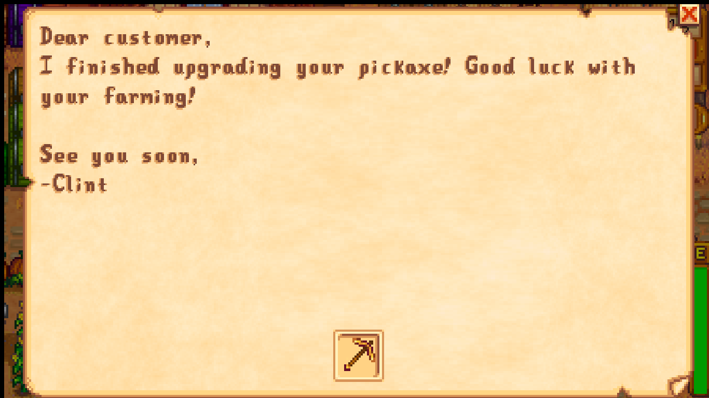

**Tool-Upgrade Delivery Service** is a [Stardew Valley](http://stardewvalley.net/) mod which makes retrieving upgraded farm tools 
less tedious. With this mod, Clint (the blacksmith) will simply send you a mail with the upgraded tool included as soon as 
the upgrade is finished. No more visiting the blacksmith simply to get your improved farm tool!

## Contents
* [Install](#install)
* [Use](#use)
* [Showcase](#showcase)
* [Compatibility](#compatibility)
* [See also](#see-also)

## Install
1. [Install the latest version of SMAPI](https://smapi.io/).
2. [Install this mod from Nexus mods]().
3. Run the game using SMAPI.

## Use
Order a tool upgrade as usual. Check your mailbox the following days for a mail sent by Clint with the tool included. 
If you want, you can still receive the tool by visiting the blacksmith. In this case, the tool won't be included in the mail.

## Showcase
* An example mail sent by Clint:
  

## Compatibility
* Compatible with Stardew Valley 1.3 on Windows/Linux (Mac likely, but not tested).
* Works in both single-player and multiplayer.
* This mod is compatible with the mod [Rented Tools](https://www.nexusmods.com/stardewvalley/mods/1307). When you add the upgraded tool to your inventory, Clint's rented tool will be sent back to him.
* This mod is compatible with the mod [Prismatic Tools](https://www.nexusmods.com/stardewvalley/mods/2428).

## See also
* [Release notes](release-notes.md)
* [Nexus mod](https://www.nexusmods.com/stardewvalley/mods/2938)
