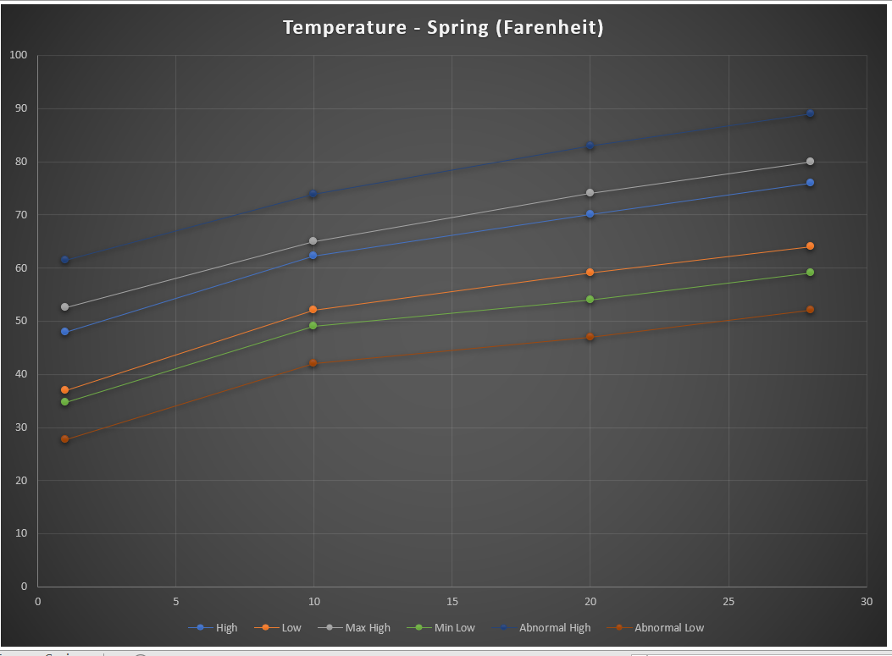
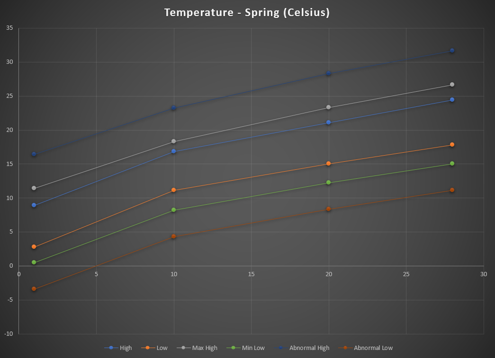

# Normal (Default) Climate

This shows off all of the features of Climates. In versions before 2.0 these were the enhanced versions. In an effort to simplify mainteance, this merges into one file. In an effort to make it easier for people to turn off fog, I've restructured the climates.

## 1. Spring

Springs start at 
 * 48 F/37F (8.89C /2.78 C) with about +4.5F/-2.3 F(+2.5 C/-1.28 C) variation in temperature for the first week
 * In the second week, it rises to about 62.3F/52 F(16.83 C/11.11 C) by mid Spring. Variation dies down, to about +2.6F/-2.9 F (1.44C/-1.61 C). 
 * As the Spring dies down, it rises to 70F/59 F (21.11 C/15 C) and ends the season about 76 F/64 F (24.44 C/17.78C), with a variation of +4 F/-3 F (+2.22C/-1.67 C). Lows are more variant, to -5F (-2.78 C). 

 Abnormal cold and heat is about 20% likely throughout the season, with more chances of cold (35% to 20%) vs hot (20% flat) in the beginning. In this season, abnormal cold is -7 F (-3.89 C), and abnormal heat is +9 F (5 C)

For a visual breakdown, see:

While the season starts out wet (~40% chance of rain), the chances of rain drop throughout the season. Storms start moving in towards the end as often as rain. Days have a good chance to be windy, with mostly gentle winds. With the season, fogs are somewhat frequent, mostly around the beginning of the season, while evening fogs are infrequent.

Sandstorms are likelier towards the end of the season, but never exceed 5%. Blizzards are 10% possible, but white outs never. 

Rain stays gentle to light, with a few storms moving through, and wind is primarily NW to W, light. Major lightning storms are unlikely

Chances of typhoons are minimal. 

Flower Rain conversion: 30% (highest)
Jumino Weather: Random chance that a sunny day will be jumino instead: 1.5% pre CC completion, 7.5% pre Movie Theatre completion, 15% post both.

## 2. Summer

Summers are warm, starting at 80 F/66 F (26.67 C/18.89 C) with a variation of +3.2F/-1.6F (1.78C/-.89C) in the first week, rising to 88 F/72 F (31.11 C/22.22 C) mid-season, with a variation of +4.5F/-2F (+2.5 C/-1.11 C). In the final week, it begins to cool for the upcoming fall - dropping to 74 F/62 F (23.33C/16.67 C), with a variation of +3F/-3F (1.67 C/-1.67 C)

The season is somewhat dry, with rain chances never really exceeding 25%. Due to the temperature, winds are somewhat gentle. Storms are as likely as rain throughout the season. Fogs are extremely rare in this season. 

Abnormal cold and heat is about 40% likely throughout the season, with more chances of hot (flat 40%) vs cold (20%) throughout. In this season, abnormal cold is -9 F (-5 C), and abnormal heat is +9 F(5 C)

Sandstorms have a flat chance of 10%, although heavy winds raise this by 5% for every 1.5 kph (.932 mph) over 16kph (10 mph). Blizzards are 1% possible. Somehow. 

Rain is more variable light to severe, especially during storms. Wind is primarily NW to W, light to medium. Major lighting storms have an average chance.

Chances of typhoons are normal.

Flower Rain conversion: 10% 
Jumino Weather: Random chance that a sunny day will be jumino instead: .75% pre CC completion, 5% pre Movie Theatre completion, 10% post both.

## 3. Fall

Fall is the best season. I mean, Fall is a time when it gets chilly out there.

Fall is the best season. I mean, Fall is a time when it gets chilly out there.

The weather starts at 71 F/62 F (21.67 C/16.67 C), falling to 64 F/56 F (17.78 C/13.33 C) in the first week, with varations of +2 F/-4.5 F(+1.11 C/-2.5 C). These variations remain constant throughout the season. The temperature continues falling, and by the end of the middle of the season - the temperature is 48F/39F (8.89 C/3.89C), and frosts become possible. In the end of the season, the temperature average is 34F/27F (1.11 C/-2.78 C).

The season gets wet rapidly, with rain chances starting at 30% and rising to 55% by the end of the season. Storms drop from 50% to 10% as likely. Fogs are very common throught the season, with sandstorms dropping to 5% likely.  Blizzards become more possible, although unlikely, rising to 10% by the end of the season.

Rain continues to be variable as summer, with the wind changing from NW-W to E-SE as the season goes through. Major lightning storms drop to 5%. Wind can reach a fresh gale often.

Chances of typhoons are normal.

Flower Rain conversion: 15%
Jumino Weather: Random chance that a sunny day will be jumino instead: .75% pre CC completion, 5% pre Movie Theatre completion, 10% post both.

## 4. Winter

Winters are cold, starting at 34F/27F (1.11 C/-2.78C), with variations of +2.2 F/-5.5 F (???). By the end of the middle, it falls to 21F/14 F (-6.11 C/-10 C), with particularly cold days falling into the teens (18 F/10 F [-7.78 C/-12.22 C] before variations. It begins to warm again in the last part of the season rising to 36 F/29 F(2.22 C/-1.67 C). 

The season is intermittenly snowy, at roughly 55%. Storms are vanishingly rare (at 1%). Fogs are reasonbly unlikely (10%), but will be freezing fogs. Wind is always from the E-SE, and will be gentle to a light gale. Blizzards are likely

Chances of typhoons are 1%. 

Flower Rain conversion: 1%
Jumino Weather: Random chance that a sunny day will be jumino instead: .25% pre CC completion, 1% pre Movie Theatre completion, 5% post both.