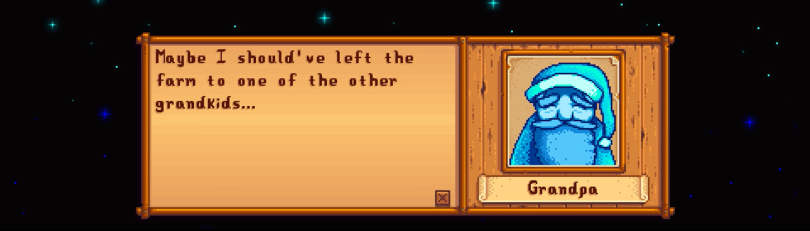
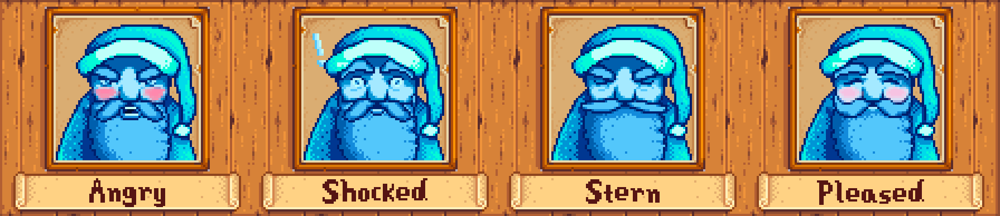

  
<i>TRANSLATION INFO:</i>

  
  - Traduction française incluse! (mes propres efforts) | [informations de configuration](https://www.nexusmods.com/stardewvalley/articles/460)
  - Tradução para o português incluída, graças ao [Nathan2076](https://www.nexusmods.com/users/80828368)! | [informações de configuração](https://www.nexusmods.com/stardewvalley/articles/461)

---

# Angry Grandpa
*He's only angry when you've earned it!*

In early 2016 versions of Stardew Valley, grandpa's evaluation was much tougher. There were fewer ways to earn points (13 total), and 12 points were required to obtain 4 candles. If you disappointed grandpa, his original dialogue was pretty harsh...

  
<i>Original 1-candle result:</i>

  
  

Angry Grandpa mod gives a huge overhaul to the evaluation system! Restore the original dialogue, keep it as is, or use new `"Nuclear"` dialogue, all with new portrait expressions to match! You can see your actual points total during evaluations, customize the scoring system used, re-evaluate even after earning 4 candles, reschedule grandpa's visit to happen earlier or later in the game, and earn new rewards for achieving a 1, 2, or 3 candle result.

**Can be used on existing late-game saves:** Angry Grandpa comes with a `reset_evaluation` console command. You can use this command to redo all evaluations on an existing save and experience everything new from scratch.

## Features
### Dialogue Changes
Choose from the `"Original"` (pre-SDV v1.05) game dialogue, `"Vanilla"` normal game dialogue, or creative *new* `"Nuclear"` dialogue for grandpa's evaluation response! **Warning: `"Nuclear"` dialogue includes profanity and a lot of sass.** All dialogue variants can be made gender-neutral with an optional setting.

### Expressive Portraits
Grandpa gets a lot more personality with new, expressive portraits edited by [TayLindsey](https://www.nexusmods.com/users/84157593)! A total of **eleven** new facial expressions are used to give flavor and variety to all dialogues. (Some portraits are only used in certain dialogue variants. If you want to experience them all, choose `"Nuclear"` dialogue with a higher difficulty setting.)

### Scoring System Overhaul
Choose your difficulty setting with different point thresholds. Relive the earliest versions of Stardew Valley with only 13 possible grandpa points available to earn... or use the new evaluation system with all 21 available points, but harder thresholds for earning a 4-candle result. This setting defaults to `"Vanilla"`, so you'll need to change it if you want more of a challenge!

**Choose from:** `"Original"`, `"Vanilla"`, `"Hard"` or `"Expert"`

  
<i>How many points are required to get candles?</i>

  
  | result  | `"Original"` | `"Vanilla"` | `"Hard"` | `"Expert"` |
  |---------|:------:|:------:|:------:|:------:| 
  |1 candle |   0    |   0    |   0    |   0    | 
  |2 candles|   4    |   4    |   10   |   15   | 
  |3 candles|   8    |   8    |   14   |   18   | 
  |4 candles|   12   |   12   |   18   |   21   | 

<i>How do you earn grandpa points?</i>
 

**In early versions of Stardew Valley, there were 13 points available to earn.**
This set of criteria is **only** used for AngryGrandpa's `"Original"` scoring difficulty level.

<i>Click for list of 13-point criteria</i>

    
  - Earn 100k gold (1 point)
  - Earn 200k gold (1 point)
  - Earn 300k gold (1 point)
  - Earn 500k gold (1 point)
  - Earn 1 million gold (1 point)
  - Total 50 levels in skills (all at max) (1 point)
  - Married with second house upgrade (1 point)
  - At least 8 hearts of friendship with 10 villagers (1 point)
  - Finish Community Center (1 point)
  - A Complete Collection achievement (finished museum) (1 point)
  - Master Angler achievement (catch every fish) (1 point)
  - Full Shipment achievement (ship every item) (1 point)
  - Find every stardrop (1 point)

  
 
  
**In the current version of Stardew Valley, there are 21 points available to earn:**
This set of criteria is used for AngryGrandpa's `"Vanilla"`, `"Hard"`, and `"Expert"` scoring difficulty levels.

<i>Click for list of 21-point criteria</i>

  
  - **Earn 50k gold (1 point)**
  - Earn 100k gold (1 point)
  - Earn 200k gold (1 point)
  - Earn 300k gold (1 point)
  - Earn 500k gold (1 point)
  - Earn 1 million gold **(2 points)**
  - **Total 30 levels in skills (1 point)**
  - Total 50 levels in skills (all at max) (1 point)
  - Married with second house upgrade (1 point)
  - **At least 8 hearts of friendship with 5 villagers (1 point)**
  - At least 8 hearts of friendship with 10 villagers (1 point)
  - Have 999 friendship points with your pet (1 point)
  - **Find the rusty key (1 point)**
  - **Find the skull key (1 point)**
  - Finish Community Center (1 point)
  - **See the finished Community Center cut-scene (2 points)**
  - A Complete Collection achievement (finished museum) (1 point)
  - Master Angler achievement (catch every fish) (1 point)
  - Full Shipment achievement (ship every item) (1 point)

  

 

You can customize the schedule for grandpa's initial visit, which usually happens at the beginning of Year 3. If you choose, grandpa can whip you into shape as soon as you arrive on the farm... or you can delay his visit for decades!

### Display Points Total
A re-added feature from early game versions. You can now see your exact point total during evaluations (out of 21 or 13 possible points). You can use a diamond to request a re-evaluation and see your new score at *any* time, even after earning 4 candles.

### More Rewards
With bonus rewards enabled, grandpa's shrine will give you new, useful gifts for reaching milestones under 4 candles. The new bonus rewards for 1+, 2+ and 3+ candles are available to everyone in a multiplayer game.

  
<i>Click to see the new rewards</i>

  
  - 1+ candles - ancient seed artifact
  - 2+ candles - dinosaur egg
  - 3+ candles - prismatic shard

If you earn 4 candles in your first evaluation, you will be given all three bonus rewards plus the usual vanilla reward for 4 candles. If you install this mod after already earning 4 candles, re-doing the evaluation will give you the bonus rewards. Bonus rewards can be disabled in the config.

### Farmhand Rewards
In vanilla multiplayer games, scoring is done individually, but only one Statue of Perfection (the 4-candle reward) can be obtained from grandpa's shrine. With the `StatuesForFarmhands` setting enabled, Angry Grandpa now allows every player in a game to receive their own statue once they've earned 4 candles.

If you install this mod on an existing save, it will assume that any existing Statue of Perfection in the game world belongs to the host. The host player will **not** be able to receive extra statues by using the `reset_evaluation` command.

### Translation Support
No translations are available yet, but the mod is designed with full language support! If you would like to help translate this mod, you can [contribute here](https://github.com/StardewModders/mod-translations/issues/31). Submitted translations will be included in future mod updates.

## User Information
### COMPATIBILITY
- Stardew Valley v1.4 or later;
- Linux, Mac, Windows, and Android.
- Single-player and multiplayer. Can be installed by some OR all players - see Multiplayer section for details.

### INSTALLATION
- [Install the latest version of SMAPI.](https://smapi.io/)
- Download this mod from [Nexus](https://www.nexusmods.com/stardewvalley/mods/6324) or the [GitHub Release](https://github.com/Jonqora/StardewMods/releases) list.
- Unzip the mod and place the `AngryGrandpa` folder inside your `Mods` folder.
- Run the game using SMAPI.

### USING THE MOD
If you are using this mod on a NEW save, or one where grandpa has not visited yet, choose whatever config settings you like! They will be used when grandpa makes his future visits. 

If you are currently in Year 1 and want grandpa to visit right away, you can set `YearsBeforeEvaluation` to `0`.

If you are using this mod on an EXISTING save (grandpa has already visited), you have two options:

1. You can request a re-evaluation at grandpa's shrine. Angry Grandpa mod enables infinite re-evaluations even after earning 4 candles, and the option to request one should be available right away.
2. You can **reset** all past evaluations with a special command by typing `reset_evaluation` in the SMAPI console. If the current in-game year is greater than the `YearsBeforeEvaluation` setting in config, grandpa should appear the next morning.

**PLEASE NOTE: to activate the Bonus Rewards or Statues for Farmhands features, you must complete a grandpa evaluation OR re-evaluation event with this mod installed.**

## Multiplayer
Angry Grandpa mod is HIGHLY customizable in multiplayer. As long as you don't change `YearsBeforeEvaluation`, all features of this mod should work even if you are the only person who uses it! This mod only affects gameplay for players who install it.

If multiple players install this mod, each player can have personalized settings. You can set individual dialogue variants, portrait use, scoring settings, and even bonus rewards! Farmhands can use the `StatuesForFarmhands` feature even if the host player does not have this mod installed. (Warning: if the host player has not installed this mod, they can only obtain a Statue of Perfection if they are the **first** player to collect it.)

If you want to use the scheduling feature of this mod in multiplayer, all players must have this mod installed and all players must use the **same** setting for `YearsBeforeEvaluation`.

If you install this mod on an existing multiplayer save and want to redo past evaluations, the `reset_evaluation` command must be used by the **host player**.

## Config Settings
After running SMAPI at least once with Angry Grandpa installed, a `config.json` file will be created inside the `AngryGrandpa` mod folder. Open it in any text editor to change your config settings for Angry Grandpa.

**Optional:** Angry Grandpa Mod includes [Generic Mod Config Menu](https://www.nexusmods.com/stardewvalley/mods/5098) (GMCM) support. If you download this optional mod, you can use a settings button in the Stardew Valley menu screen to change your Angry Grandpa config while the game is running.

<i>Click to see mod author's recommended settings:</i>

These are not the mod's default settings, but I think they give the most interesting experience!

    {
        "GrandpaDialogue": "Nuclear",
        "GenderNeutrality": false,
        "ExpressivePortraits": true,
        "ScoringSystem": "Hard",
        "YearsBeforeEvaluation": 1,
        "ShowPointsTotal": true,
        "BonusRewards": true,
        "StatuesForFarmhands": true
    }

    
- **GrandpaDialogue:** Choose the dialogue used during evaluation and re-evaluation events. Default is `"Original"`.
  - `"Original"` - Harsher dialogue found in early versions of the game
  - `"Vanilla"` - Normal dialogue used in the game ever since version 1.05 was released
  - `"Nuclear"` - Grandpa is *very* enthusiastic about his opinions, good or bad. **Warning: profanity!**

- **GenderNeutrality:** Removes all references to player gender in grandpa's dialogue. Defaults to `true` if  [Gender Neutrality mod](https://www.nexusmods.com/stardewvalley/mods/722) is installed. Otherwise defaults to `false`.

- **ExpressivePortraits:** Gives grandpa a variety of new facial expressions to use in all evaluation dialogue. Defaults to `true`.

- **ScoringSystem:** Choose how points are scored and how many points are required to earn 4 candles. Default is `"Vanilla"`.
  - `"Original"` - Original (pre-SDV v1.05) game evaluation: 13 possible points, you need 12 to earn 4 candles.
  - `"Vanilla"` - Normal game evaluation: 21 possible points, you need 12 to earn 4 candles.
  - `"Hard"` - Harder scoring option. You need 18/21 points to earn 4 candles.
  - `"Expert"` - Hardest scoring option. You need all 21 points to earn 4 candles!

- **YearsBeforeEvaluation:** How many in-game years to wait before grandpa's first visit. Default is `2` - grandpa will appear Spring 1 of Year 3.

- **ShowPointsTotal:** Shows your raw score during the evaluation (e.g. "14 of 21 Great Honors"). Defaults to `true`.

- **BonusRewards:** You will get new bonus rewards for earning at least 1, at least 2, and at least 3 candles. Defaults to `true`.

- **StatuesForFarmhands:** In a multiplayer game, allows each farmhand to receive their own Statue of Perfection. Defaults to `true`.

## Notes
### ACKNOWLEDGEMENTS
* Immense kudos go to [TayLindsey](https://www.nexusmods.com/users/84157593) whose pixel art brings great new variety to grandpa's portraits!
* Much gratitude to ConcernedApe and [Pathoschild](https://www.nexusmods.com/stardewvalley/users/1552317?tab=user+files)!
* Thanks to those who provided help and support in the [Stardew Valley Discord](https://discordapp.com/invite/StardewValley) #making-mods channel.

### SEE ALSO
* Help [translate](https://github.com/StardewModders/mod-translations/issues/31) this mod to other languages
* Source code on [GitHub](https://github.com/Jonqora/StardewMods/tree/master/AngryGrandpa]GitHub)
* Check out [my other mods](https://www.nexusmods.com/users/88107803?tab=user+files)!