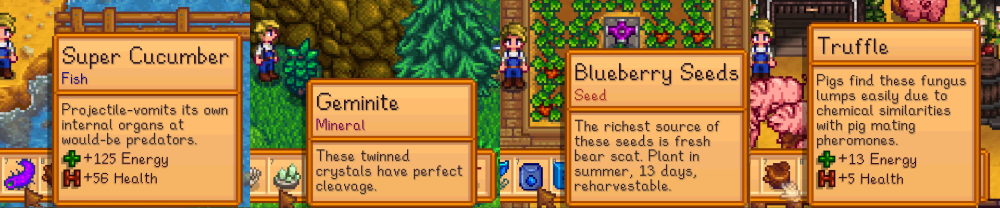

# Unsettling Item Descriptions
Does your game feel as bland as fiddlehead risotto? As common as carp? Install this slightly-spoopy mod to add mildly disturbing or uncomfortable descriptive text to over 800 in-game items!

*Currently includes reinvented descriptions for:*
* **534** small objects
* **106** large objects
* **38** weapons
* **13** boots
* **73** pants & shirts
* **42** hats
* **21** buildings
* **11** tools

---
## Q&A
### Q: Geez, those are some WEIRD nature facts. How much of this stuff is true?
**A. Most of it is true!** Don't treat us like a textbook—we can't *guarantee* the truth of every description. But we **did** do a lot of research for this mod, and tried to avoid spreading false information as facts. Remember that some of the animals, plants, and minerals in Stardew Valley are fictional or only loosely based on the real world. We may have gotten more creative for those. :)

By and large, though, the weirdest and most bizarre nature facts revealed in this mod are all **true**. We figure that weird-but-true facts are a lot more unsettling than fiction, anyway. Isn't it more uncomfortable when it's real?

### Q: Does this mod make it harder to play the game?
**A. Brand-new players *may* be disadvantaged by using this mod.** Sometimes, a helpful description relating to an item's purpose has been replaced with unsettling but less-informative text. If you're not already familiar with the purpose and use of most in-game items, you might have a harder time. We recommend that players use the [wiki](https://stardewvalleywiki.com/) to look up unfamiliar items!

The amount of information left out is **small**, and should not be a problem for experienced players. All descriptions for seed items, for example, still contain season, growth, and harvest information.

### Q: Hey! I found a description that isn't very unsettling.
**A. Feel free to suggest a better one!** Our [spreadsheets](https://docs.google.com/spreadsheets/d/1s3Upkb2qTd6m02gyfdLdIgkqdHE1TD2ga0LU8BdDnKY/edit?usp=sharing) are open for anyone to comment with suggestions or improvements. Generally speaking, the creepiness of individual descriptions in this mod may vary. Some are weird, and a few are just silly.

We are actively collecting suggestions for "silly" descriptions also, and will consider expanding this mod in the future to include an option making all descriptions silly, all unsettling, or fifty-fifty randomized. This depends on how many new descriptions we can collect, so please contribute your ideas!

---
## Showcase
A team of 20 people worked hard to bring you this mod! We would each like to share one of our favorite rewrites, beginning with the *Bouquet* description that started it all:

[Draylon](https://www.nexusmods.com/users/8049772)'s favorite: **Bouquet**
> A colorful bunch of severed plant reproductive organs. Maybe your sweetheart will get the hint?

[Arknir](https://www.nexusmods.com/stardewvalley/users/92469153)'s favorite: **Wilted Bouquet**
> As dead as your heart. Makes a thoughtful and symbolic gift.

[Ruukas](https://www.nexusmods.com/users/3391358)' favorite: **Plush Bunny**
> The fur looks awfully real.

[Undare](https://www.nexusmods.com/users/12004908)'s favorite: **Strange Bun**
> What's inside? OH SWEET YOBA IT'S SPIDERS!

Glowbug's favorite: **Mouse Ears**
> Me gonna be deaf now, poke.

[LenneDalben](https://www.nexusmods.com/users/18592979?tab=user+files)'s favorite: **Cave Carrot**
> A dirtier variety of carrot. Fulfills many needs of a miner.

[General Alexis](https://www.nexusmods.com/users/94394293)' favorite: **Axe**
> A perfect tool for chopping trees and stealing kneecaps.

Wobin's favorite: **Skeletal Hand**
> The age of these bones is about one thous... Oh! ...Oh no. They're much more recent.

[Jonqora](https://www.nexusmods.com/users/88107803)'s favorite: **Worm Bin**
> Produces bait. Close the lid to give the worms some privacy.

[ExnoticTest](https://www.nexusmods.com/users/85656033)'s favorite: **Quality Retaining Soil**
> Ohh yes! Keep the dirt wet all night long...

[ItsBenter](https://www.nexusmods.com/users/41011220)'s favorite: **Mermaid's Pendant**
> A ghost ripped this from a mermaid so you can woo your lover.

[Kat](https://github.com/KatrinaHoffert)'s favorite: **Explosive Ammo**
> Owing to improper storage, it causes hundreds of unfortunate child deaths each year.

ssoshwac's favorite: **Earmuffs**
> They won't block out the voices in your head...

[Gervig91](https://www.nexusmods.com/stardewvalley/users/24986819)'s favorite: **Treasure Chest**
> Many of the coins inside are stained an ugly dark reddish-brown, almost black.

[foggywizard](https://www.nexusmods.com/users/48380238)'s favorite: **Strange Doll (green)**
> What a beautiful smile you have.

Wingheart's favorite: **Log Cabin**
> Termites included.

[Forsy :D](https://www.nexusmods.com/users/84002498)'s favorite: **Living Hat**
> It slowly absorbs life energy from your scalp, waiting for the day you die.

[icecreamrat](https://www.nexusmods.com/users/91777683)'s favorite: **Official Cap**
> Wear this and you can get away with murder.

[Arcane](https://www.nexusmods.com/users/67314851?tab=user+files)'s favorite: **Shirt (made from Basalt)**
> May cause chaffing and bleeding of the nipples.

[SwiftIsHere](https://www.nexusmods.com/users/61873026)'s favorite: **Elvish Jewelry**
> Legend says they are enchanted to be as warm as their owners. It's cold to the touch.

---
## User Information
### COMPATIBILITY
- Stardew Valley v1.4 or later;
- [Content Patcher](https://www.nexusmods.com/stardewvalley/mods/1915) v1.16.0 or later (v1.16.4 and up recommended);
- Linux, Mac, Windows, and Android.
- Single-player and multiplayer. This mod only affects players who install it.

### INSTALLATION
- [Install the latest version of SMAPI.](https://smapi.io/)
- Install the latest version of [Content Patcher.](https://www.nexusmods.com/stardewvalley/mods/1915)
- Download this mod from [Nexus](https://www.nexusmods.com/stardewvalley/mods/6822) or the [GitHub Releases](https://github.com/Jonqora/StardewMods/releases) list.
- Unzip the mod and place the `[CP] Unsettling Item Descriptions` folder inside your `Mods` folder.
- Run the game using SMAPI.

### USING THE MOD
You should see the new item descriptions show up right away. Almost every description for objects, craftables, boots, weapons, and tools has been re-written. (There were a few that were already so unsettling we didn't change them.) Some—but not all—descriptions for hats, clothing, and buildings have been re-written as well.

If you want to help add to this mod by suggesting description ideas for missed items, you can join our contributor group by commenting on our [shared google speadsheet document!](https://docs.google.com/spreadsheets/d/1s3Upkb2qTd6m02gyfdLdIgkqdHE1TD2ga0LU8BdDnKY/edit?usp=sharing)

## Config Settings
After running SMAPI at least once with Unsettling Item Descriptions (and Content Patcher) installed, a `config.json` file will be created inside the `[CP] Unsettling Item Descriptions` mod folder. Open it in any text editor to change your config settings.

- **DescribeObjects:** Use unsettling descriptions for normal objects. Defaults to `true`.

- **DescribeBigCraftables:** Use unsettling descriptions for big craftables (large objects). Defaults to `true`.

- **DescribeWeapons:** Use unsettling descriptions for weapons. Defaults to `true`.

- **DescribeTools:** Use unsettling descriptions for tools. Defaults to `true`.

- **DescribeBoots:** Use unsettling descriptions for shoes and boots. Defaults to `true`.

- **DescribeHats:** Use unsettling descriptions for hats and headgear. Defaults to `true`.

- **DescribeClothing:** Use unsettling descriptions for pants and shirts. Defaults to `true`.

- **DescribeBuildings:** Use unsettling descriptions for farm buildings. Defaults to `true`.

---
## Notes
### ACKNOWLEDGEMENTS
* This project was made possible by the joint creativity of many people! Huge thanks to contributors [Draylon](https://www.nexusmods.com/users/8049772), [SwiftIsHere](https://www.nexusmods.com/users/61873026), [foggywizard](https://www.nexusmods.com/users/48380238), [Forsy :D](https://www.nexusmods.com/users/84002498), [ItsBenter](https://www.nexusmods.com/users/41011220), [Undare](https://www.nexusmods.com/users/12004908), [Ruukas](https://www.nexusmods.com/users/3391358), [ExnoticTest](https://www.nexusmods.com/users/85656033), [Kat](https://github.com/KatrinaHoffert), [General Alexis](https://www.nexusmods.com/users/94394293), [LenneDalben](https://www.nexusmods.com/users/18592979?tab=user+files), Glowbug, Wingheart, [Arknir](https://www.nexusmods.com/stardewvalley/users/92469153), ssoshwac, Wobin, [Gervig91](https://www.nexusmods.com/stardewvalley/users/24986819), [Arcane](https://www.nexusmods.com/users/67314851?tab=user+files), and [icecreamrat](https://www.nexusmods.com/users/91777683).
* Much gratitude to ConcernedApe and [Pathoschild](https://www.nexusmods.com/stardewvalley/users/1552317?tab=user+files)!
* Thanks to those who provided help and support in the [Stardew Valley Discord](https://discordapp.com/invite/StardewValley) #making-mods channel.
* If you want to contribute description ideas to expand this mod, you can [comment your suggestions here!](https://docs.google.com/spreadsheets/d/1s3Upkb2qTd6m02gyfdLdIgkqdHE1TD2ga0LU8BdDnKY/edit?usp=sharing)

### SEE ALSO
* This mod on [GitHub](https://github.com/Jonqora/StardewMods/tree/master/UnsettlingDescriptions)
* Check out [my other mods](https://www.nexusmods.com/users/88107803?tab=user+files)! My favorite one is [Angry Grandpa](https://www.nexusmods.com/stardewvalley/mods/6324) mod, it has a bunch of cool features.