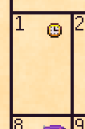
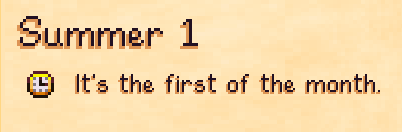
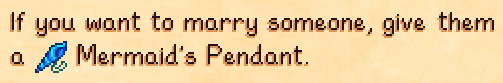
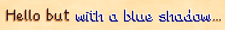
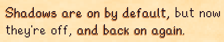
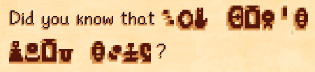
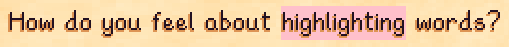
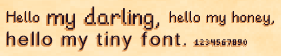
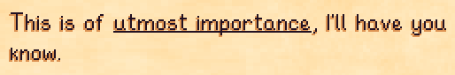

**You're viewing a file in the SMAPI mod dump, which contains a copy of every open-source SMAPI mod
for queries and analysis.**

**This is _not_ the original file, and not necessarily the latest version.**  
**Source repository: https://github.com/KhloeLeclair/StardewMods**

----

← [README](README.md)

This document is intended to help mod authors create content packs for Almanac.

## Contents

* [Getting Started](#getting-started)
  * [Create a Content Pack](#create-a-content-pack)
* [Crops](#crops)
  * [Crop Overrides](#crop-overrides)
  * [Using Content Patcher](#crop-overrides-using-content-patcher)
* [Fish](#fish)
  * [Fish Overrides](#fish-overrides)
  * [Using Content Patcher](#fish-overrides-using-content-patcher)
* [Local Notices](#local-notices)
  * [What is a Notice?](#what-is-a-notice)
  * [Using Content Patcher](#notices-using-content-patcher)
  * [Testing](#notice-testing)
  * [Notice Format](#notice-format)
* [NPCs](#npcs)
  * [NPC Overrides](#npc-overrides)
  * [Using Content Patcher](#npc-overrides-using-content-patcher)
* [Themes](#themes)
  * [What is a Theme?](#what-is-a-theme)
  * [Theme Definitions](#theme-definitions)
  * [Theme Assets](#theme-assets)
  * [Template](#template)
  * [Theme Testing](#theme-testing)
* [Rich Text](#rich-text)

## Getting Started

### Create a Content Pack

1. Install [SMAPI](https://smapi.io/) and [Almanac](https://www.nexusmods.com/stardewvalley/mods/11022/)
   if you haven't yet. (If you haven't, how did you even find this?)
2. Create an empty folder in your `Stardew Valley\Mods` folder and name it
   `[Almanac] Your Mod's Name`. Replace `Your Mod's Name` with your mod's
   unique name, of course.
3. Create a `manifest.json` file inside the folder with this content:
   ```json
   {
	   "Name": "Your Mod's Name",
	   "Author": "Your Name",
	   "Version": "1.0.0",
	   "Description": "Something short about your mod.",
	   "UniqueId": "YourName.YourModName",
	   "ContentPackFor": {
		   // Do not change this when changing UniqueID
		   "UniqueID": "leclair.almanac"
	   },
	   "UpdateKeys": [
		   // When you get ready to release your mod, you will populate
		   // this section as according to the instructions at:
		   // https://stardewvalleywiki.com/Modding:Modder_Guide/APIs/Update_checks
	   ]
   }
   ```
4. Change the `Name`, `Author`, `Description`, and `UniqueID` values to
   describe your mod. Later, don't forget to set your UpdateKeys before
   uploading your mod.
5. Create other files as described below, based on what you want your content
   pack to do with Almanac.


## Crops

### Crop Overrides

Currently, crop overrides only allow you to control the visibility of a crop
in the Planting Dates page of the Almanac. All other crop information should
be read from the game's crop data table, or by using a C# mod that uses the
API to add crops to the system.

Crop overrides have the following format:

<table>
<tr>
<th>Field</th>
<th>Description</th>
</tr>
<tr>
<td><code>Visible</code></td>
<td>

A boolean value. Whether or not the crop should be listed in the Almanac.
This is `true` by default for all crops.

</td>
</tr>
</table>


### Crop Overrides Using Content Patcher

The best, and currently only, way to add crop overrides to Almanac using a
content pack is through the use of Content Patcher. This is particularly
useful to authors as you can then use Content Patcher's conditions system
to only hide or show crops in ceratin cases.

> When using Content Patcher, you'll need to make a separate content pack
> that targets Content Patcher rather than Almanac. For more on that, you'll
> want to see [Content Patcher's own documentation](https://github.com/Pathoschild/StardewMods/blob/stable/ContentPatcher/docs/author-guide.md).

To add a crop override, you'll want to use Content Patcher's `EditData`
action on the file `Mods/leclair.almanac/CropOverrides`. Here's a quick
example that hides Ancient Fruit:
```json
{
  "Format": "1.25.0",
  "Changes": [
    {
      "LogName": "Hide Ancient Fruit",
      "Action": "EditData",
      "Target": "Mods/leclair.almanac/CropOverrides",
      "Entries": {
        "499": {
          "Visible": false
        }
      }
    }
  ]
}
```

When adding overrides, you should limit your use of Content Patcher
conditions as much as possible for the best user experience. Ideally,
users can see information on crops they should reasonably know about even
if those crops cannot currently be obtained.


## Fish

### Fish Overrides

Currently, fish overrides only allow you to control the visibility of a fish
in the Fishing page of the Almanac. All other information is currently read
from the fish data table, as well as the fishing data associated with every
game location.

Fish overrides have the following format:

<table>
<tr>
<th>Field</th>
<th>Description</th>
</tr>
<tr>
<td><code>Visible</code></td>
<td>

A boolean value. Whether or not the fish should be listed in the Almanac.
This is `true` by default for all fish.

</td>
</tr>
</table>


### Fish Overrides Using Content Patcher

The best, and currently only, way to add fish overrides to Almanac using a
content pack is through the use of Content Patcher. This is particularly
useful to authors as you can then use Content Patcher's conditions system
to only hide or show fish in ceratin cases.

> When using Content Patcher, you'll need to make a separate content pack
> that targets Content Patcher rather than Almanac. For more on that, you'll
> want to see [Content Patcher's own documentation](https://github.com/Pathoschild/StardewMods/blob/stable/ContentPatcher/docs/author-guide.md).

To add a fish override, you'll want to use Content Patcher's `EditData`
action on the file `Mods/leclair.almanac/FishOverrides`. Here's a quick
example that hides Pufferfish:
```json
{
  "Format": "1.25.0",
  "Changes": [
    {
      "LogName": "Hide Pufferfish",
      "Action": "EditData",
      "Target": "Mods/leclair.almanac/FishOverrides",
      "Entries": {
        "128": {
          "Visible": false
        }
      }
    }
  ]
}
```

When adding overrides, you should limit your use of Content Patcher
conditions as much as possible for the best user experience. Ideally,
users can see information on fish they should reasonably know about even
if those fish cannot currently be obtained.


## Local Notices

### What is a Notice?

Notices are simply entries that show in the Local Notices tab of Almanac. They
can use rich text formatting, and have an associated image that is displayed
on the calendar, as well as at the start of the message's message line.

Notices can also have an associated item. The item is only used at this time
in an integration with Lookup Anything, allowing users to look up the item
paired with a notice.

Notices can be added to the system using the C# API, or via Content Patcher.


### Notices Using Content Patcher

The best, and currently only, way to add Notices to Almanac using a content
pack is through the use of Content Patcher. This is particularly useful to
authors as you can then use Content Patcher's conditions system to only
display notices in certain cases.

> When using Content Patcher, you'll need to make a separate content pack
> that targets Content Patcher rather than Almanac. For more on that, you'll
> want to see [Content Patcher's own documentation](https://github.com/Pathoschild/StardewMods/blob/stable/ContentPatcher/docs/author-guide.md).

To add a notice, you'll want to use Content Patcher's `EditData` action on
the file `Mods/leclair.almanac/ExtraLocalNotices`. Here's a quick example
that adds a simple notice to the first day of every season:
```json
{
  "Format": "1.25.0",
  "Changes": [
    {
      "LogName": "Local Notices",
      "Action": "EditData",
      "Target": "Mods/leclair.almanac/ExtraLocalNotices",
      "Entries": {
        "leclair.almanac.example-cp-notices/1": {
          "Period": "Season",
          "Ranges": [
            {"Start": 1, "End": 1}
          ],

          "Description": "It's the first of the month.",

          "IconType": "Texture",
          "IconSource": "MouseCursors",
          "IconSourceRect": {"X": 434, "Y": 475, "Width": 9, "Height": 9}
        }
      }
    }
  ]
}
```

That example adds a new notice with the ID `leclair.almanac.example-cp-notices/1`,
that appears seasonally, that appears on the first and only the first, and that
has a text message along with an icon. It looks like this:





When adding notices, you should limit your use of Content Patcher conditions as
much as possible for the best user experience.

You should especially avoid using Content Patcher to limit a notice to appearing
over a specific date range, instead using the notice format itself to do so.
Notices added through Content Patcher are **only visible when their conditions
match**.


### Notice Testing

Once you've edited your content file, you can use Content Patcher's `patch`
command to reload your content pack. To then see the data in game, you'll need
to either re-open the Almanac or use the `al_update` command.

> If you have Debug Mode enabled in settings, pressing F5 will also reload data
> as if you used the `al_update` command.


### Notice Format

<table>
<tr>
<th>Field</th>
<th>Description</th>
</tr>
<tr>
<td colspan=2>When It Happens</td>
</tr>
<tr>
<td><code>Period</code></td>
<td>

`Period`, along with `Ranges`, is used for limiting which days the notice
should be displayed for. Depending on the `Period`, there are different
ranges of dates available:

<table>
<tr>
<th>Value</th>
<th>Date Range</th>
</tr>
<tr>
<td><code>Week</code></td>
<td>1 to 7</td>
</tr>
<tr>
<td><code>Season</code></td>
<td>1 to 28*</td>
</tr>
<tr>
<td><code>Year</code></td>
<td>1 to 112*</td>
</tr>
<tr>
<td><code>Total</code></td>
<td>1 to ...</td>
</tr>
</table>

> Note: The upper bounds of `Season` and `Year` may be different if there are
> mods being used that change the length of seasons or years.

By using the correct `Period`, it's easy to have a notice show on exactly the
days you would like with a minimal number of `Ranges`.

</td>
</tr>
<tr>
<td><code>Ranges</code></td>
<td>

`Ranges` is used to specify which date or dates within a given `Period` that
the notice occurs on. You can specify one or multiple range within `Ranges`,
and the notice will appear on days that match any range.

Each range has a `Start` day and an `End` day, which are inclusive.

For example, the following values will create a notice that appears on the
first two days of the week, and also the fifth day:
```json
{
  "Period": "Week",
  "Ranges": [
    {"Start": 1, "End": 2},
    {"Start": 5, "End": 5}
  ]
}
```

</td>
</tr>
<tr>
<td><code>FirstYear</code></td>
<td>

`FirstYear` is the first year during which this notice can appear. By default,
this is `1` to allow notices to appear during the first year.

</td>
</tr>
<tr>
<td><code>LastYear</code></td>
<td>

`LastYear` is the last year during which this notice can appear. By default,
this is set to the integer maximum value (`2147483647`) to allow notices to
appear through any concievable reasonable amount of play time.

</td>
</tr>
<tr>
<td><code>ValidYears</code></td>
<td>

`ValidYears` is an array of integers, representing which years this notice
can appear in. It is unlikely you'll ever need this, and if you do, it might
be a better idea to use Content Patcher's conditions.

</td>
</tr>
<td><code>ValidSeasons</code></td>
<td>

`ValidSeasons` is an array of strings, representing which seasons this notice
can appear in.

Valid Values:
* `spring`
* `summer`
* `fall`
* `winter`

</td>
</tr>
<tr>
<td colspan=2>Content</td>
<tr>
<td><code>ShowEveryDay</code></td>
<td>

`ShowEveryDay` is a simple boolean, false by default. When set to `true`, an
entry will appear in the right column of Local Notices for every day that
the notice appears.

When set to `false`, an entry only appears for the first day when a notice
matches multiple consecutive days to avoid spamming the log. Local Notices
does this already for all of its multi-day events, including harvesting
seasons and the night market.

</td>
</tr>
<tr>
<td><code>Description</code></td>
<td>

`Description` is a string that is rendered for the user to read. This string
allows the use of Almanac's [rich text formatting](#rich-text) syntax, and
thanks to Content Patcher should also support quite a lot of tokens for
customizing strings.

</td>
</tr>
<tr>
<td><code>Item</code></td>
<td>

`Item` allows you to specify an item that should be associated with this
notice. Currently, the item is used in two ways. First, users with the
Lookup Anything extension can view information on the item by hovering
over the notice in the log and pressing their Lookup Anything key.

Second, the item may be used as an icon for the notice. Icons are displayed
both in the calendar view and in the log.

`Item` expects a string, and it's using the new Qualified Item ID syntax
being [added to the game in 1.6](https://stardewvalleywiki.com/Modding:Migrate_to_Stardew_Valley_1.6#Custom_items).
Read more about it in the migration guide for now.

</td>
</tr>
<tr>
<td><code>IconType</code></td>
<td>

`IconType` allows you to specify which type of icon we want to display
for this notice. There are two possibilities.

1. `Item`: A value of `item` means that the `Item` associated with this notice should be
used as the notice's icon.

2. `Texture`: A value of `texture` means that the notice should take its icon from a specific
texture. When set to `texture`, the item should have either an `IconPath` or
`IconSource` along with an `IconSourceRect` set.

</td>
</tr>
</table>

</td>
</tr>
<tr>
<td><code>IconSource</code></td>
<td>

`IconSource` allows you to easily specify one of the game's built-in textures
as the source for a notice's icon. The following are valid values:

> `Concessions`, `Birds`, `DayBG`, `NightBG`, `Menu`, `UncoloredMenu`,
> `Lantern`, `WindowLight`, `SconceLight`, `CauldronLight`, `IndoorWindowLight`,
> `Shadow`, `MouseCursors`, `MouseCursors2`, `Giftbox`, `ControllerMap`,
> `Animations`, `Object`, `Crop`, `Emote`, `Debris`, `BigCraftable`, `Rain`,
> `Buffs`, `Greenhouse`, `Barn`, `Coop`, `House`, `Mailbox`, `TVStation`,
> `Cloud`, `Tool`, `HairStyles`, `Shirts`, `Pants`, `Hats`, `Accessories`,
> `Furniture`, `FurnitureFront`, `Chair`, `Weapon`, `Projectile`,
> `Wallpaper`, `Emoji`

</td>
</tr>
<tr>
<td><code>IconPath</code></td>
<td>

`IconPath` allows you to specify a path to your own texture. `IconPath` is a
string, and it's used via `Game1.content.Load<Texture2D(iconPath)` so can be
any texture from the game's content files.

</td>
</tr>
<tr>
<td><code>IconSourceRect</code></td>
<td>

`IconSourceRect` allows you to specify which region of the texture you want
to use as the notice's icon. If not specified, the entire texture is used.

This is a rectangle and specified as an object with `X`, `Y`, `Width`, and
`Height` values. Example:
```json
{"X": 434, "Y": 475, "Width": 9, "Height": 9}
```

> Note: Icons are expected to be 16x16 or smaller, so larger sources or
> sources with odd aspect ratios may not display how you'd expect.

</td>
</tr>
</table>


## NPCs

### NPC Overrides

NPC overrides currently serve two purposes:

1. Allowing you to control the visibility of an NPC in the Almanac, which
   currently only affects birthdays on the Local Notices page.
2. Allowing you to control the portion of a character's sprite used to
   draw their head on the Local Notices page. It's likely you won't need
   to supply this data because we're reading data from the
   NPC Map Locations mod for broader support.

<table>
<tr>
<th>Field</th>
<th>Description</th>
</tr>
<tr>
<td><code>Visible</code></td>
<td>

A boolean value. Whether or not the NPC should be listed in the Almanac.
This is `true` by default for all NPCs. There are further visibility
checks based on your friendship level and the socialability state of
the NPC in question.

</td>
</tr>
<tr>
<td><code>Head</code></td>
<td>

An object describing the portion of the NPC's sprite to use when drawing
their head. By default, this is a rectangle starting at (0, 0) with a
width of 16 and a height of 15. Values for this should be formatted as:
```json
{
  "OffsetX": 0,
  "OffsetY": 0,
  "Width": 16,
  "Height": 15
}
```

</td>
</tr>
</table>


### NPC Overrides Using Content Patcher

The best, and currently only, way to add NPC overrides to Almanac using a
content pack is through the use of Content Patcher. This is particularly
useful to authors as you can then use Content Patcher's conditions system
to only hide or show NPCs in ceratin cases.

> When using Content Patcher, you'll need to make a separate content pack
> that targets Content Patcher rather than Almanac. For more on that, you'll
> want to see [Content Patcher's own documentation](https://github.com/Pathoschild/StardewMods/blob/stable/ContentPatcher/docs/author-guide.md).

To add an NPC override, you'll want to use Content Patcher's `EditData`
action on the file `Mods/leclair.almanac/NPCOverrides`. Here's a quick
example that hides Gus and adjusts Willy's head sprite down by 3 pixels:
```json
{
  "Format": "1.25.0",
  "Changes": [
    {
      "LogName": "Hide Gus and Move Abigail",
      "Action": "EditData",
      "Target": "Mods/leclair.almanac/NPCOverrides",
      "Entries": {
        "Gus": {
          "Visible": false
        },
        "Willy": {
          "Head": {
            "OffsetY": 3
          }
        }
      }
    }
  ]
}
```


## Themes

### What is a Theme?

Themes for Almanac are content packs that allow you override entire resource
files, primarily [Menu.png](https://github.com/KhloeLeclair/StardewMods/blob/main/Almanac/assets/Menu.png),
as well as customizing text colors and margins so that content fits your new
look for the mod.


### Theme Definitions

In order to supply a theme, content packs need only contain a `theme.json`
file in their root folder. This file contains a user friendly name that is
displayed in the theme selector (assuming the user is using the Generic Mod
Config Menu), a list of mod IDs that the theme is meant for, as well as the
various colors and margins. Only the name and list of IDs are required.

To explain, let's look at the theme for [Vintage Interface 2](https://www.nexusmods.com/stardewvalley/mods/4697)
support. You can [find the theme here](https://github.com/KhloeLeclair/StardewMods/tree/main/Almanac/assets/themes/VintageInterface2)
but let's just look at the `theme.json` file.

```json
{
	"$schema": "https://raw.githubusercontent.com/KhloeLeclair/StardewMods/main/Almanac/theme-schema.json",
	"Name": "Vintage Interface 2",
	"For": [
		"ManaKirel.VintageInterface2"
	],

	"CoverTextColor": "#3c3c3c",
	"CoverYearColor": "white",

	"Standard": {
		"CustomScroll": true,
		"SeasonTextColor": "#3c3c3c",

		"TextColor": "#382f29",
		"TextShadowColor": "#D4C8AF"
	},

	"Magic": {
		"CustomScroll": true,
		"SeasonTextColor": "white",

		"CalendarLabelColor": "#8073D1",
		"CalendarDayColor": "#9c8cff",
		"CalendarHighlightColor": "#ccc"
	}
}
```

> Note: The `$schema` entry points to a JSON Schema for validating themes
> and may allow your editor to provide a better theme editing experience.

Here, you see that the name of the theme is "Vintage Interface 2". It could
be anything, but to save users confusion, I've named it after the interface
mod it's designed to integrate with.

In the `For` section, I've included the unique mod ID of Vintage Interface 2.
When Almanac is set to Automatic, it will see that this theme is for that
mod and, if the user has Vintage Interface 2 installed, it will automatically
use that theme.


### Theme Assets

Any replacement assets that are supplied by a theme should go in an `assets`
subfolder within that theme's folder. Currently, the only asset used in that
way is our `Menu.png` spritesheet.


### Template

You can find a [template for creating themes here](https://github.com/KhloeLeclair/StardewMods/blob/main/Almanac/assets/themes/Template/theme.json).
This file is always updated to contain a full theme definition, echoing all
the default values, and with comment strings to explain what the different
parts of the theme definition do.

To get started on a new theme, make sure you've created your content pack
and then just copy that template's `theme.json` into your content pack.
From there, you can edit your theme and delete anything you don't need.


### Theme Testing

You can use a console command to have Almanac reload its themes at any time,
as well as to change the current theme. This is done via the `al_theme`
command in the game's console window.
```
> al_theme
[Almanac] [Theme] Available Themes:
[Almanac] [Theme]   > [automatic]: Automatic
[Almanac] [Theme]     [default]: Default
[Almanac] [Theme]     [leclair.almanac.theme.Template]: Theme Template
[Almanac] [Theme]  =  [leclair.almanac.theme.VintageInterface1]: Vintage Interface 1
[Almanac] [Theme]  =  [leclair.almanac.theme.VintageInterface2]: Vintage Interface 2
[Almanac] [Theme]     [YourName.YourModName]: Your Mod's Name
```

When run without arguments, `al_theme` will dump a list of all available
themes, along with their IDs, and tell you which theme is currently active.
In that example, the theme is set to `automatic` and the active theme is
`leclair.almanac.theme.VintageInterface2`.

To switch a theme, just enter `al_theme ` followed by the name or partial
name of the theme. For example, to switch to the template theme, you could
enter: `al_theme temp`

To reload all themes, you can either enter `al_theme reload` or, for a bit
less typing, use the `al_retheme` command.

> Note: When reloading the current theme, Almanac tries to update all GUI
> components, but you may have to close and re-open the menu for everything
> to take effect.


## Rich Text

> Note: This is likely to change in a future version to something more
> involved than a control character to improve compatibility with
> arbitrary input strings.

Almanac's rich text support allows you to apply a great deal of formatting to
text via control characters in the string. There is support for:

* Bold
* Scale
* Underline
* Strikethrough
* Foreground Color
  * Prismatic as well as Solid
* Shadow Color
* Background Color
* Changing Font
  * As well as using SpriteText
* Enabling/Disabling Shadow

To use rich text, you simply enter an at sign (`@`) followed by the appropriate
control character. To include an at sign in the output, you can escape it by
posting two (`@@`). Example:

<table>
<tr>
<th>Input</th>
<td>This is an @Bexample@b of @Urich text@u. Thanks, @@Khloe!</td>
</tr>
<tr>
<th>Output</th>
<td>This is an <b>example</b> of <ins>rich text</ins>. Thanks, @Khloe!</td>
</tr>
</table>

The following control characters are available:

<table>
<tr>
<th>Sequence</th>
<th>Effect</th>
</tr>
<tr><td colspan=2>Content Alignment</td></tr>
<tr>
<td colspan=2>

Vertical and horizontal alignment can be used to nicely lay out text in some cases.
```
@<Left @|Center @>Right

@|@^Top @-Middle @vBottom
```


> Note: Here we're also using `@\_{2}@m{0}@\_{1}` to insert large weed sprites so
> that you can actually see the effect of vertical alignment.

</td>
</tr>
<tr>
<td><code>@<</code></td>
<td>Use left horizontal alignment for subsequent content.</td>
</tr>
<tr>
<td><code>@|</code></td>
<td>Use center horizontal alignment for subsequent content.</td>
</tr>
<tr>
<td><code>@></code></td>
<td>Use right horizontal alignment for subsequent content.</td>
</tr>
<tr>
<td><code>@^</code></td>
<td>Use top vertical alignment for subsequent content.</td>
</tr>
<tr>
<td><code>@-</code></td>
<td>Use middle vertical alignment for subsequent content.</td>
</tr>
<tr>
<td><code>@v</code></td>
<td>Use bottom vertical alignment for subsequent content.</td>
</tr>
<tr><td colspan=2>Embedded Content</td></tr>
<tr>
<td><code>@M{...}</code></td>
<td>

Display an item along with its name.

This requires a string with the item's ID, using the new Qualified Item ID
syntax being [added to the game in 1.6](https://stardewvalleywiki.com/Modding:Migrate_to_Stardew_Valley_1.6#Custom_items).
Read more about it in the migration guide for now.

Example:
```
If you want to marry someone, give them a @M{(O)460}.
```



</td>
</tr>
<tr><td colspan=2>Text Style</td></tr>
<tr>
<td><code>@_{...}</code></td>
<td>

Use a new scale for subsequent content. Scale is a floating point number, which
defaults to `1.0`. Example:
```
Hello @\_{2}there@\_{1}!
```


</td>
</tr>
<tr>
<td><code>@B</code></td>
<td>

Enable bold rendering for subsequent text. Example:
```
That's a @Blotta@b damage!
```


</td>
</tr>
<tr>
<td><code>@b</code></td>
<td>Disable bold rendering for subsequent text.</td>
</tr>
<tr>
<td><code>@C{...}</code></td>
<td>

Use a new foreground color for subsequent text.  When entering colors, you can
use hex values along with some color names. Example:
```
Hello but @C{red}with red text@C{}!
```


</td>
</tr>
<tr>
<td><code>@c{...}</code></td>
<td>

Use a new shadow color for subsequent text. Example:
```
Hello but @C{white}@c{navy}with a blue shadow@C{}@c{}...
```



</td>
</tr>
<tr>
<td><code>@F</code></td>
<td>

Use SpriteText rendering for subsequent text. Example:
```
Have a @Fwonderful@f day!
```


</td>
</tr>
<tr>
<td><code>@f</code></td>
<td>Disable SpriteText rendering for subsequent text.</td>
</tr>
<tr>
<td><code>@H</code></td>
<td>

Enable shadow rendering for subsequent text. Example:
```
Shadows are on by default, @hbut now they're off, @Hand back on again.
```



</td>
</tr>
<tr>
<td><code>@h</code></td>
<td>Disable shadow rendering for subsequent text.</td>
</tr>
<tr>
<td><code>@I</code></td>
<td>

Invert the foreground and background colors for subsequent text.

> Note: You should only use this if you're already using a background color.
> But honestly this is pretty weird and likely not useful.

Example:
```
@C{white}@R{navy}@hThis is when @Ithings flip@i so hold on.
```


</td>
</tr>
<tr>
<td><code>@i</code></td>
<td>Disable inverted colors for subsequent text.</td>
</tr>
<tr>
<td><code>@J</code></td>
<td>

Enable junimo text rendering for subsequent text.

> Note: Junimo Text forces SpriteText rendering to be used.

Example:
```
Did you know that @Jyou can't read this@j?
```



</td>
</tr>
<tr>
<td><code>@j</code></td>
<td>Disable junimo text rendering for subsequent text.</td>
</tr>
<tr>
<td><code>@P</code></td>
<td>

Enable prismatic foreground color for subsequent text. The prismatic color changes over time. Example:
```
This is some @B@Pfancy text@b@p, just so you know.
```


</td>
</tr>
<tr>
<td><code>@p</code></td>
<td>Disable prismatic foreground color for subsequent text.</td>
</tr>
<tr>
<td><code>@R{...}</code></td>
<td>

Enable a new background color for subsequent text. (Why R, you ask? I don't know either.) Example:
```
How do you feel about @R{pink}highlighting@R{} words?
```



</td>
</tr>
<tr>
<td><code>@S</code></td>
<td>

Enable strikethrough for subsequent text. Example:
```
To Do: @Smake mod@s, @Swrite docs@s, take over world
```


</td>
</tr>
<tr>
<td><code>@s</code></td>
<td>Disable strikethrough for subsequent text.</td>
</tr>
<tr>
<td><code>@T{...}</code></td>
<td>

Use a different font for subsequent text. The following fonts are supported:

> `dialog`, `small`, `tiny`

Example:
```
Hello @T{dialog}my darling, @T{small}hello my honey, @T{tiny}hello my tiny font. 1234567890
```



> Note: As you can see in the image, the `tiny` font is actually not so tiny
> at all. It only has support for numbers, 0-9.

</td>
</tr>
<tr>
<td><code>@U</code></td>
<td>

Enable underline for subsequent text. Example:
```
This is of @Uutmost importance@u, I'll have you know.
```



</td>
</tr>
<tr>
<td><code>@u</code></td>
<td>Disable underline for subsequent text.</td>
</tr>
</table>
