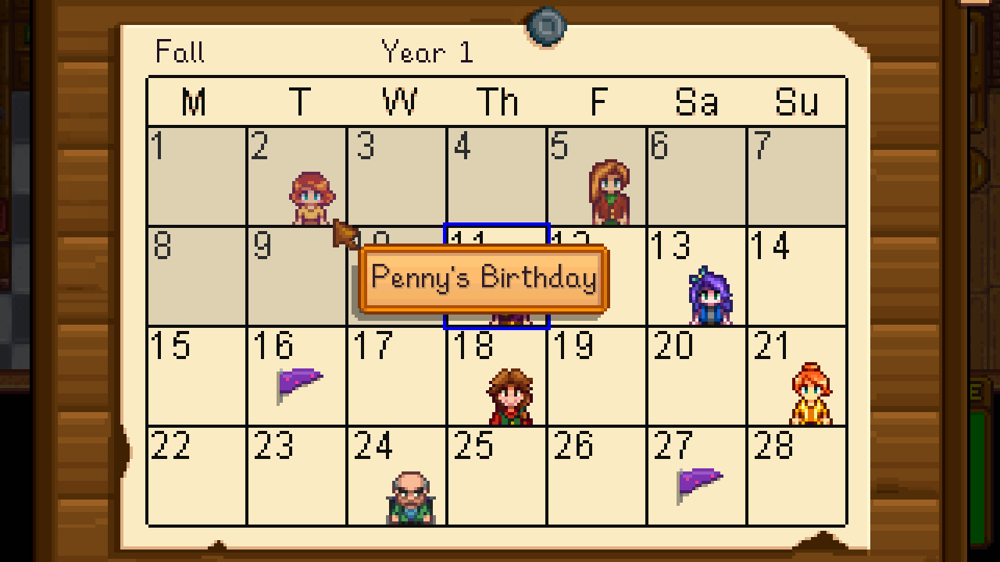
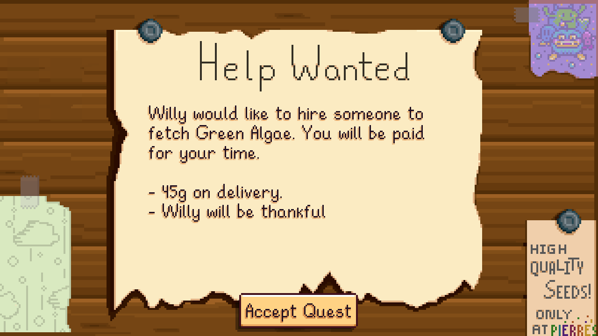
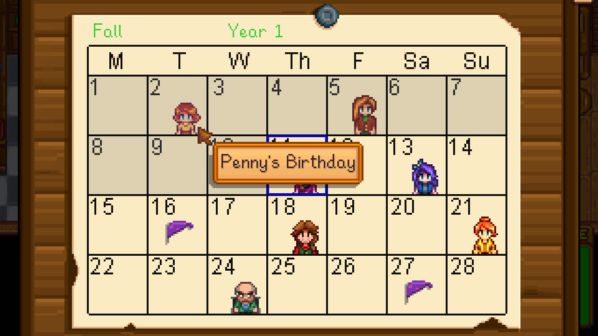
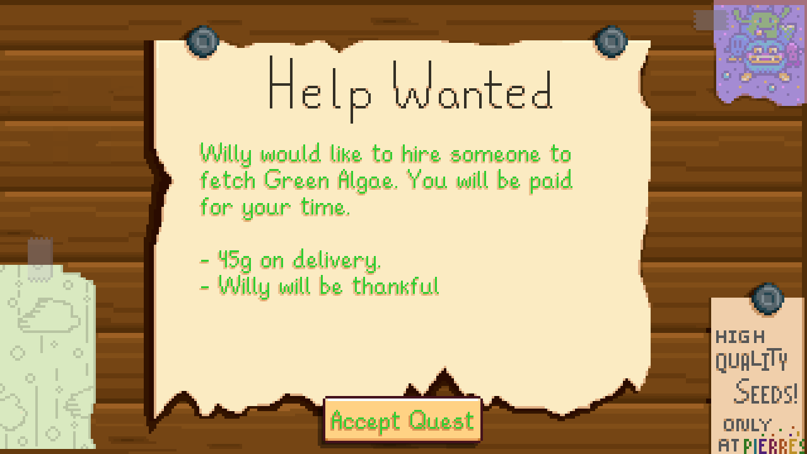
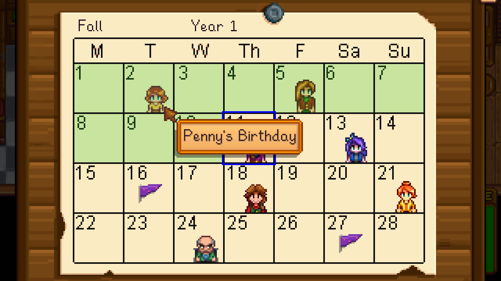
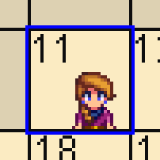
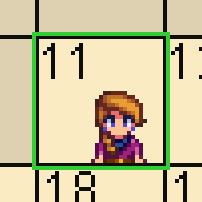

**You're viewing a file in the SMAPI mod dump, which contains a copy of every open-source SMAPI mod
for queries and analysis.**

**This is _not_ the original file, and not necessarily the latest version.**  
**Source repository: https://github.com/KhloeLeclair/StardewMods**

----

← [Author Guide](author-guide.md)

# Built-in Patches

The following is a list of the currently built-in patches. It is generally
very easy to add new patches, so please don't hesitate to ask if you want
something that isn't listed here:

* [AboutMenu](#aboutmenu)
* [Billboard](#billboard)
* [BobberBar](#bobberbar)
* [CarpenterMenu](#carpentermenu)
* [CharacterCustomization](#charactercustomization)
* [CoopMenu](#coopmenu)
* [DayTimeMoneyBox](#daytimemoneybox)
* [DrawHud](#drawhud)
* [ExitPage](#exitpage)
* [ForgeMenu](#forgemenu)
* [ItemTooltips](#itemtooltips)
* [LetterViewerMenu](#letterviewermenu)
* [LevelUpMenu](#levelupmenu)
* [LoadGameMenu](#loadgamemenu)
* [MineElevatorMenu](#mineelevatormenu)
* [MoneyDial](#moneydial)
* [OptionsDropDown](#optionsdropdown)
* [PrairieKing](#prairieking)
* [QuestLog](#questlog)
* [ShopMenu](#shopmenu)
* [SkillsPage](#skillspage)
* [SpecialOrdersBoard](#specialordersboard)
* [TutorialMenu](#tutorialmenu)

# AboutMenu

<table>
<tr>
<th>Id</th>
<td>AboutMenu</td>
</tr>
<tr>
<th>Variables</th>
<td>
<table>
<tr><th>Name</th><th>Default Value</th></tr>
<tr><td>$CreditsText</td><td><i>White (#FFFFFF)</i></td></tr>
<tr><td>$CreditsLink</td><td></td></tr>
<tr><td>$CreditsLinkHover</td><td></td></tr>
</table>
</td>
</tr>
<tr>
<th>Target</th>
<td>
<table>
<tr><th>Class</th><th>Method</th></tr>
<tr><td>StardewValley.Menus.AboutMenu</td><td>draw</td></tr>
<tr><td>StardewValley.Menus.TextCreditsBlock</td><td><i>Constructor</i></td></tr>
<tr><td>StardewValley.Menus.LinkCreditsBlock</td><td><i>Constructor</i></td></tr>
</table>
</td>
</tr>
</table>

# Billboard

<table>
<tr>
<th>Id</th>
<td>Billboard</td>
</tr>
<tr>
<th>Variables</th>
<td>
<table>
<tr><th>Name</th><th>Default Value</th></tr>
<tr><td>$BillboardHover</td><td>$ButtonHover</td></tr>
<tr><td>$BillboardText</td><td></td></tr>
<tr><td>$BillboardTextShadow</td><td></td></tr>
<tr><td>$CalendarDim</td><td><i>Gray (#808080)</i></td></tr>
<tr><td>$CalendarToday</td><td><i>Blue (#0000FF)</i></td></tr>
</table>
</td>
</tr>
<tr>
<th>Target</th>
<td>
<table>
<tr><th>Class</th><th>Method</th></tr>
<tr><td>StardewValley.Menus.Billboard</td><td>draw</td></tr>
</table>
</td>
</tr>
</table>

The Billboard patch, despite only affecting the Billboard class, affects two
separate menus in the game:

1. The Calendar
2. The Help Wanted billboard

<table>
<tr>
<th>Calendar</th>
<th>Billboard</th>
</tr>
<tr>
<td>

</td>
<td>

</td>
</tr>
</table>

## Variable: `$BillboardHover`

The billboard hover variable affects the color of the "Accept Quest" button
when the user is hovering over it with their mouse. The following table
demonstrates the button in its normal state and the button in its hover
state:

<table>
<tr><th>Normal</th><th>Hover</th></tr>
<tr>
<td>

</td>
<td>

</td>
</tr>
</table>

The texture is being colored with `White` when not hovered, and `LightPink`
when hovered. As you can see, the texture already *has* color and the
`LightPink` is just altering the existing hue.

The following demonstrates how the button's hover state changes if
the `$BillboardHover` variable is set to `LimeGreen`:

This variable has no effect on the Calendar menu. Only on the Help Wanted
billboard menu.

## Variable: `$BillboardText`

The billboard text variable affects the color of the following text:

* The season and year on the Calendar.
* The description of the quest on the Help Wanted billboard
* The text on the Accept Quest button on the Help Wanted billboard

The following images compare the appearance of the variable with its default
value and the appearance of the variable when set to `LimeGreen`:

<table>
<tr>
<th></th>
<th>Normal</th>
<th>LimeGreen</th>
</tr>
<tr>
<th>Calendar</th>
<td>

</td>
<td>

</td>
</tr>
<tr>
<th>Billboard</th>
<td>

</td>
<td>

</td>
</tr>
</table>

You'll note that all other text within the two menus is either baked into
textures or drawn in a different way that isn't affected by this variable.
As such, the variable doesn't affect most visible text.

## Variable: `$CalendarDim`

The calendar dim variable affects the color of the square that is drawn over
previous days. The default color used by the game is `Gray` and it's drawn
with 25% opacity.

The following images compare the appearance of the variable with its default
value and the appearance of the variable when set to `LimeGreen`:

<table>
<tr>
<th>Normal</th>
<th>LimeGreen</th>
</tr>
<tr>
<td>

</td>
<td>

</td>
</tr>
</table>

## Variable: `$CalendarToday`

The calendar today variable affects the color of the pulsating square that is
drawn around the current day. The default color used by the game is `Blue`.

The following images compare the appearance of the variable with its default
value and the appearance of the variable when set to `LimeGreen`:

<table>
<tr>
<th>Normal</th>
<th>LimeGreen</th>
</tr>
<tr>
<td>

</td>
<td>

</td>
</tr>
</table>

# BobberBar

<table>
<tr>
<th>Id</th>
<td>BobberBar</td>
</tr>
<tr>
<th>Variables</th>
<td>
<table>
<tr><th>Name</th><th>Default Value</th></tr>
<tr><td>$FishingCastPowerRed</td><td><i>Red (#FF0000)</i></td></tr>
<tr><td>$FishingCastPowerYellow</td><td><i>Yellow (#FFFF00)</i></td></tr>
<tr><td>$FishingCastPowerGreen</td><td><i>#00FF00</i></td></tr>
<tr><td>$FishingTreasureBar</td><td><i>Orange (#FFA500)</i></td></tr>
<tr><td>$FishingProgressRed</td><td><i>Red (#FF0000)</i></td></tr>
<tr><td>$FishingProgressYellow</td><td><i>Yellow (#FFFF00)</i></td></tr>
<tr><td>$FishingProgressGreen</td><td><i>#00FF00</i></td></tr>
<tr><td>$FishingPerfectText</td><td><i>Yellow (#FFFF00)</i></td></tr>
<tr><td>$FishingPerfectSparkle</td><td><i>White (#FFFFFF)</i></td></tr>
</table>
</td>
</tr>
<tr>
<th>Target</th>
<td>
<table>
<tr><th>Class</th><th>Method</th></tr>
<tr><td>StardewValley.Tools.FishingRod</td><td>draw</td></tr>
<tr><td>StardewValley.Menus.BobberBar</td><td>draw</td></tr>
<tr><td>StardewValley.Menus.BobberBar</td><td>update</td></tr>
</table>
</td>
</tr>
</table>

The bobber bar patch affects not only the actual bobber bar menu, but also the
fishing rod tool in order to support most colors associated with fishing in
the game.

# CarpenterMenu

<table>
<tr>
<th>Id</th>
<td>CarpenterMenu</td>
</tr>
<tr>
<th>Variables</th>
<td>
<table>
<tr><th>Name</th><th>Default Value</th></tr>
<tr><td>$CarpenterErrorText</td><td>$ErrorText</td></tr>
<tr><td>$CarpenterMagicText</td><td><i>PaleGoldenrod (#EEE8AA)</i></td></tr>
<tr><td>$CarpenterMagicBackground</td><td><i>RoyalBlue (#4169E1)</i></td></tr>
</table>
</td>
</tr>
<tr>
<th>Target</th>
<td>
<table>
<tr><th>Class</th><th>Method</th></tr>
<tr><td>StardewValley.Menus.CarpenterMenu</td><td>draw</td></tr>
</table>
</td>
</tr>
</table>

# CharacterCustomization

<table>
<tr>
<th>Id</th>
<td>CharacterCustomization</td>
</tr>
<tr>
<th>Variables</th>
<td>
<table>
<tr><th>Name</th><th>Default Value</th></tr>
<tr><td>$CharacterCustomizationErrorText</td><td>$ErrorText</td></tr>
</table>
</td>
</tr>
<tr>
<th>Target</th>
<td>
<table>
<tr><th>Class</th><th>Method</th></tr>
<tr><td>StardewValley.Menus.CharacterCustomization</td><td>draw</td></tr>
</table>
</td>
</tr>
</table>

# CoopMenu

<table>
<tr>
<th>Id</th>
<td>CoopMenu</td>
</tr>
<tr>
<th>Variables</th>
<td>
<table>
<tr><th>Name</th><th>Default Value</th></tr>
<tr><td>$CoopHover</td><td>$Hover</td></tr>
<tr><td>$CoopSmallTabSelected</td><td><i>Orange (#FFA500)</i></td></tr>
<tr><td>$CoopSmallTabSelectedShadow</td><td><i>DarkOrange (#FF8C00)</i></td></tr>
<tr><td>$CoopTabHover</td><td><i>Yellow (#FFFF00)</i></td></tr>
<tr><td>$CoopTabHoverShadow</td><td><i>DarkGoldenrod (#B8860B)</i></td></tr>
<tr><td>$CoopTabSelected</td><td><i>#FFFF96</i></td></tr>
<tr><td>$CoopTabSelectedShadow</td><td><i>#DD9454</i></td></tr>
</table>
</td>
</tr>
<tr>
<th>Target</th>
<td>
<table>
<tr><th>Class</th><th>Method</th></tr>
<tr><td>StardewValley.Menus.CoopMenu</td><td>drawTabs</td></tr>
<tr><td>StardewValley.Menus.CoopMenu</td><td>drawExtra</td></tr>
</table>
</td>
</tr>
</table>

# DayTimeMoneyBox

<table>
<tr>
<th>Id</th>
<td>DayTimeMoneyBox</td>
</tr>
<tr>
<th>Variables</th>
<td>
<table>
<tr><th>Name</th><th>Default Value</th></tr>
<tr><td>$DayTimeAfterMidnight</td><td>$ErrorText</td></tr>
<tr><td>$DayTimeText</td><td></td></tr>
</table>
</td>
</tr>
<tr>
<th>Target</th>
<td>
<table>
<tr><th>Class</th><th>Method</th></tr>
<tr><td>StardewValley.Menus.DayTimeMoneyBox</td><td>draw</td></tr>
</table>
</td>
</tr>
</table>

# DrawHud

<table>
<tr>
<th>Id</th>
<td>DrawHud</td>
</tr>
<tr>
<th>Variables</th>
<td>
<table>
<tr><th>Name</th><th>Default Value</th></tr>
<tr><td>$HUDStaminaRed</td><td><i>Red (#FF0000)</i></td></tr>
<tr><td>$HUDStaminaYellow</td><td><i>Yellow (#FFFF00)</i></td></tr>
<tr><td>$HUDStaminaGreen</td><td><i>#00FF00</i></td></tr>
<tr><td>$HUDHealthRed</td><td><i>Red (#FF0000)</i></td></tr>
<tr><td>$HUDHealthYellow</td><td><i>Yellow (#FFFF00)</i></td></tr>
<tr><td>$HUDHealthGreen</td><td><i>#00FF00</i></td></tr>
<tr><td>$HUDHealthLow</td><td><i>Pink (#FFC0CB)</i></td></tr>
<tr><td>$HUDHealthText</td><td><i>Red (#FF0000)</i></td></tr>
</table>
</td>
</tr>
<tr>
<th>Target</th>
<td>
<table>
<tr><th>Class</th><th>Method</th></tr>
<tr><td>StardewValley.Game1</td><td>drawHUD</td></tr>
</table>
</td>
</tr>
</table>

# ExitPage

<table>
<tr>
<th>Id</th>
<td>ExitPage</td>
</tr>
<tr>
<th>Variables</th>
<td>
<table>
<tr><th>Name</th><th>Default Value</th></tr>
<tr><td>$ExitPageHover</td><td>$Hover</td></tr>
</table>
</td>
</tr>
<tr>
<th>Target</th>
<td>
<table>
<tr><th>Class</th><th>Method</th></tr>
<tr><td>StardewValley.Menus.ExitPage</td><td>draw</td></tr>
</table>
</td>
</tr>
</table>

# ForgeMenu

<table>
<tr>
<th>Id</th>
<td>ForgeMenu</td>
</tr>
<tr>
<th>Variables</th>
<td>
<table>
<tr><th>Name</th><th>Default Value</th></tr>
<tr><td>$ForgeBackground</td><td><i>#740B03</i></td></tr>
</table>
</td>
</tr>
<tr>
<th>Target</th>
<td>
<table>
<tr><th>Class</th><th>Method</th></tr>
<tr><td>StardewValley.Menus.ForgeMenu</td><td>draw</td></tr>
</table>
</td>
</tr>
</table>

# ItemTooltips

<table>
<tr>
<th>Id</th>
<td>ItemTooltips</td>
</tr>
<tr>
<th>Variables</th>
<td>
<table>
<tr><th>Name</th><th>Default Value</th></tr>
<tr><td>$TooltipInsufficientText</td><td>$ErrorText</td></tr>
<tr><td>$TooltipText</td><td>$Text</td></tr>
<tr><td>$TooltipTextShadow</td><td>$TextShadow</td></tr>
<tr><td>$ForgeCountText</td><td><i>DimGray (#696969)</i></td></tr>
<tr><td>$ForgedText</td><td><i>DarkRed (#8B0000)</i></td></tr>
<tr><td>$TooltipHealthRed</td><td><i>Red (#FF0000)</i></td></tr>
<tr><td>$TooltipHealthYellow</td><td><i>Yellow (#FFFF00)</i></td></tr>
<tr><td>$TooltipHealthGreen</td><td><i>#00FF00</i></td></tr>
<tr><td>$TooltipModifiedStatText</td><td><i>#007878</i></td></tr>
<tr><td>$TooltipEnchantmentText</td><td><i>#7800D2</i></td></tr>
</table>
</td>
</tr>
<tr>
<th>Target</th>
<td>
<table>
<tr><th>Class</th><th>Method</th></tr>
<tr><td>StardewValley.Menus.IClickableMenu</td><td>drawHoverText</td></tr>
<tr><td>StardewValley.Object</td><td>drawInMenu</td></tr>
<tr><td>StardewValley.Item</td><td>drawTooltip</td></tr>
<tr><td>StardewValley.Objects.Boots</td><td>drawTooltip</td></tr>
<tr><td>StardewValley.Tools.MeleeWeapon</td><td>drawTooltip</td></tr>
<tr><td>StardewValley.CraftingRecipe</td><td>drawRecipeDescription</td></tr>
</table>
</td>
</tr>
</table>

# LetterViewerMenu

<table>
<tr>
<th>Id</th>
<td>LetterViewerMenu</td>
</tr>
<tr>
<th>Variables</th>
<td>
<table>
<tr><th>Name</th><th>Default Value</th></tr>
<tr><td>$LetterViewerHover</td><td>$ButtonHover</td></tr>
</table>
</td>
</tr>
<tr>
<th>Target</th>
<td>
<table>
<tr><th>Class</th><th>Method</th></tr>
<tr><td>StardewValley.Menus.LetterViewerMenu</td><td>draw</td></tr>
</table>
</td>
</tr>
</table>

# LevelUpMenu

<table>
<tr>
<th>Id</th>
<td>LevelUpMenu</td>
</tr>
<tr>
<th>Variables</th>
<td>
<table>
<tr><th>Name</th><th>Default Value</th></tr>
<tr><td>$LevelUpHoverText</td><td><i>Green (#008000)</td></tr>
</table>
</td>
</tr>
<tr>
<th>Target</th>
<td>
<table>
<tr><th>Class</th><th>Method</th></tr>
<tr><td>StardewValley.Menus.LevelUpMenu</td><td>update</td></tr>
</table>
</td>
</tr>
</table>

# LoadGameMenu

<table>
<tr>
<th>Id</th>
<td>LoadGameMenu</td>
</tr>
<tr>
<th>Variables</th>
<td>
<table>
<tr><th>Name</th><th>Default Value</th></tr>
<tr><td>$LoadGameErrorText</td><td>$ErrorText</td></tr>
<tr><td>$LoadGameHover</td><td>$Hover</td></tr>
</table>
</td>
</tr>
<tr>
<th>Target</th>
<td>
<table>
<tr><th>Class</th><th>Method</th></tr>
<tr><td>StardewValley.Menus.LoadGameMenu+SaveFileSlot</td><td>drawVersionMismatchSlot</td></tr>
<tr><td>StardewValley.Menus.LoadGameMenu</td><td>drawSlotBackground</td></tr>
</table>
</td>
</tr>
</table>

# MineElevatorMenu

<table>
<tr>
<th>Id</th>
<td>MineElevatorMenu</td>
</tr>
<tr>
<th>Variables</th>
<td>
<table>
<tr><th>Name</th><th>Default Value</th></tr>
<tr><td>$ElevatorCurrentFloorText</td><td><i>Gray (#808080)</i></td></tr>
<tr><td>$ElevatorFloorText</td><td><i>Gold (#FFD700)</i></td></tr>
</table>
</td>
</tr>
<tr>
<th>Target</th>
<td>
<table>
<tr><th>Class</th><th>Method</th></tr>
<tr><td>StardewValley.Menus.MineElevatorMenu</td><td>draw</td></tr>
</table>
</td>
</tr>
</table>

# MoneyDial

<table>
<tr>
<th>Id</th>
<td>MoneyDial</td>
</tr>
<tr>
<th>Variables</th>
<td>
<table>
<tr><th>Name</th><th>Default Value</th></tr>
<tr><td>$MoneyDialSparkle</td><td><i>Gold (#FFD700)</i></td></tr>
<tr><td>$MoneyDialText</td><td><i>Maroon (#800000)</i></td></tr>
</table>
</td>
</tr>
<tr>
<th>Target</th>
<td>
<table>
<tr><th>Class</th><th>Method</th></tr>
<tr><td>StardewValley.BellsAndWhistles.MoneyDial</td><td>draw</td></tr>
</table>
</td>
</tr>
</table>

# OptionsDropDown

<table>
<tr>
<th>Id</th>
<td>OptionsDropDown</td>
</tr>
<tr>
<th>Variables</th>
<td>
<table>
<tr><th>Name</th><th>Default Value</th></tr>
<tr><td>$DropDownHover</td><td>$Hover</td></tr>
<tr><td>$DropDownText</td><td>$Text</td></tr>
</table>
</td>
</tr>
<tr>
<th>Target</th>
<td>
<table>
<tr><th>Class</th><th>Method</th></tr>
<tr><td>StardewValley.Menus.OptionsDropDown</td><td>draw</td></tr>
</table>
</td>
</tr>
</table>

# PrairieKing

<table>
<tr>
<th>Id</th>
<td>OptionsDropDown</td>
</tr>
<tr>
<th>Variables</th>
<td>
<table>
<tr><th>Name</th><th>Default Value</th></tr>
<tr><td>$PrairieKingAbigailDialogueText</td><td><i>Purple (#6E2BFF)</i></td></tr>
<tr><td>$PrairieKingStoreItemText</td><td><i>(#581D2B)</i></td></tr>
<tr><td>$PrairieKingTimerGreen</td><td><i>(#93B126)</i></td></tr>
<tr><td>$PrairieKingTimerRed</td><td><i>(#BC334A)</i></td></tr>
<tr><td>$PrairieKingScreenFlash</td><td><i>(#FFD6A8)</i></td></tr>
</table>
</td>
</tr>
<tr>
<th>Target</th>
<td>
<table>
<tr><th>Class</th><th>Method</th></tr>
<tr><td>StardewValley.Minigames.AbigailGame</td><td>draw</td></tr>
</table>
</td>
</tr>
</table>

# QuestLog

<table>
<tr>
<th>Id</th>
<td>QuestLog</td>
</tr>
<tr>
<th>Variables</th>
<td>
<table>
<tr><th>Name</th><th>Default Value</th></tr>
<tr><td>$QuestLogText</td><td>$Text</td></tr>
<tr><td>$QuestLogHover</td><td>$Hover</td></tr>
<tr><td>$QuestObjectiveText</td><td><i>DarkBlue (#00008B)</i></td></tr>
<tr><td>$QuestBarIncomplete</td><td><i>Red (#FF0000)</i></td></tr>
<tr><td>$QuestBarIncompleteDark</td><td><i>DarkRed (#8B0000)</i></td></tr>
<tr><td>$QuestBarComplete</td><td><i>LimeGreen (#32CD32)</i></td></tr>
<tr><td>$QuestBarCompleteDark</td><td><i>Green (#008000)</i></td></tr>
</table>
</td>
</tr>
<tr>
<th>Target</th>
<td>
<table>
<tr><th>Class</th><th>Method</th></tr>
<tr><td>StardewValley.Menus.QuestLog</td><td>draw</td></tr>
</table>
</td>
</tr>
</table>

# SkillsPage

<table>
<tr>
<th>Id</th>
<td>SkillsPage</td>
</tr>
<tr>
<th>Variables</th>
<td>
<table>
<tr><th>Name</th><th>Default Value</th></tr>
<tr><td>$SkillsPageText</td><td>$Text</td></tr>
<tr><td>$SkillsPageModifiedNumber</td><td><i>LightGreen (#90EE90)</i></td></tr>
<tr><td>$SkillsPageNumber</td><td><i>SandyBrown (#F4A460)</i></td></tr>
<tr><td>$SkillsPageDivider</td><td><i>(#D68F54)</i></td></tr>
<tr><td>$SkillsPageStardropText</td><td><i>(#A01EEB)</i></td></tr>
<tr><td>$SkillsPageNumber</td><td><i>SandyBrown (#F4A460)</i></td></tr>
<tr><td>$SkillsPageMasteryProgressBorder</td><td><i>(#3C3C19)</i></td></tr>
<tr><td>$SkillsPageMasteryProgressBackground</td><td><i>(#AD814F)</i></td></tr>
<tr><td>$SkillsPageMasteryProgressLabel</td><td><i>White (#FFFFFF)</i></td></tr>
<tr><td>$SkillsPageMasteryProgressLight</td><td><i>(#3CB450)</i></td></tr>
<tr><td>$SkillsPageMasteryProgressMedium</td><td><i>(#00713E)</i></td></tr>
<tr><td>$SkillsPageMasteryProgressMediumDark</td><td><i>(#005032)</i></td></tr>
<tr><td>$SkillsPageMasteryProgressDark</td><td><i>(#003C1E)</i></td></tr>
<tr><td>$SkillsPageMasteryProgressCompleteLight</td><td><i>(#DCDCDC)</i></td></tr>
<tr><td>$SkillsPageMasteryProgressCompleteMedium</td><td><i>(#8C8C8C)</i></td></tr>
<tr><td>$SkillsPageMasteryProgressCompleteMediumDark</td><td><i>(#505050)</i></td></tr>
</table>
</td>
</tr>
<tr>
<th>Target</th>
<td>
<table>
<tr><th>Class</th><th>Method</th></tr>
<tr><td>StardewValley.Menus.SkillsPage</td><td>draw</td></tr>
<tr><td>StardewValley.Menus.MasteryTrackerMenu</td><td>drawBar</td></tr>
<tr><td>SpaceCore.Interface.NewSkillsPage</td><td>draw</td></tr>
</table>
</td>
</tr>
</table>

# SpecialOrdersBoard

<table>
<tr>
<th>Id</th>
<td>SpecialOrdersBoard</td>
</tr>
<tr>
<th>Variables</th>
<td>
<table>
<tr><th>Name</th><th>Default Value</th></tr>
<tr><td>$SpecialOrdersHover</td><td>$ButtonHover</td></tr>
</table>
</td>
</tr>
<tr>
<th>Target</th>
<td>
<table>
<tr><th>Class</th><th>Method</th></tr>
<tr><td>StardewValley.Menus.SpecialOrdersBoard</td><td>draw</td></tr>
</table>
</td>
</tr>
</table>

# TutorialMenu

<table>
<tr>
<th>Id</th>
<td>TutorialMenu</td>
</tr>
<tr>
<th>Variables</th>
<td>
<table>
<tr><th>Name</th><th>Default Value</th></tr>
<tr><td>$TutorialHover</td><td><i>Blue (#0000FF)</i></td></tr>
</table>
</td>
</tr>
<tr>
<th>Target</th>
<td>
<table>
<tr><th>Class</th><th>Method</th></tr>
<tr><td>StardewValley.Menus.TutorialMenu</td><td>draw</td></tr>
</table>
</td>
</tr>
</table>
