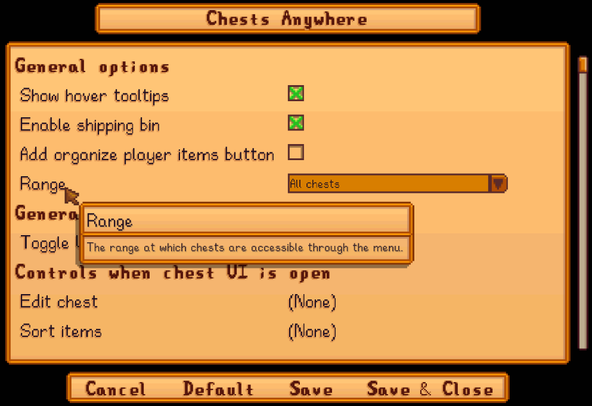

**You're viewing a file in the SMAPI mod dump, which contains a copy of every open-source SMAPI mod
for queries and analysis.**

**This is _not_ the original file, and not necessarily the latest version.**  
**Source repository: https://github.com/Pathoschild/StardewMods**

----

**Chests Anywhere** is a [Stardew Valley](http://stardewvalley.net/) mod which lets you access
your chests, fridge, Junimo huts, and shipping bin from anywhere and organize them your way.
Transfer items without having to run around, from the comfort of your bed to the deepest mine level.


## Contents
* [Install](#install)
* [Use](#use)
* [Configure](#configure)
* [Compatibility](#compatibility)
* [FAQs](#mod-integrations)
* [See also](#see-also)

## Install
1. [Install the latest version of SMAPI](https://smapi.io/).
3. Install [this mod from Nexus mods](http://www.nexusmods.com/stardewvalley/mods/518).
4. Run the game using SMAPI.

## Use
**Access chests** by pressing `B`. This will show your chests grouped by category. Navigate by
clicking the top dropdowns, or by pressing the `left` or `right` key.

**Edit chests** by clicking the edit icon after opening a chest ([see example](screenshots/animated-edit.gif)).
This will show a form where you can...
* set the chest name;
* set a category (which defaults to its location);
* set the sort order in the chest list;
* or hide the chest from the chest list.

**Point at a chest** in the world to see its name in a tooltip.

**Open the shipping bin** to view the items in the shipping bin. This lets you retrieve items
before they're shipped overnight. (You can ship any number of items, but only the first 36 will be
visible in the UI.)

## Configure
If you install [Generic Mod Config Menu][], you can click the cog button (⚙) on the title screen
or the "mod options" button at the bottom of the in-game menu to configure the mod. Hover the
cursor over a field for details.

> 

## Compatibility
Chests Anywhere is compatible with Stardew Valley 1.6+ on Linux/macOS/Windows, both single-player and
multiplayer.

Multiplayer notes:
* There's no problem with some players not having the mod.
* If you're not the main player, you can only access chests in synced locations (usually the farm, farmhouse, constructed farm buildings, and your current location). This is due to limitations in how the game syncs data.

## Mod integrations
### Get overlay info
You can access Chests Anywhere's mod-provided API to get info about its menu overlay (i.e. the UI
it floats over the chest UI). For example:

```cs
var api = helper.ModRegistry<IChestsAnywhereApi>("Pathoschild.ChestsAnywhere");
if (api != null)
{
    bool isOverlayOpen = api.IsOverlayActive();
    bool isOverlayInterceptingInput = api.IsOverlayModal();
}
```

See [mod-provided APIs](https://stardewvalleywiki.com/Modding:Modder_Guide/APIs/Integrations#Mod-provided_APIs)
on the wiki for more info.

### Setting chest options
Chests Anywhere stores its options in each chest's `modData` field. You can add them explicitly to
set the options yourself (e.g. to hide chests that shouldn't appear in the dropdowns).

Here are the recognized options:

`modData` key | description
------------- | -----------
`Pathoschild.ChestsAnywhere/Name` | The chest name. Defaults to a name like "Chest #7".
`Pathoschild.ChestsAnywhere/Category` | The category name. Defaults to the location name.
`Pathoschild.ChestsAnywhere/IsIgnored` | Set to `true` to hide the chest from the dropdowns. Defaults to `false`.
`Pathoschild.ChestsAnywhere/Order` | An integer sort order in the dropdowns, relative to other chests. Defaults to 0.
`Pathoschild.Automate/StoreItems`<br />`Pathoschild.Automate/TakeItems` | How Automate stores/takes items in the chest. The possible values are `Allow` (_store/take items in this chest_), `Prefer` (_store/take items in this chest first_), or `Disabled` (_never store/take items in this chest_). Defaults to `Allow`.

## See also
* [Release notes](release-notes.md)
* [Nexus mod](http://www.nexusmods.com/stardewvalley/mods/518)
* This is an [open-source fork](https://github.com/VIspReaderUS/AccessChestAnywhere/issues/1) of the inactive [AccessChestAnywhere](https://github.com/VIspReaderUS/AccessChestAnywhere) mod. Versions 1.0 and 1.1 are from that mod.

[Generic Mod Config Menu]: https://www.nexusmods.com/stardewvalley/mods/5098
