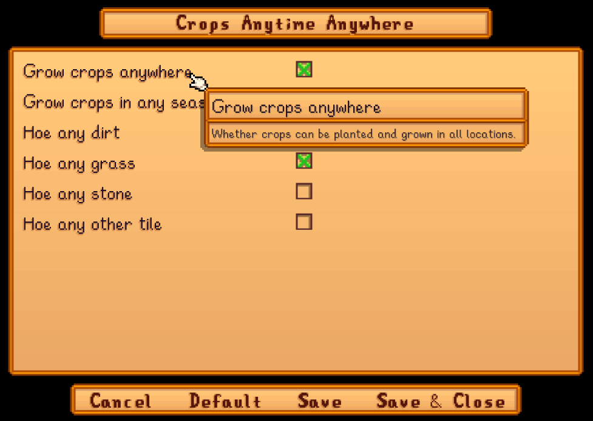

**You're viewing a file in the SMAPI mod dump, which contains a copy of every open-source SMAPI mod
for queries and analysis.**

**This is _not_ the original file, and not necessarily the latest version.**  
**Source repository: https://github.com/Pathoschild/StardewMods**

----

**Crops Anytime Anywhere** is a [Stardew Valley](http://stardewvalley.net/) mod that lets you grow
crops in any season and location, including on grass/dirt tiles you normally couldn't till. You can
optionally configure the seasons, locations, and tillable tile types.


## Contents
* [Install](#install)
* [Configure](#configure)
* [Compatibility](#compatibility)
* [See also](#see-also)

## Install
1. [Install the latest version of SMAPI](https://smapi.io/).
2. [Install this mod from Nexus mods](https://www.nexusmods.com/stardewvalley/mods/3000).
3. Run the game using SMAPI.

Note that the mod doesn't change store inventories, so you can only buy crop seeds during their
usual seasons.

## Configure
### In-game
If you install [Generic Mod Config Menu][], you can click the cog button (⚙) on the title screen
or the "mod options" button at the bottom of the in-game menu to configure the mod. Hover the
cursor over a field for details.

> 

### By editing `config.json`
The in-game UI only lets you set options for all locations. If you want different settings per
location, you can edit the `config.json` file in the mod's folder using a text editor like Notepad.
The file is created the first time you run the game with the mod installed.

You can change these settings per-location:

setting                | default | what it affects
:--------------------- | :------ | :------------------
`GrowCrops`            | true    | Whether crops can grow here.
`GrowCropsOutOfSeason` | true    | Whether out-of-season crops grow here too. This only applies if `GrowCrops` is true.
`ForceTillable`        | dirt, grass | The tile types to make tillable beyond those that would normally be. The available types are `dirt`, `grass`, `stone`, and `other`.

The location keys can be one of `*` (all locations), `Indoors`, `Outdoors`, or an internal location
name. (You can use [Debug Mode](https://www.nexusmods.com/stardewvalley/mods/679) to see location
names.)

By default all locations can grow any crop, but you can change that. For example, this enables
in-season crops anywhere _and_ out-of-season crops in the secret woods:

```js
{
   "InLocations": {
      "*": {
         "GrowCrops": true,
         "GrowCropsOutOfSeason": false
      },
      "Woods": {
         "GrowCrops": true,
         "GrowCropsOutOfSeason": true
      },
   }
}
```

If multiple configs apply to a location, the last one specified applies. This is always additive,
so you can't _disable_ crops in a location that normally does allow them.

## Compatibility
Compatible with Stardew Valley 1.6+ on Linux/macOS/Windows, both single-player and multiplayer. In
multiplayer mode, it must be installed by the main player to work correctly.

## See also
* [Release notes](release-notes.md)
* [Nexus mod](https://www.nexusmods.com/stardewvalley/mods/3000)

[Generic Mod Config Menu]: https://www.nexusmods.com/stardewvalley/mods/5098
