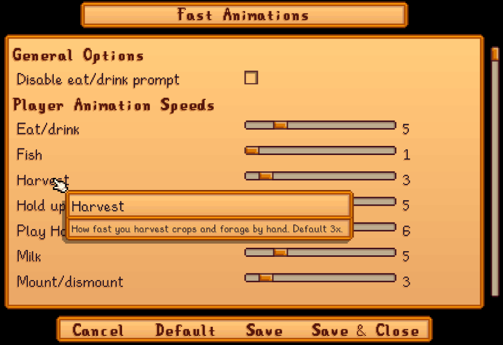

**You're viewing a file in the SMAPI mod dump, which contains a copy of every open-source SMAPI mod
for queries and analysis.**

**This is _not_ the original file, and not necessarily the latest version.**  
**Source repository: https://github.com/Pathoschild/StardewMods**

----

**Fast Animations** is a [Stardew Valley](http://stardewvalley.net/) mod that lets you selectively
speed up many animations like eating, breaking geodes, etc.

## Contents
* [Install](#install)
* [Configure](#configure)
* [Compatibility](#compatibility)
* [See also](#see-also)

## Install
1. [Install the latest version of SMAPI](https://smapi.io/).
2. [Install this mod from Nexus mods](http://www.nexusmods.com/stardewvalley/mods/1089/).
3. Run the game using SMAPI.

## Configure
If you install [Generic Mod Config Menu][], you can click the cog button (⚙) on the title screen
or the "mod options" button at the bottom of the in-game menu to configure the mod. Hover the
cursor over a field for details.

> 

## Compatibility
Fast Animations is compatible with Stardew Valley 1.6+ on Linux/macOS/Windows, both single-player and
multiplayer.

Multiplayer notes:
* Animations will be sped up smoothly for you, but other players may see them skip frames.
* If multiple players have it installed, some animation speeds may stack.

## See also
* [Release notes](release-notes.md)
* [Nexus mod](http://www.nexusmods.com/stardewvalley/mods/1089/)

[Generic Mod Config Menu]: https://www.nexusmods.com/stardewvalley/mods/5098
