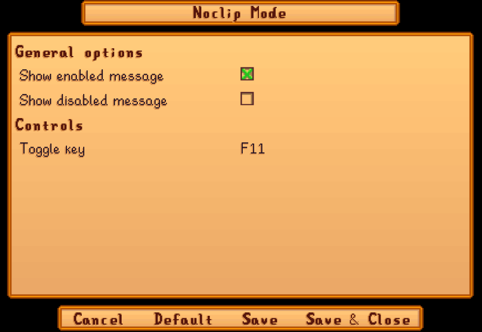

**You're viewing a file in the SMAPI mod dump, which contains a copy of every open-source SMAPI mod
for queries and analysis.**

**This is _not_ the original file, and not necessarily the latest version.**  
**Source repository: https://github.com/Pathoschild/StardewMods**

----

**Noclip Mode** is a [Stardew Valley](http://stardewvalley.net/) mod that toggles
[noclip mode](https://en.wikipedia.org/wiki/Noclip_mode) at the press of a button, letting you walk
through anything (even map boundaries).

## Contents
* [Install](#install)
* [Use](#use)
* [Configure](#configure)
* [Compatibility](#compatibility)
* [See also](#see-also)

## Install
1. [Install the latest version of SMAPI](https://smapi.io/).
2. [Install this mod from Nexus mods](https://www.nexusmods.com/stardewvalley/mods/3900).
3. Run the game using SMAPI.

## Use
Just press `F11` (configurable) to toggle noclip mode. When it's enabled, nothing can stop you.

## Configure
If you install [Generic Mod Config Menu][], you can click the cog button (⚙) on the title screen
or the "mod options" button at the bottom of the in-game menu to configure the mod. Hover the
cursor over a field for details.

> 

## Compatibility
Noclip Mode is compatible with Stardew Valley 1.6+ on Linux/macOS/Windows, both single-player and
multiplayer (even if other players don't have it). No known mod incompatibilities.

## See also
* [Release notes](release-notes.md)
* [Nexus mod](https://www.nexusmods.com/stardewvalley/mods/3900)

[Generic Mod Config Menu]: https://www.nexusmods.com/stardewvalley/mods/5098
