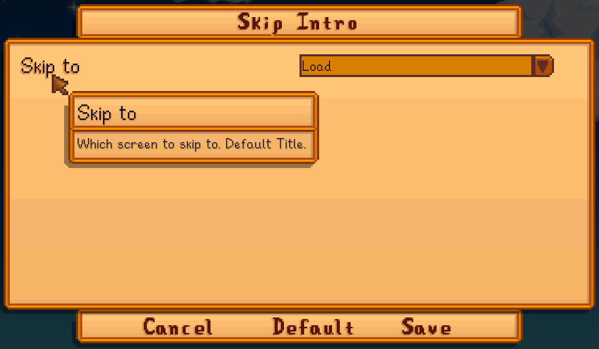

**You're viewing a file in the SMAPI mod dump, which contains a copy of every open-source SMAPI mod
for queries and analysis.**

**This is _not_ the original file, and not necessarily the latest version.**  
**Source repository: https://github.com/Pathoschild/StardewMods**

----

**Skip Intro** is a minimal [Stardew Valley](http://stardewvalley.net/) mod that skips straight to
the title screen when you start the game. You can optionally skip to the load screen, co-op join
screen, or co-op host screen instead. It also skips the screen transitions, so starting the game is
much faster.

## Install
1. [Install the latest version of SMAPI](https://smapi.io/).
2. Install [this mod from Nexus mods](http://www.nexusmods.com/stardewvalley/mods/533).
3. Run the game using SMAPI.

## Configure
If you install [Generic Mod Config Menu][], you can click the cog button (⚙) on the title screen
or the "mod options" button at the bottom of the in-game menu to configure the mod. Hover the
cursor over a field for details.

> 

## Compatibility
Skip Intro is compatible with Stardew Valley 1.6+ on Linux/macOS/Windows, both single-player and
multiplayer. There are no known issues in multiplayer (even if other players don't have it installed).

## See also
* [release notes](release-notes.md)
* [Nexus mod](http://www.nexusmods.com/stardewvalley/mods/533)

[Generic Mod Config Menu]: https://www.nexusmods.com/stardewvalley/mods/5098
