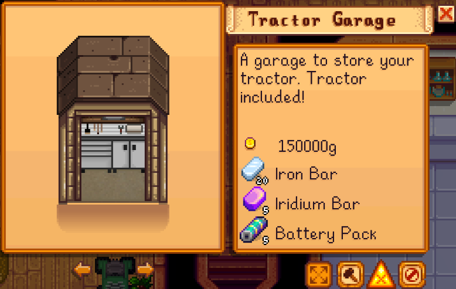
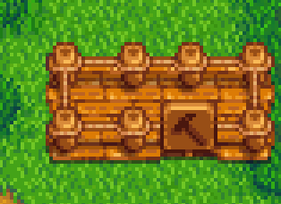
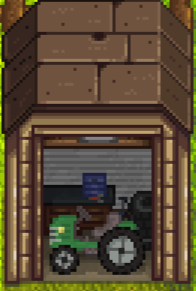
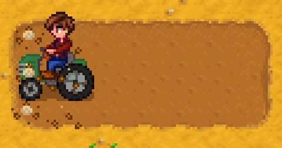
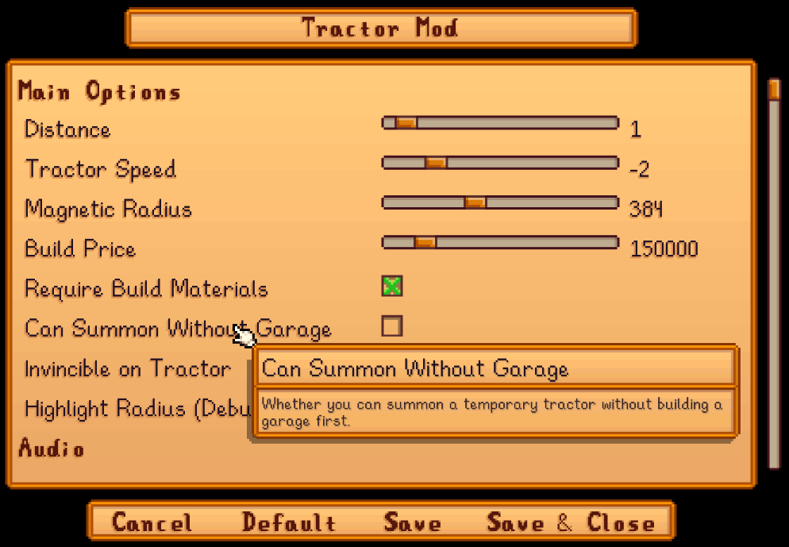

**You're viewing a file in the SMAPI mod dump, which contains a copy of every open-source SMAPI mod
for queries and analysis.**

**This is _not_ the original file, and not necessarily the latest version.**  
**Source repository: https://github.com/Pathoschild/StardewMods**

----

**Tractor Mod** is a [Stardew Valley](http://stardewvalley.net/) mod which lets you buy a tractor
(and tractor garage) to more efficiently till/fertilize/seed/water/harvest crops, clear rocks, etc.

## Contents
* [Install](#install)
* [Use](#use)
* [Configure](#configure)
* [Custom textures](#custom-textures)
* [Compatibility](#compatibility)
* [See also](#see-also)

## Install
1. [Install the latest version of SMAPI](https://smapi.io/).
2. Install [this mod from Nexus mods](http://www.nexusmods.com/stardewvalley/mods/1401).
3. Run the game using SMAPI.

## Use
Buy a tractor garage from Robin:
> 

...choose where you want it built:
> 

...and Robin will build your garage overnight:
> 

Now just get on a tractor, choose a tool or seeds or fertilizer, and drive:
> 

You can do these by default:

hold item  | default effects | optional effects (disabled by default)
---------- | --------------- | --------------------------------------
axe        | clear debris; clear dead crops; cut giant crops. | chop down bushes and trees; clear live crops.
fertilizer | fertilize crops and trees. | —
grass starter | plant grass. | —
hoe        | till dirt; clear weeds; dig artifact spots and ginger. | —
melee blunt | break mine containers. | attack monsters.
melee dagger | clear dead crops; break mine containers. | attack monsters; harvest grass.
melee sword | clear dead crops; break mine containers. | attack monsters; harvest grass.
milk pail  | collect milk from farm animals. | —
pickaxe    | break rocks; clear tilled dirt; clear dead crops; harvest spawned mine items. | break paths/flooring; break placed objects.
scythe     | harvest crops, flowers, bushes, fruit trees, forage, tree moss & seeds, and spawned mine items; clear weeds and dead crops. | collect machine output.
seeds      | plant seeds in dirt. | —
shears     | shear wool from farm animals. | —
slingshot  | — | shoot one projectile/tile/second in the aimed direction.
watering can | water crops; cool lava in the volcano dungeon. | —

Tractors use no stamina when using tools, and the watering can won't run out of water. They will
consume fertilizer or seeds when you sow those, though.

## Configure
If you install [Generic Mod Config Menu][], you can click the cog button (⚙) on the title screen
or the "mod options" button at the bottom of the in-game menu to configure the mod. Hover the
cursor over a field for details.

> 
 
## Custom textures
### For players
You can install content packs that edit the textures. You can find some by opening [Tractor Mod's
mod page](https://www.nexusmods.com/stardewvalley/mods/1401), clicking "Requirements", and looking
under "Mods requiring this file".

You can also drop new PNGs into the `assets` folder to change the appearance of tractors or garages
directly. For a seasonal texture, just prefix the name with the season (like `spring_tractor.png`).
The mod will load the seasonal texture if present, else it'll load the default name (like
`tractor.png`).

### For mod authors
You can edit Tractor Mod's textures by patching three assets:
* `Mods/Pathoschild.TractorMod/BuffIcon`
* `Mods/Pathoschild.TractorMod/Garage`
* `Mods/Pathoschild.TractorMod/Tractor`

Only edits (i.e. `EditImage` in content packs or `IAssetEditor` in C#) are allowed. Tractor Mod
will load the base asset itself to ensure compatibility.

For example, here's how you'd edit the tractor sprite using [Content Patcher](https://stardewvalleywiki.com/Modding:Content_Patcher):

```js
{
   "Action": "EditImage",
   "Target": "Mods/Pathoschild.TractorMod/Tractor",
   "FromFile": "assets/custom-tractor.png"
}
```

## Compatibility
Tractor Mod is compatible with Stardew Valley 1.6+ on Linux/macOS/Windows, both single-player and
multiplayer.

In multiplayer mode it must be installed by the host player, plus any farmhands who
want to use its features. Farmhands who don't have it installed won't have any issues, they just
won't see the tractor/garage textures or be able to use its features.

## See also
* [Release notes](release-notes.md)
* [Nexus mod](http://www.nexusmods.com/stardewvalley/mods/1401)
* Derived from [TractorMod](https://github.com/lambui/StardewValleyMod_TractorMod) by PhthaloBlue (@lambui), rewritten with their permission.

[Generic Mod Config Menu]: https://www.nexusmods.com/stardewvalley/mods/5098
