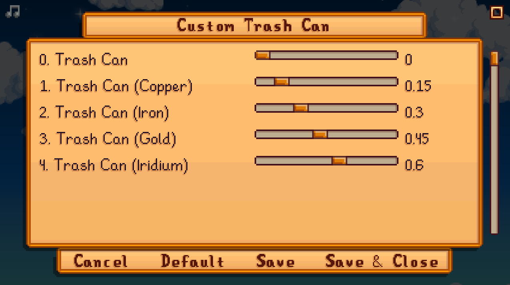

**You're viewing a file in the SMAPI mod dump, which contains a copy of every open-source SMAPI mod
for queries and analysis.**

**This is _not_ the original file, and not necessarily the latest version.**  
**Source repository: https://github.com/ShivaGuy/StardewMods**

----

# Custom Trash Can

Customize the item reclamation price for all levels of [Trash Cans](https://stardewvalleywiki.com/Trash_Cans).

Edit config.json or use [Generic Mod Config Menu](https://www.nexusmods.com/stardewvalley/mods/5098) to modify trash reclamation percentage.

___Cheat__:  Edit config.json directly to go beyond 100% refund value._

## See also

- [Release notes](release-notes.md)
- [Nexusmods page](https://www.nexusmods.com/stardewvalley/mods/11835)
