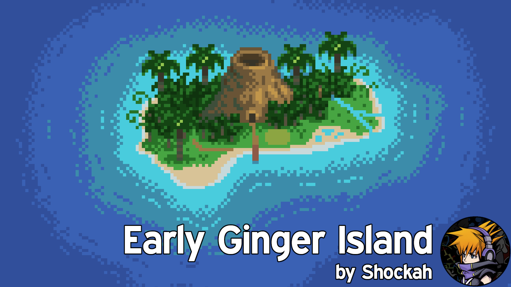

**You're viewing a file in the SMAPI mod dump, which contains a copy of every open-source SMAPI mod
for queries and analysis.**

**This is _not_ the original file, and not necessarily the latest version.**  
**Source repository: https://github.com/Shockah/Stardew-Valley-Mods**

----

# Early Ginger Island
Access the Ginger Island early, depending on your friendship with Willy. Optionally access the Ginger Island west/farm, too. Configure the boat fix materials and ticket price.

## See also
* [Nexus Mods page](https://www.nexusmods.com/stardewvalley/mods/13885)
* [Release notes](release-notes.md)