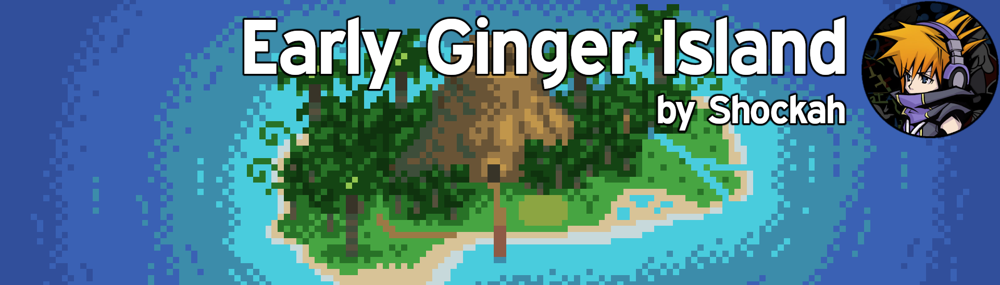
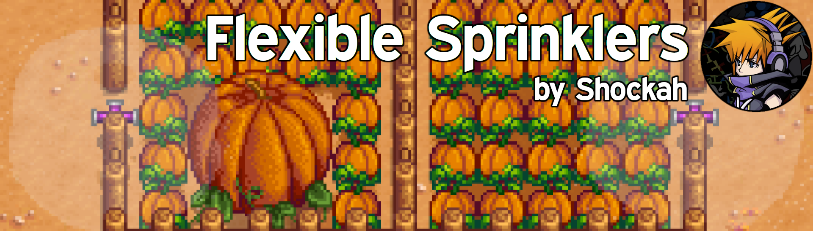
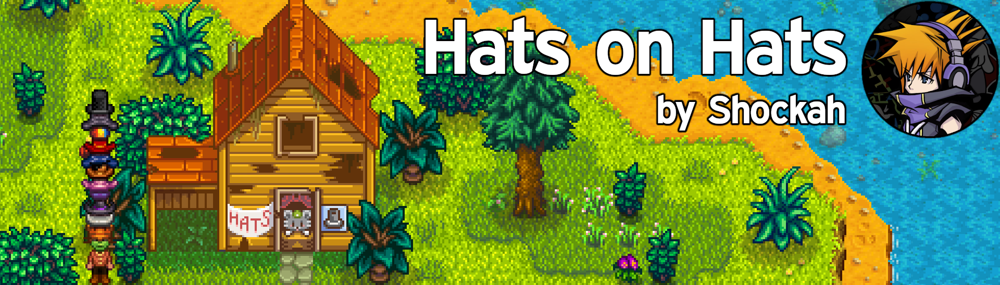
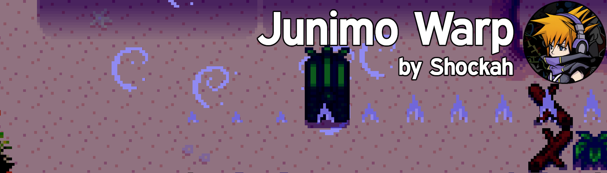
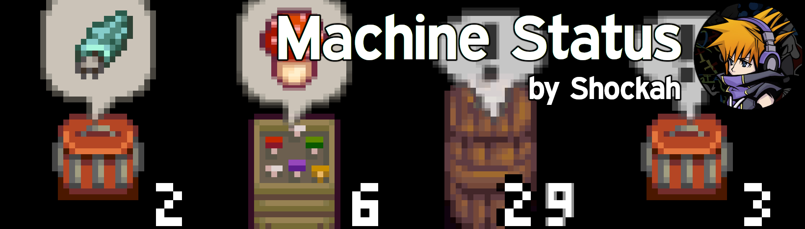
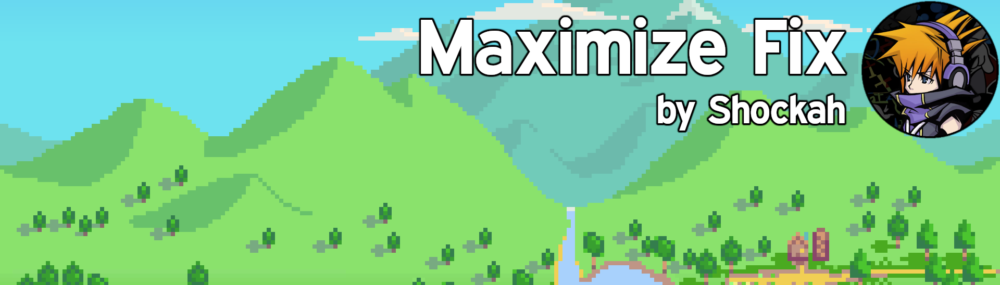
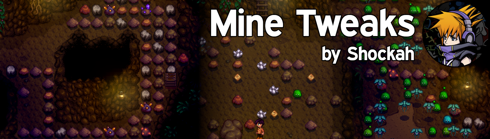
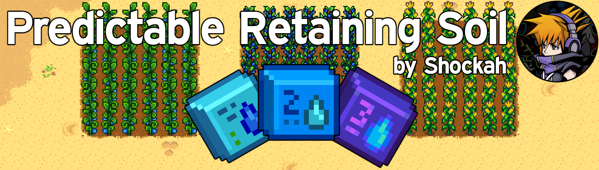
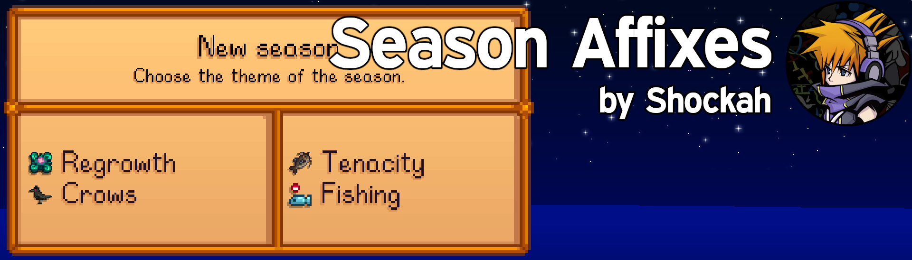
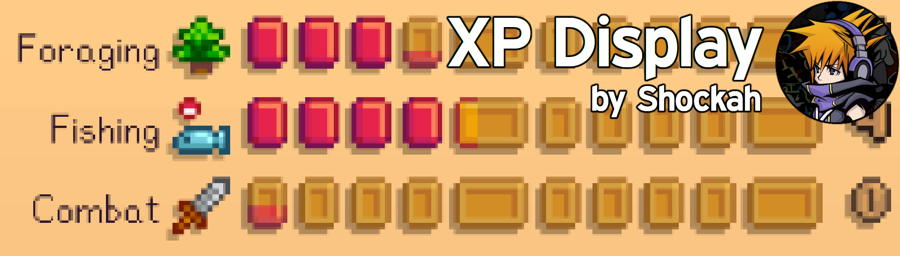

**You're viewing a file in the SMAPI mod dump, which contains a copy of every open-source SMAPI mod
for queries and analysis.**

**This is _not_ the original file, and not necessarily the latest version.**  
**Source repository: https://github.com/Shockah/Stardew-Valley-Mods**

----

# Shockah's Stardew Valley mods

This is a list of all Stardew Valley mods I made. Issues or ideas can be reported via [the GitHub issues page](issues), the Posts/Bugs tabs on the Nexus Mods pages, or via Discord (you can find me on the official Stardew Valley server, in the `#making-mods`, `#modded-game-support` and `#modded-farmers` channels, depending on the topic; my tag is `Shockah#1830`).

**Note:** The below list only includes mods I already made README files for. You can find the rest of the mods on this repository, or via [my Nexus Mods profile](https://www.nexusmods.com/users/133612513?tab=user+files).

Access the Ginger Island early, depending on your friendship with Willy. Optionally access the Ginger Island west/farm, too. Configure the boat fix materials, ticket price and Golden Walnut requirements.
\[[source code](EarlyGingerIsland)]

Ever hated having to put a sprinkler in the middle of your crops? Ever wanted to make a layout that isn't 5x5? Now you can!
\[[source code](FlexibleSprinklers)]

Hats on hats.
\[[source code](HatsOnHats)]

Show some extra love to date/marry villagers early. Adds craftable Bouquets and Mermaid's Pendants.
\[[source code](InAHeartbeat)]

Place yourself inside a Junimo Chest and warp to another chest.
\[[source code](JunimoWarp)]

A core mod for Shockah's mods.
\[[source code](Kokoro)]

Machine ready/waiting/busy status at a glance.
\[[source code](MachineStatus)]

Fixes a problem with game window maximization on Windows.
\[[source code](MaximizeFix)]

Tweaks for various things in the mines.
\[[source code](MineTweaks)]

Adds some more realism and life to the Gift Delivery Service. An extension to the [Mail Services Mod](https://www.nexusmods.com/stardewvalley/mods/7842).
\[[source code](PleaseGiftMeInPerson)]

No more RNG on Retaining Soil. Upgrade your watering can even on sunny days! 
\[[source code](PredictableRetainingSoil)]

Adds seasonal "affixes", making every season unique in its own way.
\[[source code](SeasonAffixes)]

Displays the progress to reach the next level of each skill. 
\[[source code](XPDisplay)]

# Contributing

Most contributions are welcome!

## Translations

I'm super happy to see people translating my mods! Unfortunately, this does not fit my mentality.

I, as a modder, feel obligated to provide as best of a service as I can when releasing anything to the public, while still keeping it as just a hobby.

I do not want to release anything to the public that is untested by me (and I feel ashamed when I'm forced to do so due to time constraints, especially if it ends up being broken). I also do not like to release unpolished things.

I cannot know whether a potential translation contribution is polished or not, as I probably do not speak the language it translates my mod to, and cannot test whether the translations are correct or feel right in the context they are used in.

While I could just welcome any translations that come my way, it creates another problem - if I am to follow the "do not release unpolished things" mantra, they block any further modifications to the mod. If I want to add a new feature or change an existing feature, and that feature requires translation updates, I can only guarantee the English translation is correct. This means I either have to contact the translation's original author and ask them to update their translations, or find new translators to do that, or release a mod with missing translations (which I'm unwilling to do). While the translator may be active in the community *today*, it does not mean they will be active *whenever I need to update the mod* - they may have quit the community already. This is just a hobby after all.

For these reasons, I do not feel like I should accept any translations as part of the base mods.

### HOWEVER

This mentality led me to add a translation override feature in my [Project Fluent](https://www.nexusmods.com/stardewvalley/mods/12638) mod \[[source code](ProjectFluent)].

That mod can be used to create a separate mod which YOU can release under your own name and add translations to any other mods. I have also released an example mod, which translates the [Automate](https://www.nexusmods.com/stardewvalley/mods/1063) mod to Polish - see it [here](https://www.nexusmods.com/stardewvalley/mods/12639).

You can find documentation for Project Fluent [here](https://hackmd.io/@Shockah/H1q8H-mcc).

Releasing your own translation mod should be pretty straightforward, you get the benefit of earning [NexusMods Donation Points](https://www.nexusmods.com/about/donation-points/), and I get the benefit of being able to sleep at night! :P