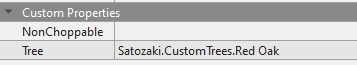

**You're viewing a file in the SMAPI mod dump, which contains a copy of every open-source SMAPI mod
for queries and analysis.**

**This is _not_ the original file, and not necessarily the latest version.**  
**Source repository: https://github.com/Sonozuki/StardewMods**

----

**Barking Up the Right Tree** is a [Stardew Valley](http://stardewvalley.net/) framework mod that allows you to add custom trees using json.

## Creating a Content Pack
1. Create a new folder for the content pack. The convention is: **[BURT] mod name**.
2. Create a sub folder for each tree you plan to add (see final result below for reference).
3. Create a **tree.png** image and add to the respective tree folder. NOTE: the images must be called **tree.png**.
4. Create a content.json and add to the respective tree folder (see below for reference). 
5. Create a manifest.json (see below for reference).

#### Final Content Pack Layout
    [BURT] mod name
        manifest.json
        Hard Oak
            tree.png
            content.json
        Birch
            tree.png
            content.json
        Spruce
            tree.png
            content.json
        Maple
            tree.png
            content.json
        Rowan
            tree.png
            content.json

#### Tree.png example
// TODO: give example and pixel locations of tree sprite sheet

#### Content.json example
    {
        "Name": "tree name"
        "TappedProduct": {
            "DaysBetweenProduce": 4.0,
            "Product": "id",
            "Amount": 9
        },
        "Wood": "id",
	    "DropsSap": false,
        "Seed": "id",
        "RequiredToolLevel": 2,
        "IsStumpInWinter": true,
        "UnfertilisedGrowthChance": 0.2,
        "FertilisedGrowthChance": 1,
        "ShakingProducts": [
            {
                "DaysBetweenProduce": 1,
                "Product": "id",
                "Amount": 3,
                "Seasons": [ "spring", "summer", "fall" ]
            },
            {
                "DaysBetweenProduce": 3,
                "Product": "id",
                "Amount": 10
            }
        ],
        "IncludeIfModIsPresent": [ "uniqueModId", "uniqueModId" ],
        "ExcludeIfModIsPresent": [ "uniqueModId", "uniqueModId" ],
        "BarkProduct": {
            "DaysBetweenProduce": 4,
            "Product": "id",
            "Amount": 15
        }
    }

* **Name**: This is the name of the tree, this doesn't necessarily have to match the folder name but it's encouraged.
* **TappedProduct**: This is the product that the tree drops when using a [tapper](https://stardewvalleywiki.com/Tapper) on it (If this is not specified, then a tapper will not be able to be placed on the tree).
* **TappedProduct.DaysBetweenProduce**: The number of days between each harvest.
* **TappedProduct.Product**: The product that gets harvested when using a tapper.
* **TappedProduct.Amount**: The number of items you'll get from each harvest.
* **Wood**: This is the product that the tree drops when it gets cut down.
* **Seed**: This is the item to plant for the tree to grow.
* **RequiredToolLevel**: The required tool level to harvest this the tree (this also applies to all growth stages except the initial seed stage).
* **IsStumpInWinter**: Whether the tree turns into a stump in winter, like the mushroom tree.
* **UnfertilisedGrowthChance**: The 0 => 1 chance that the tree has to grow a stage at the beginning of each day when it's not fertilised.
* **FertilisedGrowthChance**: The 0 => 1 chance that the tree has to grow a stage at the beginning of each day when it's fertilised.
* **ShakingProducts**: This is a list of products that drop when the tree is shaken
* **ShakingProducts.DaysBetweenProduce**: The number of days between the product can be dropped again.
* **ShakingProducts.Product**: The product that will get dropped.
* **ShakingProducts.Amount**: The amount of the item that will get dropped.
* **ShakingProducts.Seasons**: The seasons the item will get dropped (leaving this out means it can be dropped in all seasons).
* **IncludeIfModIsPresent**: The tree will only get loaded if atleast one of the listed mods (by uniqueId) is present.
* **ExcludeIfModIsPresent**: The tree will only get loaded if none of the listed mods (by uniqueId) are present.
* **BarkProduct**: This is the product that the tree drops when using the **Bark Remover**.
* **BarkProduct.DaysBetweenProduce**: The number of days between each bark harvest.
* **BarkProduct.Product**: The product that gets harvested when using a **Bark Remover**.
* **BarkProduct.Amount**: The amount of items that gets harvested when using a **Bark Remover**.

**NOTE:** Ensure all ids are strings, this is because they also allow API tokens (The layout is: "UniqueModId:MethodName:Value"), and example of an API token is: **spacechase0.JsonAssets:GetObjectId:Maple Bark**, this will use an item from JA called **Maple Bark**.

#### Manifest.json example
    {
        "Name": "[BURT] mod name",
        "Author": "your name",
        "Version": "1.0.0",
        "Description": "description",
        "UniqueID": "your name.mod name",
        "MinimumApiVersion": "3.8.0",
        "UpdateKeys": [ update key ],
        "ContentPackFor": {
            "UniqueID": "Satozaki.BarkingUpTheRightTree"
        }
    }

## Tile data
To add a tree to a map, add a tile property on the **Back** object layer; the key of the tile should be **Tree** and the value should be your **[unique mod id].[tree name]** such as **Satozaki.CustomTrees.Red Oak**

You can also specify a tree to be non choppable on a per tile basis. A non choppable tree can still have it's bark removed (if a bark product has been specified), have a tapper on it, be shaken etc. Just put a tile property on the **Back** object layer with a key of **NonChoppable** (you don't need to specify any value).

An example of these tile properties can be seen below  

## Install
1. Install the latest version of [SMAPI](https://www.nexusmods.com/stardewvalley/mods/2400).
2. Install the latest version of [SpaceCore](https://www.nexusmods.com/stardewvalley/mods/1348).
3. Install the latest version of [this mod](https://www.nexusmods.com/stardewvalley/mods/).
4. Extract the .zip mod file into your StardewValley/Mods folder and run the game using SMAPI.

## Use
First, add any content packs to the **StardewValley/Mods** folder 
Then load into the game with SMAPI and play like normal.

## Compatibility
Barking Up the Right Tree is compatible with Stardew Valley 1.5+ on Windows/Mac/Linus, both single player and multiplayer. To view reported bugs visit both the issues on this repo and bug reports on [Nexus](https://www.nexusmods.com/stardewvalley/mods/?tab=bugs).

TODO: add mod ids to compat and install sections