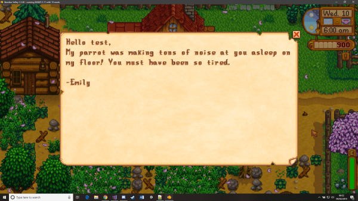

**You're viewing a file in the SMAPI mod dump, which contains a copy of every open-source SMAPI mod
for queries and analysis.**

**This is _not_ the original file, and not necessarily the latest version.**  
**Source repository: https://github.com/Sonozuki/StardewMods**

----

**Better 10 Hearts** is a [Stardew Valley](http://stardewvalley.net/) mod that adds a few perks to NPCs.

## Install
1. Install the latest version of [SMAPI](https://www.nexusmods.com/stardewvalley/mods/2400).
2. Install the latest version of [this mod](https://www.nexusmods.com/stardewvalley/mods/3605).
3. Extract the .zip mod file into your StardewValley/Mods folder and run the game using SMAPI.

## Use
First, open the game using SMAPI like normal, this will generate a config.json file in the Mods/Better10Hearts folder.
Then using the below section configure the mixed seeds to your liking.
Lastly load back into the game and play like normal.

## Configure
    {
        "NPCStaminaIncrease": 20,
        "SpouseStaminaIncrease": 40,
        "OnlyGetStaminaAt10Hearts": true
    }
    
The **NPCStaminaIncrease** property accepts any interger, this is the amount of stamina you'll recieve when speaking to an NPC that fit's the critea to give stamina.
The **SpouseStaminaIncrease** property accepts any interger, this is the amount of stamina you'll recieve whwn speaking to your spouse, when they fit the critea to give stamina.
The **OnlyGetStaminaAt10Hearts** property accepts **true** or **false**, this determines whether you need to have a 10 heart relationship with the NPC to get stamina. 

## Compatibility
Better 10 Hearts is compatible with Stardew Valley 1.4+ on Windows/Mac/Linus, both single player and multiplayer. To view reported bug visit both the issues on this repo and bug reports on [Nexus](https://www.nexusmods.com/stardewvalley/mods/3605?tab=bugs).
