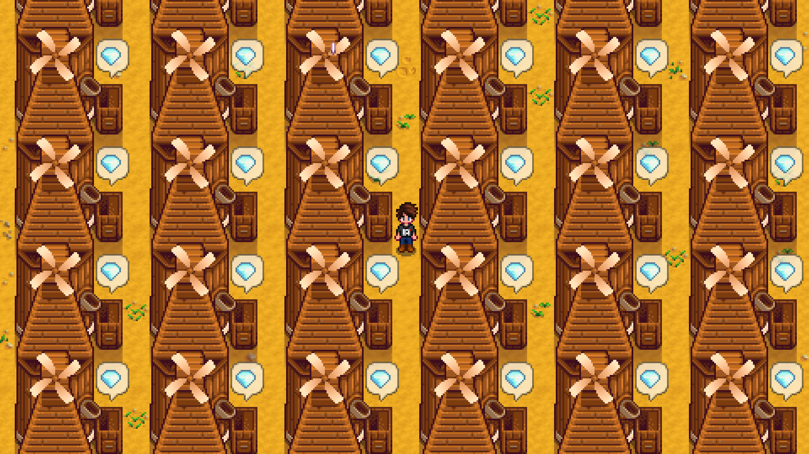

**You're viewing a file in the SMAPI mod dump, which contains a copy of every open-source SMAPI mod
for queries and analysis.**

**This is _not_ the original file, and not necessarily the latest version.**  
**Source repository: https://github.com/Sonozuki/StardewMods**

----

**Miller Time** is a [Stardew Valley](http://stardewvalley.net/) framework mod that allows you to add custom recipes to the [Mill](https://stardewcommunitywiki.com/Mill) using json.

## Creating a Content Pack
1. Create a new folder for the content pack. The convention is: **[MT] mod name**
2. Create a manifest.json, see below for reference
3. Create a content.json, see below for reference

#### Final Content Pack Layout
    [MT] mod name
        content.json
        manifest.json

#### Manifest.json example
    {
        "Name": "[MT] mod name",
        "Author": "your name",
        "Version": "1.0.0",
        "Description": "description",
        "UniqueID": "your name.mod name",
        "MinimumApiVersion": "3.8.0",
        "UpdateKeys": [ update key ],
        "ContentPackFor": {
            "UniqueID": "Satozaki.MillerTime"
        }
    }

#### Content.json example
    [
        {
            "InputId": "id",
            "Output": {
                "Id": "id",
                "Amount": 3
            }
        },
        {
            "InputId": "id",
            "Output":{
                "Id": "id",
                "Amount": 10
            }
        }
    ]

* **InputId**: The id of the item to input into the mill.
* **Output.Id**: The id of the item that will get outputted from the mill.
* **Output.Amount** The number of items will get outputted for each item that gets inputted.

**NOTE:** All ids also allow API tokens (The layout is: "UniqueModId:MethodName:Value"), and example of an API token is: **spacechase0.JsonAssets:GetObjectId:Maple Bark**, this will use an item from JA called **Maple Bark**.

## Install
1. Install the latest version of [SMAPI](https://www.nexusmods.com/stardewvalley/mods/2400).
2. Install the latest version of [this mod](https://www.nexusmods.com/stardewvalley/mods/7575).
3. Extract the .zip mod file into your StardewValley/Mods folder and run the game using SMAPI.

## Use
Add any content packs to the **StardewValley/Mods** file and run the game using SMAPI.

## Compatibility
Miller Time is compatible with Stardew Valley 1.5+ on Windows/Mac/Linus, both single player and multiplayer. To view reported bug visit both the issues on this repo and bug reports on [Nexus](https://www.nexusmods.com/stardewvalley/mods/7575?tab=bugs).
