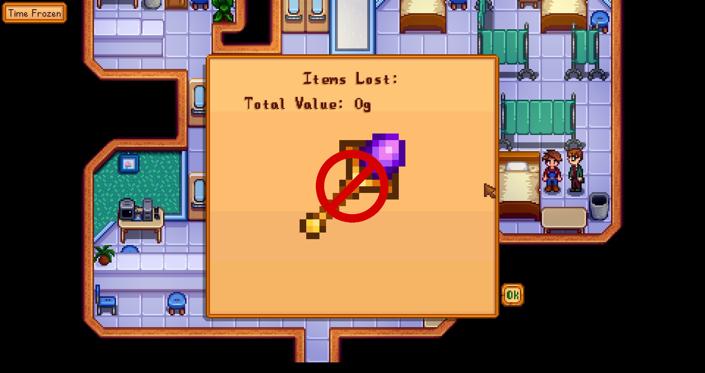

**You're viewing a file in the SMAPI mod dump, which contains a copy of every open-source SMAPI mod
for queries and analysis.**

**This is _not_ the original file, and not necessarily the latest version.**  
**Source repository: https://github.com/atravita-mods/StardewMods**

----

Avoid Losing Specter
===========================

This mod prevents you from losing the Return Specter on death. Also prevents loss of the horse flute, and golden scythe.

## Install

1. Install the latest version of [SMAPI](https://smapi.io).
2. Download and install [AtraCore](https://www.nexusmods.com/stardewvalley/mods/12932).
2. Download this mod and unzip it into `Stardew Valley/Mods`.
3. Run the game using SMAPI.

## Uninstall
Simply remove this mod from your Mods folder.

## Compatibility

* Works with Stardew Valley 1.5.6 on Linux/macOS/Windows.
* Works in single player, multiplayer, and split-screen mode. Should be fine if installed for one player only in multiplayer.
* Should be compatible with most other mods. (Special handling for [Moon Misadventures](https://www.nexusmods.com/stardewvalley/mods/10612), which has its own way of preventing you from losing certain things on death.)

For other mod authors: if you would like this mod to forbid the loss of an item, just attach the context tag `atravita_no_loss_on_death` on that item.

## See also

[Changelog](docs/Changelog.md)
