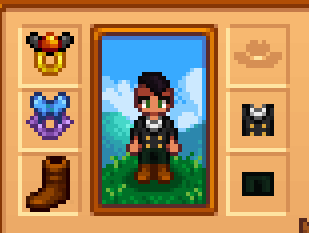

**You're viewing a file in the SMAPI mod dump, which contains a copy of every open-source SMAPI mod
for queries and analysis.**

**This is _not_ the original file, and not necessarily the latest version.**  
**Source repository: https://github.com/atravita-mods/StardewMods**

----

Critter Rings
=================================

This incredibly self-indulgent mod has two rings in it. The Butterfly ring summons a butterfly every ten in-game minutes during daytime. The Firefly ring summons a firefly every ten in-game minutes during night. Additionally, the butterfly ring is a magnetic ring, and the firefly ring is a glow ring.

Buy both from Marlon after you've gotten the skull key.

## Install

1. Install the latest version of [SMAPI](https://smapi.io).
2. Download and unzip [Spacecore](https://www.nexusmods.com/stardewvalley/mods/1348) and [Json Assets](https://www.nexusmods.com/stardewvalley/mods/1720), and unzip both into `Stardew Valley/Mods`.
2. Download and install [AtraCore](https://www.nexusmods.com/stardewvalley/mods/12932).
2. Download this mod and unzip it into `Stardew Valley/Mods`.
3. Run the game using SMAPI.

## Configuration
Run SMAPI at least once with this mod installed to generate the `config.json`, or use [Generic Mod Config Menu](https://www.nexusmods.com/stardewvalley/mods/5098) to configure.

Options
`ButterfliesSpawnInRain`: if enabled, butterflies will spawn in the rain.

## Compatibility

* Works with Stardew Valley 1.5.6 on Linux/macOS/Windows.
* Works in single player, multiplayer, and split-screen mode. In multiplayer, both players should install.
* Should be compatible with most other mods.

## Much thanks to
* [Violetlizabet](https://www.nexusmods.com/stardewvalley/users/120958053) for drawing the ring graphics for me!

## See also

[Changelog](docs/changelog.md)
