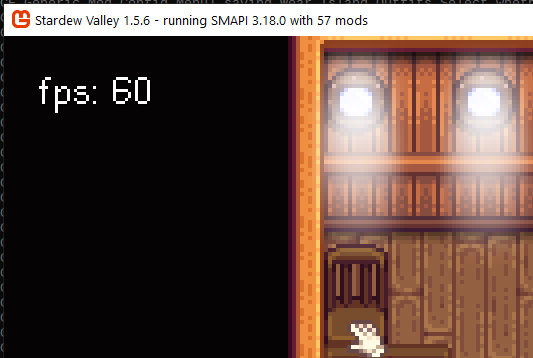

**You're viewing a file in the SMAPI mod dump, which contains a copy of every open-source SMAPI mod
for queries and analysis.**

**This is _not_ the original file, and not necessarily the latest version.**  
**Source repository: https://github.com/atravita-mods/StardewMods**

----

FrameRateLogger
===========================

This simply causes the game to display the framerate on the upper left corner, and also log the current framerate to the log.

To be honestly, I'm only uploading this because I sometimes give out this file to people for debugging.

## Install

1. Install the latest version of [SMAPI](https://smapi.io).
2. Download this mod and unzip it into `Stardew Valley/Mods`.
3. Run the game using SMAPI.

## Uninstall
Simply remove this mod from your Mods folder.

## Compatibility

* Works with Stardew Valley 1.5.6 on Linux/macOS/Windows.
* Works in single player, multiplayer, and split-screen mode. Safe to be installed by a single player.
* Should be compatible with most other mods. 

## See also

[Changelog](docs/Changelog.md)
