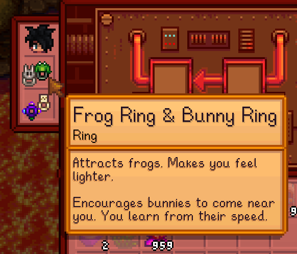

**You're viewing a file in the SMAPI mod dump, which contains a copy of every open-source SMAPI mod
for queries and analysis.**

**This is _not_ the original file, and not necessarily the latest version.**  
**Source repository: https://github.com/atravita-mods/StardewMods**

----

Identifiable Combined Rings
===========================

I've always hated how the combined rings are handled in game. Firstly, giving all of them the same name means it's harder to find the one you want in a dresser. Secondly, while the automated recolor code is neat, I prefer the individual ring graphics.

Note that this is not designed for the various mods that let you combine more than two rings. That should just fall back to vanilla behavior though.

## Install

1. Install the latest version of [SMAPI](https://smapi.io).
2. Download and install [AtraCore](https://www.nexusmods.com/stardewvalley/mods/12932).
2. Download this mod and unzip it into `Stardew Valley/Mods`.
3. Run the game using SMAPI.

## Uninstall
Simply delete from your Mods directory.

## Configuration
Run SMAPI at least once with this mod installed to generate the `config.json`, or use [Generic Mod Config Menu](https://www.nexusmods.com/stardewvalley/mods/5098) to configure.

`OverrideCombinedRing` - whether or not this mod should override the graphics for a combined ring.

## Compatibility

* Works with Stardew Valley 1.5.6 on Linux/macOS/Windows.
* Works in single player, multiplayer, and split-screen mode. Should be fine if installed for only one player in multiplayer.
* Should be compatible with most other mods.

## See also

[Changelog](docs/changelog.md)
