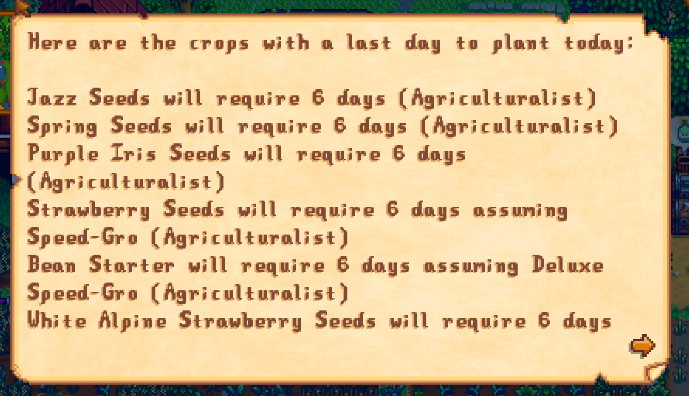

**You're viewing a file in the SMAPI mod dump, which contains a copy of every open-source SMAPI mod
for queries and analysis.**

**This is _not_ the original file, and not necessarily the latest version.**  
**Source repository: https://github.com/atravita-mods/StardewMods**

----

Last Day To Plant Redux
===========================

Look, I just wanted a mod of this type to handle the fertilizers from [More Fertilizers](../MoreFertilizers/MoreFertilizers), okay?

Inspired by [LastDayToPlant](https://www.nexusmods.com/stardewvalley/mods/7917?tab=posts), this mod calculates the last day you can plant certain crops, taking into account fertilizers (including mod fertilizers!)

## Install

1. Install the latest version of [SMAPI](https://smapi.io).
2. Download and install [AtraCore](https://www.nexusmods.com/stardewvalley/mods/12932).
2. Download this mod and unzip it into `Stardew Valley/Mods`.
3. Run the game using SMAPI.

## Uninstall
Simply delete from your Mods directory.

## Configuration
Run SMAPI at least once with this mod installed to generate the `config.json`, or use [Generic Mod Config Menu](https://www.nexusmods.com/stardewvalley/mods/5098) to configure.

*  `DisplayOption`: The way you'd like the information presented to you. `OnFirstWarp` displays it the first time you warp, assuming you have no menus open and no events are happening. `InMailbox` puts it in your mailbox. `None` does neither. (The letter is also always present in the mail collections tab, should you ever need to refer back to it. It should always be relatively near the end.)
*  `CropsToDisplay`: Which crops should this mod display to you? `All` displays all for the season, `Purchaseable` displays crops you can purchase AND crops you've "seen", and `Seen` only displays crops you've seen.
*  `FertilizersToDisplay`: Which fertilizers should this mod display to you? `All` for all relevant fertilizers, `Seen` for only fertilizers you've seen before. (`Purchaseable` isn't an option here, since More Fertilizers handles most of its shop logic on its own.)
*  `AllowSeedsList`: A list of seeds to always display. Would look something like `["Beet Seeds", "Cake Plant Seeds", "Ancient Ferns Seed"]`. Use the `internal` name, not the display name. (The ID will also work.)
*  `AllowFertilizersList`: A list of fertilizers to always display. Follows the same format as seeds, and also uses the internal name. (Note that most fertilizers for More Fertilizers have long internal names that don't match the display names).

## Technical notes:

* Each plant is only checked once per fertilizer. This shouldn't matter unless someone creates a fertilizer that only has a chance of changing the growth time, which as far as I know no one has.
* I assume all paddy crops are grown near water.
* The process used to calculate the number of days for each plant under each condition is fairly slow, and there's nothing I can realistically do about the fact that it's an `O(mn)` problem. I cache as much as I can, but on my computer first startup takes about 400-500 ms (for about 100 modded crops + about 20 modded fertilizers). About half this time is reflecting into JA to see when crops are purchase-able, so `Seen` and `All` are definitely significantly faster. (That said - it's cached, I usually see about 2-20ms on subsequent days.)
* Fertilizers are only displayed if they change the time needed (so things like the Quality Fertilizer are ignored).
* For split-screen - the two players are tracked together for things like `Seen` fertilizers and crops.
* In multiplayer, if you change professions, you'll temporarily see timing info for both your old profession and new profession.
* I only look at the current month for timing info, so if you have a crop that takes more than an in-game month to grow, this mod will never tell you about it. This is entirely because I structured my caches weird, but at this point I'm not rewriting the whole mod for a handful of crops most people would plant in their greenhouse anyways.
* This mod assumes the month is 28 days. I'll implement support for mods that add longer/shorter months if sufficient people ask.

## Future development ideas:
* Displaying this info on the shop menu itself?

## Compatibility

* Works with Stardew Valley 1.5.6 on Linux/macOS/Windows.
* Works in single player, multiplayer, and split-screen mode. Should be fine if installed for only one player in multiplayer.
* Should be compatible with most other mods. Works for JA crops, but not DGA crops. Works with mods that change the growth time via CP, like [Balanced Valley](https://www.nexusmods.com/stardewvalley/mods/13970?tab=description) (except, well, not taking into account crops that take more than a month to grow.) Designed to work with my [More Fertilizers](https://www.nexusmods.com/stardewvalley/mods/11837). Takes into account Walk of Life's Prestiged Agriculturalist.

## See also

[Changelog](docs/changelog.md)
