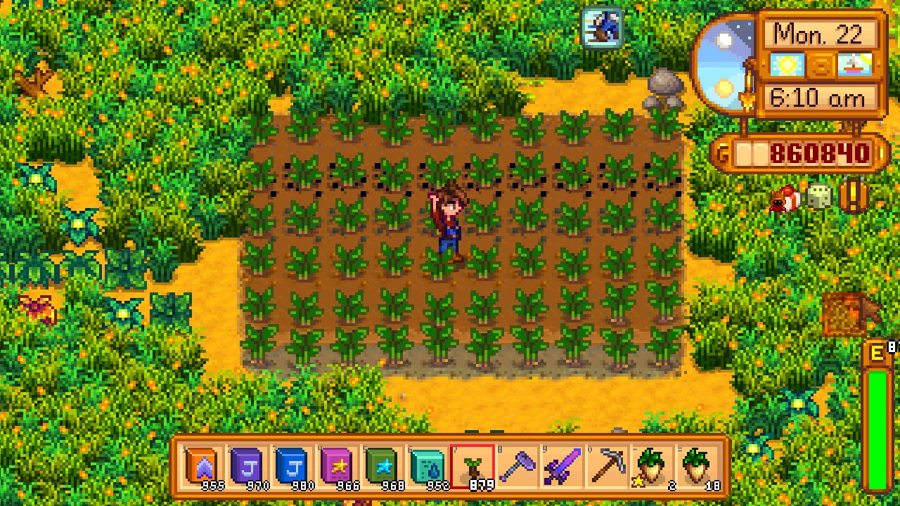

**You're viewing a file in the SMAPI mod dump, which contains a copy of every open-source SMAPI mod
for queries and analysis.**

**This is _not_ the original file, and not necessarily the latest version.**  
**Source repository: https://github.com/atravita-mods/StardewMods**

----

More Fertilizers
===========================

This mod adds a bunch of new fertilizers, including some with quite unique effects. See the table for details.

## Install

1. Install the latest version of [SMAPI](https://smapi.io).
2. Download and unzip [Spacecore](https://www.nexusmods.com/stardewvalley/mods/1348) and [Json Assets](https://www.nexusmods.com/stardewvalley/mods/1720), and unzip both into `Stardew Valley/Mods`.
2. Download and install [AtraCore](https://www.nexusmods.com/stardewvalley/mods/12932).
2. Download this mod and unzip it into `Stardew Valley/Mods`.
3. Run the game using SMAPI.

## Uninstall
Remove every instance of all these fertilizers you have in your inventory and any chest, and then remove this mod from your Mods folder.

## Usage

This mod adds twenty-two new fertilizers that do the following things:

fertilizer                      | effect                                           | purchase from
:------------------------------ | :------------------------------------            | :---------------------- 
Bountiful Fertilizer            | 10% chance of a double harvest.                  | Pierre on Wednesdays and Sundays, year 2 or later, after completing Pierre's special order. (Also at the Stardew Valley Fair, unless you've finished the JojaMart.)
Fish Food                       | Increases the chances of rare fish spawning      | Willy on Wednesdays, Saturdays and Sundays, after completing the CC fish tank. Not available to Joja members. 
Deluxe Fish Food                | Same as the fish food, but lasts three times as long| Traded for five magma caps from the Island Traders after at least 50% of unique available fish are caught. Not available to joja members. 
Domesticated Fish Food          | Chance to make fish in fish ponds reproduce faster| Willy on Saturdays and Sundays, after finishing his special order. Year 2 or later.
Wisdom Fertilizer               | 10% increase in experience gained while harvesting | Purchase from Krobus in spring or fall (no other requirements), or from the Traveling Cart in summer or winter (again, no other requirements).
Fruit Tree Fertilizer           | 15% increase in fruit tree growth speed          | Sandy (no other requirements.)
Deluxe Fruit Tree Fertilizer    | 30% increase in fruit tree growth speed          | Sandy, year 2 or later, after reaching floor 100 in the Skull Cavern.
Everlasting Fruit Tree Fertilizer | Out-of-season trees produce up to one fruit.   | Qi gem shop for 1 Qi gem each.
Joja's Patented Fertilizer      | Crops are silver quality.                        | JojaMart, after earning 10,000 g.
Joja's Deluxe Fertilizer        | Crops have a 20% chance to be gold; the remaining are silver. | JojaMart, on Wednesdays, Saturdays, and Sundays only. Only available to Joja members, and only after earning 1,000,000g.
Joja's Secret Fertilizer        | Reduces regrowth time but locks crop to base quality (or poor quality if you have Casey's [A Quality Mod](https://www.nexusmods.com/stardewvalley/mods/14448?tab=description) installed, in return for even faster regrowth). Works better for Joja crops. | Most easily purchasable from the Island North trader for radioactive ore, but can rarely be found at the Traveling Merchant, or in the Crane Game at the theater.
Maeby's Good-Luck Fertilizer    | Protects crops from crows and lightning strikes  | Pierre's, after spring year 1, on lucky days only.
Organic Fertilizer              | Increases the value of crops by 10% (carries over to Artisan products made with those crops.) Joja crops, however, cannot become organic.| Pierre on Wednesdays and Sundays, year 2 or later, after completing Pierre's special order. (Also at the Stardew Valley Fair, unless you've finished the JojaMart.)
Waterlogged Fertilizer.         | Paddy crops planted with this fertilizer will always be considered irrigated. **Does nothing for non-paddy crops**. | Krobus (no other requirements)
Miraculous Beverages Fertilizer | Applicable to bushes, fruit trees, and crops alike, causes the target to drop the first keg product rarely. | Most easily purchaseable from the Island North Trader in return for triple shot espresso, but also available from Krobus after 50% of all recipes have been cooked.
Prismatic Fertilizer            | Causes flowers to cycle through the prismatic colors. Can only be applied to growing flowers (not fully grown ones, you'll pick it if it's fully grown) but can be stacked on top of other fertilizers. | Collect the first five from Gunther after donating a prismatic shard, then buy from Krobus.
Seedy Fertilizer                | 10% chance of dropping the seed from the crop at harvest. | Purchase from Robin, year 2 or later, after reaching six hearts with George and finishing his special order.
Everlasting Fertilizer          | Prevents crops from dying due to season changes. | Purchase from Mr. Qi's gem shop (no other requirements) for 1 qi gem each.
Radioactive Fertilizer          | Chance of swapping around which crop is growing! Weighted towards cheaper crops, however. | Purchase from Krobus, year 2 or later, after receiving magic ink.
Bountiful Bush Fertilizer       | Increases the number of days bushes produce.     | Purchase from the Traveling Cart in spring or fall after any player has reached level 4 foraging.
Rapid Bush Fertilizer           | Increases the growth speed of tea bushes by 20%  | Purchase from Pierre on Wednesdays and Sundays, year 2 or later, after reaching 6 hearts with Caroline and seeing her tea event.
Tree Tapper's Fertilizer        | 12.5% chance of producing a doubled tapper product | Purchase from Robin on Wednesdays and Sundays, year 2 or later, after reaching 6 hearts with Robin and finishing her Resource Rush.

Additionally, fertilizers may be found by breaking barrels in the mines, while panning, while killing monsters on the farm, in volcano chests, and in fishing treasure chests. Some may rarely be found in big slimes.

## Configuration
Run SMAPI at least once with this mod installed to generate the `config.json`, or use [Generic Mod Config Menu](https://www.nexusmods.com/stardewvalley/mods/5098) to configure.

* `MillProducesOrganic`: whether or not the mill's products should be organic.
* `WaterOverlayColor`: the color of the overlay tint on bodies of water for the fish foods.
* `RecolorBushes`: whether or not fertilized bushes should be recolored.
* `RecolorFruitTrees`: whether or not fertilized fruit trees should be recolored.
* `RecolorTrees`: whether or not fertilized trees should be recolored.
* `BanRaisedSeeds`: whether or not raised seeds should be banned from the radioactive fertilizer.

## Compatibility

* Works with Stardew Valley 1.5.6 on Linux/macOS/Windows. Not compatible with Android.
* Works in single player, multiplayer, and split-screen mode. In multiplayer, all players should install.
* This mod relies heavily on transpilers and I cannot guarantee compatibility with other mods, especially other transpiler mods, or even possibly test every combination myself. If the mod is not listed below, **I don't know and you should test it yourself.** This mod is designed to fail fast if it thinks there may be a problem and produce large red errors if there's a likely incompatibility. Let me know about any compatibilities!

#### Known compatability:

* [Automate](https://www.nexusmods.com/stardewvalley/mods/1063) and [PFMAutomate](https://www.nexusmods.com/stardewvalley/mods/5038), with the exception of the beverage fertilizer.
* [Crop Variation](https://www.nexusmods.com/stardewvalley/mods/11467) - although that mod will change the quality of crops as well, which will influence the quality of the joja-crops.
* [Json Assets](https://www.nexusmods.com/stardewvalley/mods/1720) and any crops/fruit trees added through JA.
* [More Rings](https://www.nexusmods.com/stardewvalley/mods/2054?tab=description). The Quality+ ring will increase the quality of joja-crops.
* [Multi Yield Crops](https://www.nexusmods.com/stardewvalley/mods/6069) - fully supported.
* [Smart Building](https://www.nexusmods.com/stardewvalley/mods/11158?tab=description) supports these fertilizers. Thank you so much, DecidedlyHuman!
* [Teh's Fishing Overhaul](https://www.nexusmods.com/stardewvalley/mods/866).
* [Walk of Life](https://www.nexusmods.com/stardewvalley/mods/8111).
* The large framework mods (CP/BFAV/PFM/FTM/MFM, etc.) work with this mod.
* Any of my other mods - I try not to cause **myself** compat issues.
* Honestly most other mods should work fine, not many actually use transpilers.

#### Known mod incompatibilities:

**Major incompatibility**:

* [MultiFertilizer](https://www.nexusmods.com/stardewvalley/mods/7436) - I tried. It...mostly works, except sometimes the fertilizers from this mod disappear. You can only apply one fertilizer from this mod on any particular tile, but with that mod you can also apply any of the vanilla fertilizers, and the behavior can be quite unpredictable. Usually multifertilizer takes precedence and prevents these fertilizers from taking effect on that square. Note: this mod patches MultiFertilizer.

**Minor incompatibilities**:

* [Dynamic Game Assets](https://www.nexusmods.com/stardewvalley/mods/9365) - fertilizers from this mod may or may not affect DGA crops. Still trying to figure out why. Seedy fertilizer is not supported (DGA fruit trees are supported, except for the beverage fertilizer.)
* [Lookup Anything](https://www.nexusmods.com/stardewvalley/mods/541) will only show these fertilizers as a possible output of the Bone Mill if PFM is installed. The bone mill will produce these fertilizers anyways. Otherwise fine.
* [Fish Wells](https://www.nexusmods.com/stardewvalley/mods/7651) do not work with Domesticated Fish Food, as they do not preserve mod data. The remaining fertilizers should work, and that mod has settings that let you adjust the fish spawn time.
* [Deluxe Grabber Redux](https://github.com/ferdaber/sdv-mods/tree/master/DeluxeGrabberRedux), as they've re-implemented most of the relevant code. Effects from these fertilizers won't show up anything gathered by a deluxe grabber until I get around to implementing support here. That might take...a while, not going to lie.
* No mod will include the Fruit Tree Fertilizers while calculating the age of fruit trees. You'll just see the days required decrement by two occasionally.
* Using CJB cheat's instant crop growth may not work well with the Everlasting Fertilizer. (Awaiting next release of CJB).
* Still no organic support for Solid Foundations buildings, my apologies!

**Reporting an incompatibility**

A `harmony_summary` would be greatly appreciated! If you go to the console and type the words `harmony_summary` into the console, it'll list every mod that uses harmony that you have installed and what they've patched.

**Please include a [smapi.io/log](https://smapi.io/log) - there's not really much I can do without a log.**

## Known issues

* Fish ponds also slightly change color if Fish Food is applied on the farm, despite the fact that fish food does not affect fish ponds. There's realistically nothing I can do about this without tanking performance. I'd recommend [Pond Painter](https://www.nexusmods.com/stardewvalley/mods/4703).
* There's no visual indicator for the Domesticated Fish Food. I tried a bunch of things and didn't like any of them.

## Acknowledgments

Many thanks to [Violetlizabet](https://www.nexusmods.com/stardewvalley/users/120958053) for helping me with the fertilizer sprites, Schneitizel for the French translation, Puffeeydii for the Chinese translation, CrisTortion for the German translation, and [CopperSun](https://www.nexusmods.com/stardewvalley/users/114762643) for helping me with the text!

## See also

[Changelog](docs/Changelog.md)
