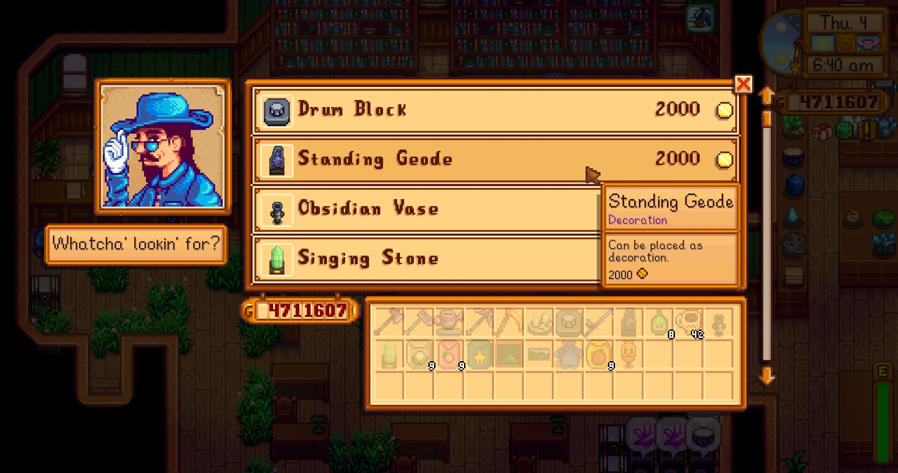

**You're viewing a file in the SMAPI mod dump, which contains a copy of every open-source SMAPI mod
for queries and analysis.**

**This is _not_ the original file, and not necessarily the latest version.**  
**Source repository: https://github.com/atravita-mods/StardewMods**

----

Museum Shop
=================================

This mod just adds collected rewards to a shop in the museum. By default, it's one tile to the right of Gunther, although it can be moved simply by relocating the tile property `Action: atravita.MuseumShop`. It also adds furniture rewards to the furniture catalogue.

## Install

1. Install the latest version of [SMAPI](https://smapi.io).
2. Download and install [AtraCore](https://www.nexusmods.com/stardewvalley/mods/12932).
2. Download this mod and unzip it into `Stardew Valley/Mods`.
3. Run the game using SMAPI.

## Configuration
Run SMAPI at least once with this mod installed to generate the `config.json`, or use [Generic Mod Config Menu](https://www.nexusmods.com/stardewvalley/mods/5098) to configure.

The single configuration option `BoxLocation` lets you set the location the box will spawn.

## Compatibility

* Works with Stardew Valley 1.5.6 on Linux/macOS/Windows.
* Works in single player, multiplayer, and split-screen mode. Probably fine for a single player to install in single player.
* Should be compatible with most other mods. 

Note: this mod looks at the `museumCollectedReward` mail flags to generate the list of items to sell; if another mod adds a museum reward (and adds the flag), it'll also be sold by this mod. As far as I know, that's currently zero other mods.

## See also

* [Changelog](docs/Changelog.md)
