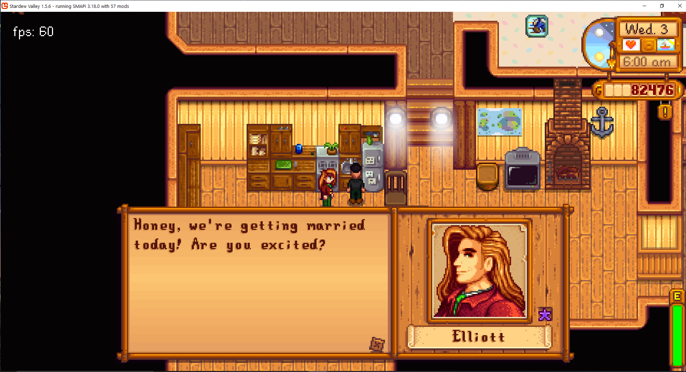

**You're viewing a file in the SMAPI mod dump, which contains a copy of every open-source SMAPI mod
for queries and analysis.**

**This is _not_ the original file, and not necessarily the latest version.**  
**Source repository: https://github.com/atravita-mods/StardewMods**

----

Sleep In Wedding
=================================

This mod simply lets you delay the wedding. Great for scrambling around to get into your wedding clothing!

(For the gents: [Customize Wedding Attire](https://www.nexusmods.com/stardewvalley/mods/10761) will let you pick your wedding attire as well!)

Additionally, fixes the game bug where the wedding doesn't play when you load into a save.

## Install

1. Install the latest version of [SMAPI](https://smapi.io).
2. Download and install [AtraCore](https://www.nexusmods.com/stardewvalley/mods/12932).
2. Download this mod and unzip it into `Stardew Valley/Mods`.
3. Run the game using SMAPI.

## Compatibility

* Works with Stardew Valley 1.5.6 on Linux/macOS/Windows.
* Works in single player, multiplayer, and split-screen mode.
* Should be compatible with most other mods. 

## For other modders:

NPCs will be in your house the day of the wedding, and have a line they'll say. If you want your NPC to have a custom line, just add the `DayOfWedding` dialogue key to their usual dialogue.

## See also

* [Changelog](docs/Changelog.md)
